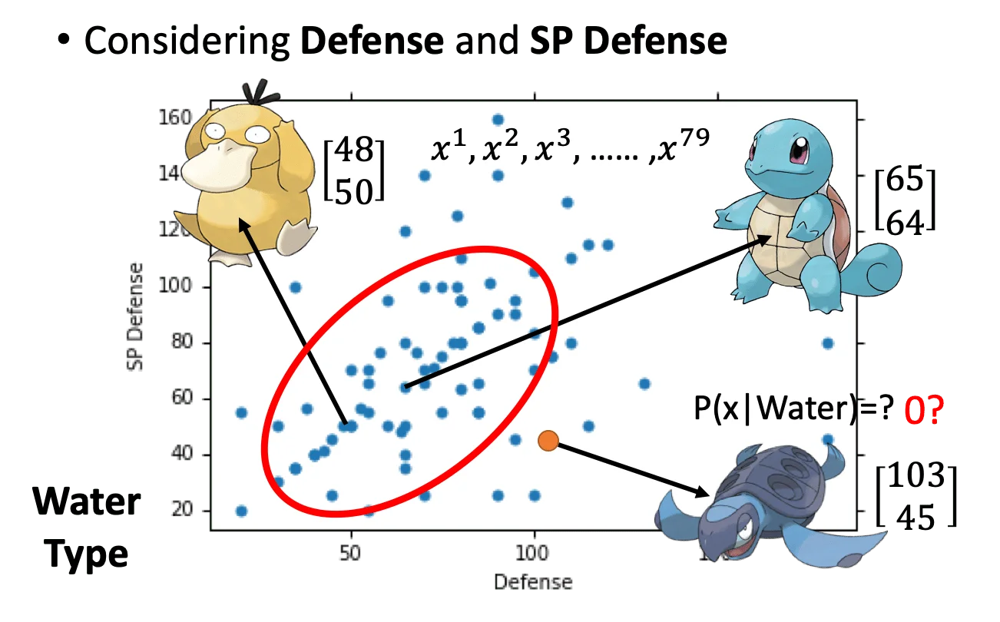

# Classification: Probabilistic Generative Model

分类的目的是要找出一个 function，它的输入是一个物体 $x$，输出是一个类别 $n$.

分类的应用很多，比如信贷资格判断、医疗诊断、手写文字识别、人脸识别等。

今天使用的例子是 PM 的属性判断，输入是一只 PM，输出就是它的属性。

## Example Application

我们要用到的宝可梦能力值有：

- 种族值（Total）：下列所有能力值之和
- HP：生命值
- Attack：攻击力
- Defense：防御力
- SP ATK：特攻
- SP DEF：特防
- Speed：速度

我们可以用一个包含上述 7 个能力值的 vector 来表示一只 PM，比如皮卡丘就可以表示为 (320, 35, 55, 40, 50, 50, 90). 我们的目的就是输入这样一个 vector，输出这只 PM 的属性。

### How to do Classification?

- Training data for Classification. 第一步就是要收集训练数据

这里有一个问题是，是否可以用回归来做分类？

答案是，这取决于你的数据。用回归来做分类会遇到两个问题：

1. 回归出来的分界线容易受到离群点的干扰，它会惩罚那些「过于正确」的点。（当然这个例子应该是损失函数有问题，用 SVM 来做比较好）

   

2. 如果我们要做的是一个多分类问题，其 target 设置为 (0, 1, 2, ...)，那么对于回归来说，我们相当于假定 0 类和 1 类是接近的，1 类和 2 类是接近的，而 0 类和 2 类的距离是比较远的。但是如果数据本身并不存在这种关联性，那么回归的结果就不会很理想。 

### Ideal Alternatives

- Function(Model)：我们可以在 regression 的函数 $f(x)$ 里面内嵌一个 $g(x)$，并且我们设定如果 $g(x) > 0$ 则为 class 1，否则为 class 2. （比如 Sigmoid）
- Loss Function：$L(f) = \sum_n \delta (f(x^n) \ne \hat{y}^n)$ 即在训练数据上分类错误的次数
- Find the best function：
  - Example：感知机、SVM

但今天我们要用贝叶斯来解这个问题。

假设我们有两个类别 Class 1 和 Class 2. 假设我们已经知道从 Class 1 和 Class 2 中采样的概率 $P(C_1), P(C_2)$，以及从对应的类中采样出 $x$ 的概率 $P(x|C_1), P(x|C_2)$，我们可以很容易用 **贝叶斯公式** 计算出 **$x$ 属于 Class 1 的几率 $P(C_1|x)$**.

同理，我们也可以计算出 $x$ 属于 Class 2 的几率 $P(C_2|x)$. 有了这些值，我们就可以用 **全概率公式**  得到 $x$ 的分布 $P(x)$，进而可以用这个分布来采样生成新的 $x$. 因此这种模型叫做**生成模型（Generative Model）**。

其中 $P(C_1), P(C_2)$ 被称为先验，一般可以从训练数据中计算出来。例如我们先看水系和一般系：

$P(x|C_1), P(x|C_2)$ 就是条件概率，也就是从对应类别中采样出 $x$ 的几率。

### Probability from Class

假设我们现在想要知道从水系 PM 里面采样出（我真不知道这个糊壁叫什么）的几率：

那我们先考虑防御和特防，把数据集画出来。**我们假设这些点都是从一个高斯分布中采样出来的。**那么问题就是，如果给定这一个数据集，我们要怎么找到这个高斯分布？

（这里略过高斯分布的讲解）

首先，我们可以通过这 79 个训练数据找出高斯分布的均值和方差。那么给定一个新的 $x$ 带入这个高斯分布，我们就可以得到这个点上的概率密度，也就能反映这个新的 $x$ 从这个高斯分布中采样出来的概率。

那么均值和方差要如何计算呢？常用的方法就是**极大似然估计（Maxmimum Likelihood）**。

其实就是最后一行的公式，把每个样本的概率密度相乘就是 Likelihood. （每个样本应该是要独立同分布的，但是显然并不是这样的，因为会有进化型等等，所以这里只是一个粗略的近似）

从直觉上来说，使这个 Likelihood 最大的均值和方差是很容易能想到的：

那么我们就可以得到水系和一般系的两个高斯分布的均值和协方差矩阵：

现在我们就可以做分类了：

注意 $P(x|C_1)$ 可以不用积分，因为分子分母积分的无穷小可以抵消掉。

现在我们来看看结果：

可以看到只有二维空间的情况下分类准确率只有 47%. 不过如果我们考虑所有 7 个能力值，分类正确率也只有 54%

### What to do next?

上一节的概率生成模型中，我们对不同的类别的高斯分布赋予了不同的方差。但是这会引入一个新的问题，因为高维的情况下，这个协方差矩阵会非常大，导致模型参数量剧烈增长，而前面几堂课已经说过，high variance 会导致 overfitting. 一个简单的解决办法是让不同的类别共享同一个协方差矩阵，这样我们就可以显著降低模型参数。

也就是说，我们假定水系和一般系的 PM 有不同的 mean 但是有相同的 variance，那么这个极大似然估计可以写成：

均值仍然是用原来的方法分别计算，而协方差矩阵则是两者协方差矩阵的加权平均。这样做会导致分类的分界线是一条直线。因此这样的 Model 也叫做 Lieanr Model. 

> 这个边界是直线的原因是，共用协方差矩阵使得两个高斯分布形态相同，位置不同。用贝叶斯分类的时候，边界就会变成直线。

## Conclusion

回顾一下到目前为止学到的东西：

一个分类任务可以分为三步：

1. 找到一个 Function Set，输入 $x$，输出对应的类别。我们这里用的是一个基于贝叶斯公式的生成模型，先验分布是高斯分布。
2. 评估这个函数的好坏：用极大似然估计找到最好的 $\mu, \Sigma$ 使得这个高斯分布最有可能生成这一批训练数据
3. 找到最好的函数

在实作中，针对不同的数据应该要选择不同的分布。比如对二元分类，我们可以假定数据是服从伯努利分布的。

如图所说，如果我们假定每个维度都是独立的，那么上图这种方法就叫做朴素贝叶斯分类器。但是在一般情况下，多个维度往往是不独立的，比如攻击力和防御力一般有一定的相关性。

### 后验概率 Posterior Probability

这部分实际上是在介绍后验概率和交叉熵损失之间的关系。

我们先写出后验概率的形式：
$$
\begin{aligned}
P(C_1|x) &= \frac{P(x|C_1)P(C_1)}{P(x|C_1)P(C_1) + P(x|C_2)P(C_2)} \\
\\	（上下同除分子）
&= \frac{1}{1 + \frac{P(x|C_2)P(C_2)}{P(x|C_1)P(C_1)}} \\

&= \frac{1}{1 + exp(-z)} = \sigma(z) \rightarrow sigmoid \ function \\
 
where \quad z &= ln \frac{P(x|C_1)P(C_1)}{P(x|C_2)P(C_2)}
\end{aligned}
\\
$$
这样我们就从后验概率推导出了 Sigmoid Function 的形式。这也是为什么 sigmoid 可以用来做分类。

我们把 $z$ 再展开：

先把对数里的乘法拆开成加法：
$$
z = ln \frac{P(x|C_1)}{P(x|C2)} + ln\frac{P(C_1)}{P(C_2)}
$$
其中后一项用样本分布来计算可以得到：
$$
P(C_1) = \frac{N_1}{N_1 + N_2} \\
\ \\
P(C_2) = \frac{N_2}{N_1 + N_2}
$$
前一项把条件概率展开：
$$
P(x|C_1) = \frac{1}{(2\pi)^{D/2}}\frac{1}{|\Sigma^1|^{1/2}}exp\{-\frac{1}{2}(x-\mu^1)^T(\Sigma^1)^{-1}(x-\mu^1)\}
\\ \ \\
P(x|C_2) = \frac{1}{(2\pi)^{D/2}}\frac{1}{|\Sigma^2|^{1/2}}exp\{-\frac{1}{2}(x-\mu^2)^T(\Sigma^2)^{-1}(x-\mu^2)\}
$$
两者相除可以约掉第一个系数，放进 $ln$ 里将除法变为减法，再将外层的乘法变为加法：
$$
\begin{aligned}
ln \frac{P(x|C_1)}{P(x|C2)} &= ln \frac{\frac{1}{(2\pi)^{D/2}}\frac{1}{|\Sigma^1|^{1/2}}exp\{-\frac{1}{2}(x-\mu^1)^T(\Sigma^1)^{-1}(x-\mu^1)\}}{\frac{1}{(2\pi)^{D/2}}\frac{1}{|\Sigma^2|^{1/2}}exp\{-\frac{1}{2}(x-\mu^2)^T(\Sigma^2)^{-1}(x-\mu^2)\}} \\
 
&= ln\frac{|\Sigma^2|^{1/2}}{|\Sigma^1|^{1/2}} - \frac{1}{2}[(x-\mu^1)^T(\Sigma^1)^{-1}(x-\mu^1) - (x-\mu^2)^T(\Sigma^2)^{-1}(x-\mu^2)]
\end{aligned}
$$
其中大括号内的第一个乘项：
$$
\begin{aligned}
& \quad(x-\mu^1)^T(\Sigma^1)^{-1}(x-\mu^1) \\

&= x^T(\Sigma^1)^{-1}x - x^T(\Sigma^1)^{-1}\mu^1 - (\mu^1)^T(\Sigma^1)^{-1}x + (\mu^1)^T(\Sigma^1)^{-1}\mu^1
\\ 

&= x^T(\Sigma^1)^{-1}x - 2(\mu^1)^T(\Sigma^1)^{-1}x + (\mu^1)^T(\Sigma^1)^{-1}\mu^1
\end{aligned}
$$
公式 （12）是合并了（11）的中间两项，因为求出来是一个标量。

同理有
$$
\begin{aligned}
& \quad(x-\mu^2)^T(\Sigma^2)^{-1}(x-\mu^2) \\

&= x^T(\Sigma^2)^{-1}x - x^T(\Sigma^2)^{-1}\mu^1 - (\mu^2)^T(\Sigma^2)^{-1}x + (\mu^2)^T(\Sigma^2)^{-1}\mu^2
\\ 

&= x^T(\Sigma^2)^{-1}x - 2(\mu^2)^T(\Sigma^2)^{-1}x + (\mu^2)^T(\Sigma^2)^{-1}\mu^2
\end{aligned}
$$

把（9）、（12）和（15）代回（5）得到：
$$
\begin{aligned}
z = ln\frac{(\Sigma^2)^{1/2}}{(\Sigma^1)^{1/2}} &- \frac{1}{2}x^T(\Sigma^1)^{-1}x + (\mu^1)^T(\Sigma^1)^{-1}x - \frac{1}{2}(\mu^1)^T(\Sigma^1)^{-1}\mu^1 \\

&+ \frac{1}{2}x^T(\Sigma^2)^{-1}x - (\mu^2)^T(\Sigma^2)^{-1}x + \frac{1}{2}(\mu^2)^T(\Sigma^2)^{-1}\mu^2 \\

&+ ln\frac{N_1}{N_2}
\end{aligned}
$$
然后我们假设公用协方差 $\Sigma^1 = \Sigma^2 = \Sigma$，上式可以进一步简化为：
$$
z = 
(\mu^1 - \mu^2)^T\Sigma^{-1}x - \frac{1}{2}(\mu^1)^T\Sigma^{-1}\mu^1
+\frac{1}{2} (\mu^2)^T\Sigma^{-1}\mu^2 + \frac{1}{2}(\mu^2)^T\Sigma^{-1}\mu^2
+ ln\frac{N_1}{N_2}
$$
可以看到这个式子就变成了一个 $z = W^Tx + b$ 的形式，也即，我们令：
$$
\begin{aligned}
&W^T = (\mu^1 - \mu^2)^T\Sigma^{-1} \\

&b = - \frac{1}{2}(\mu^1)^T\Sigma^{-1}\mu^1
+\frac{1}{2} (\mu^2)^T\Sigma^{-1}\mu^2 + \frac{1}{2}(\mu^2)^T\Sigma^{-1}\mu^2
\end{aligned}
$$
因此，回到公式（3），我们可以把后验概率 $P(C_1|x)$ 写成 Sigmoid 激活的线性函数的形式：
$$
P(C_1|x) = \sigma(w\cdot x +b)
$$
这就是为什么，当我们公用协方差的时候，分类的分界线会是一条直线。到这里我们就完成了从朴素贝叶斯到线性分类器的联系。

总而言之，在生成模型中，我们去估计 $N_1, N_2, \mu^1, \mu^2, \Sigma$，然后去计算 $w, b$. 那我们有没有更简单的方法可以直接得到 $w, b$ 呢？下一节讲。

