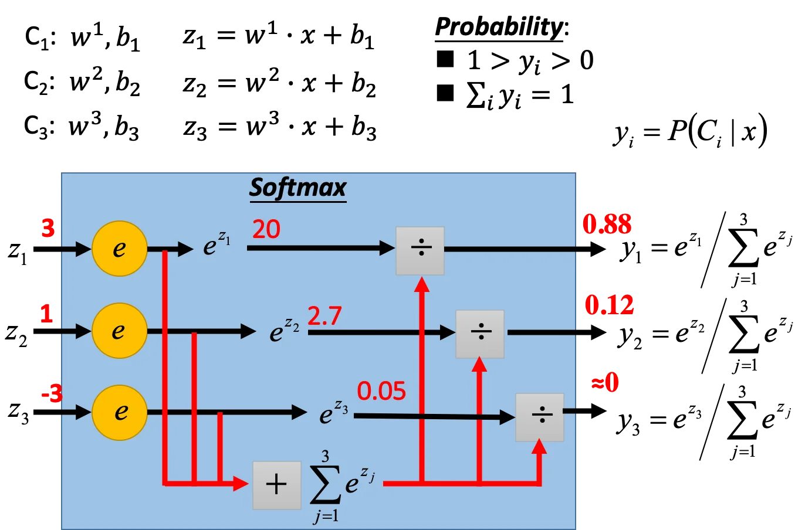

## Step 1: Function Set

上一节我们理清了朴素贝叶斯和线性分类器的关系。对于一个分类问题，我们希望找到一个概率分布 $P_{w, b}(C_1|x)$ 

如果 $P_{w,b}(C_1|x) \ge 0.5$ 输出类别 1，否则输出类别 2.

并且我们将这个概率分布写作 $P_{w, b}(C_1|x) = \sigma(z)$ 的形式，其中 $z = w\cdot x+b = \sum_i w_ix_i +b, \ \sigma(z) = \frac{1}{1+exp(-z)}$

因此我们的 Function Set 的形式就是：
$$
f_{w, b}(x) = P_{w, b}(C_1|x)
$$
下标表示我们的函数是关于 $w, b$ 这两个参数的。遍历所有可能的 $w, b$ 的组合就构成了我们的 function set. 于是我们的模型就长下面这个样子：

这件事就叫做 **逻辑回归（Logistic Regression）**。 我们和前面讲过的**线性回归（Linear Regression）**做一个对比：

|            | Logistic Regression                                          | Linear Regression                                            |
| ---------- | ------------------------------------------------------------ | ------------------------------------------------------------ |
| **Step 1** | $f_{w, b}(x) = \sigma(\sum_i w_ix_i + b)$                    | $f_{w, b}(x) = \sum_i w_ix_i + b$                            |
| 备注       | 因为输出经过了 sigmoid function，所以值一定在 0 到 1 之间    | 输出可以是任何值                                             |
| **Step 2** | Training data: $(x^n, \hat{y}^n)$ $\hat{y}^n$ : 1 for class 1, 0 for class 2 $L(f) = \sum_n C(f(x^n), \hat{y}^n)$ | Training data: $(x^n, \hat{y}^n)$ $\hat{y}^n$：a real number $L(f) = \frac{1}{2}\sum_n(f(x^n)-\hat{y}^n)^2$ |
| 备注       | 逻辑回归的损失函数是交叉熵                                   | 线性回归的损失函数是 MSE                                     |
| **Step 3** | $w_i \leftarrow w_i - \eta \sum_n -(\hat{y}^n - f_{w,b}(x^n))x_i^n$ |                                                              |
| 备注       | 逻辑回归和线性回归的参数更新其实是一样的                     |                                                              |

## Step 2: Goodness of a Function

假设我们现在有一笔训练数据 $(x^i, C_i)$，假设这笔数据是从 $f_{w,b}(x) = P_{w, b}(C_1|x)$ 中生成的。

| Input | $x^1$           | $x^2$           | $x^3$           | ...  | $x^N$           |
| ----- | --------------- | --------------- | --------------- | ---- | --------------- |
| Label | $\hat{y}^1 = 1$ | $\hat{y}^1 = 1$ | $\hat{y}^1 = 0$ | ...  | $\hat{y}^N = 1$ |

那么给定一组 $w, b$，能够生成这笔数据的概率是多少？—— 极大似然估计
$$
L(w, b) = f_{w,b}(x^1)f_{w,b}(x^2)(1-f_{w,b}(x^3))...f_{w,b}(x^N)
$$
最好的参数 $w, b$ 就是使得似然函数 $L(w, b)$ 最大的一组：
$$
w^*, b^* = arg \max_{w, b} L(w, b)
$$
这里我们做一个等价变换，把最大化转变为最小化对数：
$$
w^*, b^* = arg \min_{w, b} - lnL(w, b)
$$
这也是极大似然估计的标准做法，这样做可以把乘项转化为和项。那么每一个和项就可以写作：
$$
-[\hat{y}^ilnf(x^i) + (1-\hat{y}^i)ln(1-f(x^i))]
$$
这个形式其实是**两个伯努利分布之间的交叉熵（Cross Entropy）**. 不过它的来源和信息论并没有直接的关系，只是形式上等同。

这两个分布其实就是真实分布和预测分布：

| Distribution p （GT)     | Distribution q (Inference) |
| ------------------------ | -------------------------- |
| $p(x=1) = \hat{y}^n$     | $q(x=1)=f(x^n)$            |
| $p(x=0) = 1 - \hat{y}^n$ | $q(x=0)=1 - f(x^n)$        |

它们的交叉熵就写作 $H(p, q) = -\sum_x p(x)ln(q(x))$，反应这两个分布的接近程度。如果两个分布完全一致，那么它们的交叉熵就为 0.

因此，我们要最小化的函数就可以写作：
$$
-lnL(w, b) = \sum_{i=1}^N -[\hat{y}^ilnf(x^i) + (1-\hat{y}^i)ln(1-f(x^i))]
$$

## Step 3: Find the best function

用梯度下降法。这里涉及到复合求导。我们先计算损失函数对 $w_i$ 的导数：

整理后得到：
$$
\frac{\partial{-lnL(w,b)}}{\partial w_i} = \sum_n -(\hat{y}^n - f_{w,b}(x^n))x_i^n
$$
这就是损失函数对 $w$ 的梯度。注意到累加项的系数是 GT 和预测值的差，也就是两者的差距越大，参数更新的步长就越大。

那么这里讨论一下，为什么逻辑回归不能用 Square Error？这是因为 Square Error 在距离很大的时候实际上是有缺陷的：

可以看到无论预测值是什么样，输出的梯度都为 0. 当 $\hat{y}^n = 0$ 也是一样的，这里略。这是因为 Square Error 的误差平面在远离目标的时候是很平滑的。所以没有办法知道梯度很小的时候到底是在鞍点还是在目标附近：

## Discriminative v.s. Generative

逻辑回归称为 Discriminative，而从高斯分布中生成叫 Generative.
$$
P(C_1|x) = \sigma(w\cdot x+b)
$$
如果是逻辑回归的方法可以用梯度下降找到 $w, b$，如果是 Generative 的方法可以直接用统计的方法找到均值和协方差矩阵（解析解）。

但是这两种方法找到的参数一般是不一样的。也就是说，即使我们使用同一个 Model（Function Set）和同样的数据集，两种方法也不会得到相同的解。因为生成的方法事先假定了数据的先验分布（比如高斯分布），但是逻辑回归的方法没有对数据的分布做假设。

可以看到用 Discriminative 的方法得到的结果要更好。这里举一个简单的例子：

假设我们的数据集如上图，测试数据如下图，用贝叶斯公式计算 testing data 的类别会得到：

即正样本被分类为负例。这里主要原因是正样本的数量太少了，而朴素贝叶斯假设特征之间相互独立，这个假设太强了，导致预测失效。

但判别模型也不一定绝对比生成模型要好。生成模型的优点在于：

- 假设先验分布可以在少量数据上学习
- 假设先验分布对噪声更鲁棒
- 先验分布和条件分布可以从不同的来源取得。举例来说，在语音辨识系统中，先验是「某一句话被说出来的概率」，而这个概率分布不需要从数据中获得，可以直接从语料库中得到。而条件分布是「某个人说出这句话的概率」，这个分布是从语音数据中获得的。

## Multi-class Classification

以三分类为例：

给三个不同的类别分别定义不同的参数 $w^i, b_i$，将输出送入到 softmax 中得到一个概率值。

这个概率值有两个性质：

1. 介于 0 到 1 之间
2. 在所有类别上的输出值之和为 1

那么训练过程就是：

这里我们把 class 用 one-hot 的形式来表示，避免用实数会造成类别 1 和类别 2 比较近，和类别 3 比较远这样的情况。

## Limitation of Logistic Regression

线性模型是没办法做到下面这种分类的。因为逻辑回归画出来的分界线是一条直线。

一种解决方法是做特征变换，使得特征变得线性可分。但这样的操作一般是不容易做到的。

另一种方法是级联多层逻辑回归（下图忽略 bias 项）：

如图，我们用第一个逻辑回归输出 feature $x_1'$，用另一个逻辑回归输出 $x_2'$。假如这两个新的特征是线性可分的，那么只要把这两个 feature 相加送入另一个逻辑回归就可以得到分类结果。这里其实就是一个很浅的神经网络了。

回到刚才的例子，我们用两个逻辑回归来做特征变换：

然后把新的特征输入到最后的逻辑回归中，就会发现新的特征是线性可分的。

我们把每个逻辑回归都叫做一个 **神经元（Neuron）**，像上面这样由多个神经元组合成的网络就被称为 **神经网络（Neural Network）**。

