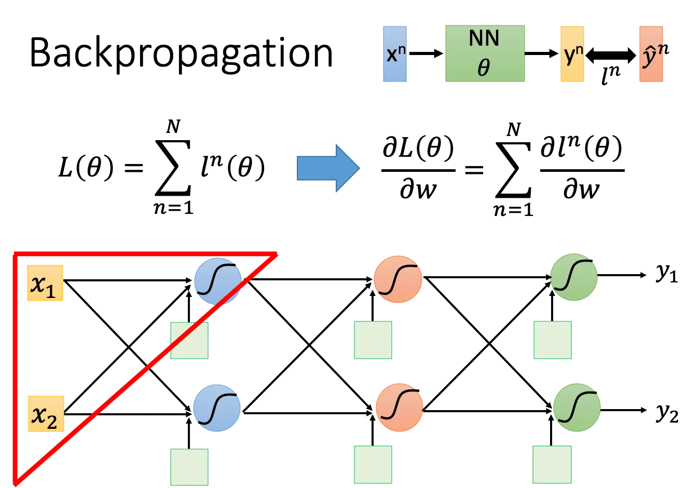
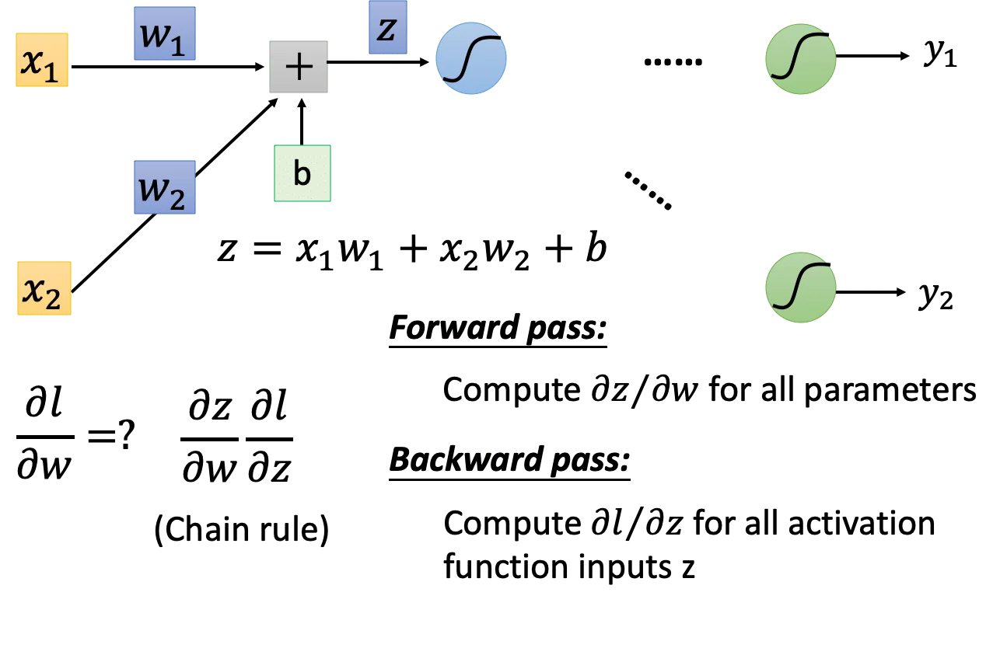
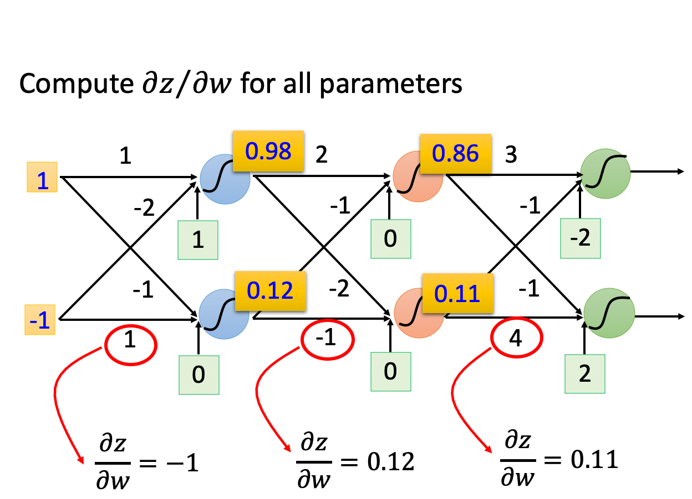
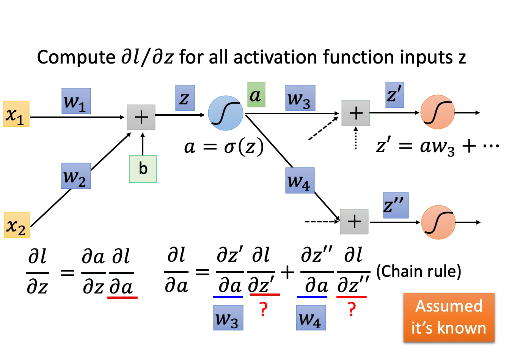
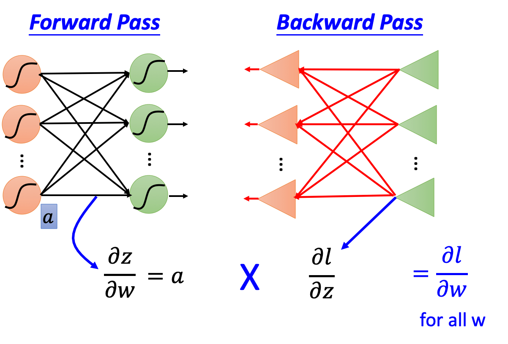

## Gradient Descent

神经网络在做梯度下降的时候和普通的逻辑/线性回归是没有什么差别的。主要区别就是神经网络的参数量非常大，这就导致梯度可能是一个上百万维的向量。**反向传播（Backpropagation）** 就是一个用于高效计算梯度的方法，其核心思想就是链式求导法则。

（这里略过链式求导法则的介绍）

其中 $l^n$ 是第 $n$ 笔数据的训练误差。因此总的梯度就可以记作所有单笔数据的梯度只和。那么这个梯度是如何计算的？

以下图为例，我们要计算 Loss 对 $w_1$ 的梯度，根据链式求导法则我们可以将这个偏导拆分：
$$
\frac{\partial l}{\partial w} = \frac{\partial z}{\partial w} \frac{\partial l}{\partial z}
$$
其中前一项是可以在前向传播的过程中计算的（用看的就知道等于 $，[x_1, x_2]$因为这个值就等于神经元对应参数的输入），因此叫做 forward pass.

而后一项是没有办法在前向传播的过程中计算出来的，而是需要从后往前算，所以叫 backward pass.

先来看 forward pass。这个就很简单了，神经元的输出对每个输入 $x_i$ 对应的参数 $w_i$ 的梯度，就是这个输入本身。

再来看 backward pass，这里就需要用到链式求导法则从后往前算：

现在假设 $\alpha = \sigma(z)$，我们需要算 Loss 对 $z$ 的梯度，就可以先拆分成 Loss 对 $\alpha$ 的梯度乘以 $\alpha$ 对 $z$ 的梯度。

同样的，后者就是 $\sigma$ 函数的导数，而前者还是不知道，因此我们继续用链式法则拆开往后走。

一直走到输出层，也即 $z'', z'$ 就是最后一层了，那么 Loss 对 $z''$ 的梯度也就很容易能看出来。这时候我们就开始往回代，就可以得到 Loss 对 $z$ 的导数了。这就是从输出层倒回到输入层的一个回溯过程。

总的来说，前向传播传递信号，反向传播传递误差。把它们的梯度相乘，就得到了 Loss 对（各层）输入的梯度，也就知道了参数更新的方向。

