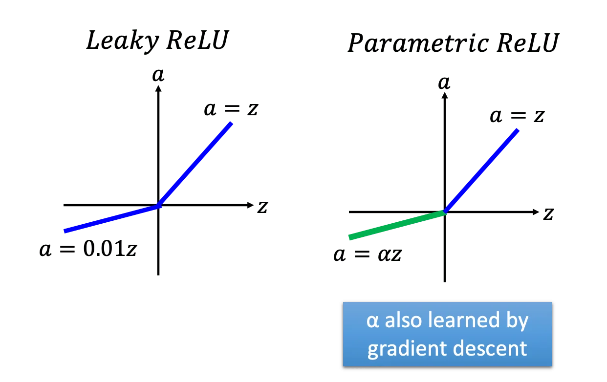
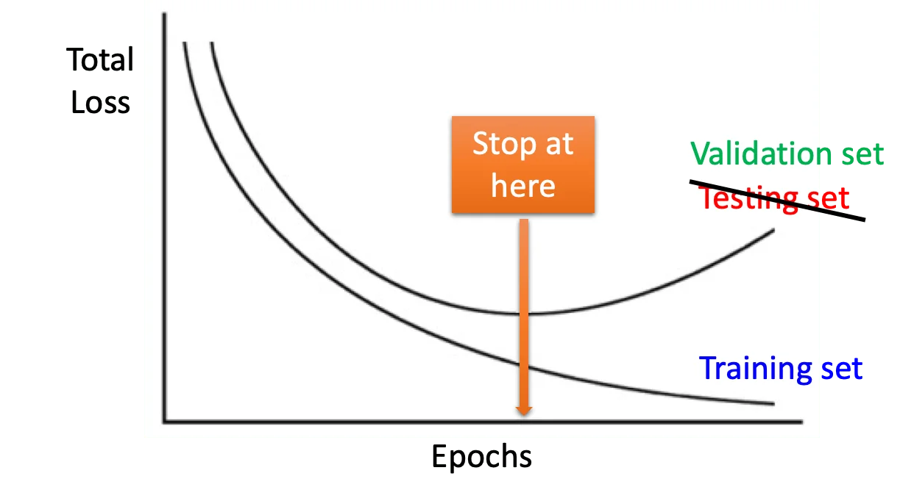
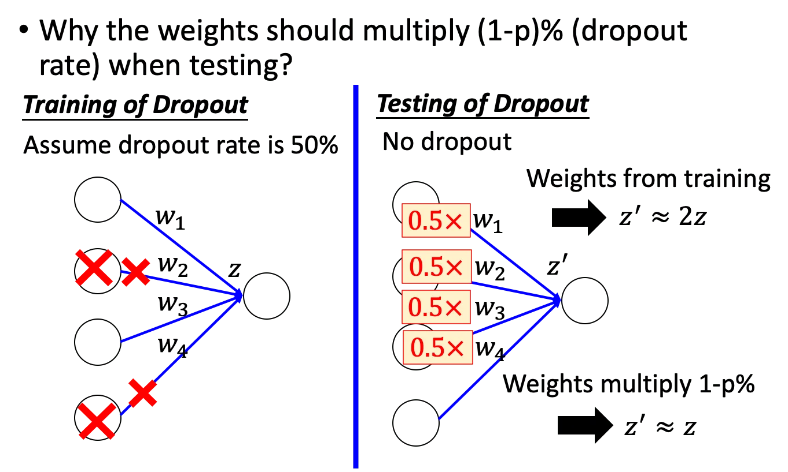

## Recipe of Deep Learning

不要什么都怪给过拟合。如果复杂的模型甚至不如简单的模型在训练集上表现得好，那么这并不是过拟合，而是复杂的模型在优化的时候出了问题。（这个其实也不叫欠拟合，因为欠拟合指的是模型过于简单而无法建模数据。）

对于上述两个 NO 的箭头要使用不同的方法去处理。比如说 Dropout 是一个常见的解决过拟合的方法，那么如果在训练集上的表现都不好的时候，就不应该应用它。

一个简单的例子是，在 MNIST 数据集上（with sigmoid），层数太多的模型表现反而下降了。

这是因为 sigmoid 存在梯度消失的问题：

也就是说，靠近输出的层有很大的梯度，它们在训练的时候很快就收敛了。但是反向传播回前几层的时候，梯度变得很小，所以前几层几乎没有学到任何东西，还是一个随机的状态。而后面的层却在这个随机的基础上收敛了，它的表现自然是比较差的。

下面介绍几个新的激活函数：

## ReLU

ReLU 的好处有：

1. 计算快
2. 生物上的理由
3. 相当于无穷多个 sigmoid 的叠加
4. 可以解决梯度消失问题（因为 ReLU 在第一象限的输出等于输出，它不存在 output 的压缩）

那么 ReLU 会导致整个网络变成线性的吗？其实不会。因为如果输出改变了，那么 ReLU 等于 0 的神经元（可能）也会改变，那么虽然对于某一条路径来说它是线性的，但是当神经元的组合改变以后，整个网络其实就不是原来那个线性函数了，所以总体来说它是非线性的。

另一个问题是，在 z = 0 的地方不可微怎么办呢？—— 答案是 z = 0 的概率是 0，所以一般认为这种情况不会发生。

ReLU 还存在一些其他的变体：

## Maxout

ReLU 其实可以看做是 Maxout 的一个特殊情况。

当然 Maxout 也可以学到其他不同形式的激活函数：

在训练的时候只对 Max 的那条路径做反向传播。

（后面跟优化有关的内容请看 P8 Optimization for DL）

## Early Stopping

我们在训练过程中同时记录 Val set 的 loss，当它不再下降的时候就停止训练。这种方法叫 Early Stopping

## Regularization

用加上正则项的损失函数来做优化。

目的就是希望权重接近 0，让整个模型更平滑。当然也可以用 L1 正则化，但是其实用的比较少，因为得到的解会比较稀疏。另外，求一下导数就可以知道，L2 正则是乘以一个小于 0 到 1 之间的系数让 weight 变小，而 L1 正则则是加减 1. 当权重很大或很小的时候，这个加项反而会导致很小/很大的变化，不够灵活。

## Dropout

每个训练批次随机丢弃一些神经元。很容易理解的是，做 Dropout 会导致训练集上的数据变差。

在测试阶段，是不使用 Dropout 的。并且如果每个神经元的 Dropout rate 是 $p\%$，那么在测试的时候所有的权重都要乘以 $(1-p\%)$

从直觉上来说：Dropout 会使得整个网络变得细长，并且不同的 Dropout 会训练出不同的细长网络。那么在测试阶段，相当于多个细长的网络合起来工作了，那么它们的效果理论上是会变好的。这也是为什么要乘以 $(1-p\%)$，因为多个细长的网络会输出 $\frac{1}{(1-p\%)}$ 倍的结果，这里是把它平均回 1.

它其实相当于是一个 ensemble 的方法：

当然我们实作上不可能用这 $2^M$ 个模型分别计算结果再取平均。不过可以证明，对所有的权重乘以 $(1-p\%)$ 可以得到近似相同的结果。