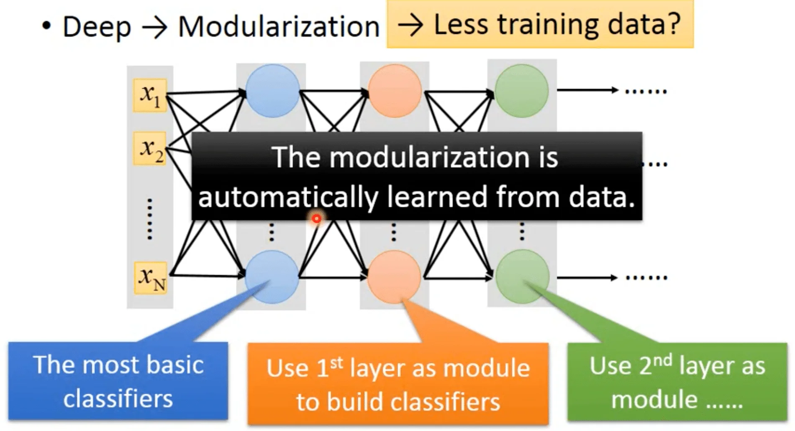

所以为什么是 Deep Learning 而不是 Fat Learning 呢？

实验证明，在参数情况相同的情况下，瘦高的网络比矮胖的网络表现要好。这是因为 Deep 天然表示「模块化」。

比如说，现在要训练一个长短发男女生的分类器。但是长发的男生和短发的女生的图像比较少。这时候可以把任务拆分成训练「长短发的人」和「男女生」的分类器，然后把他们叠加起来：

而 Deep Learning 的每一层其实就是一个 Basic Classifier：

实际上 Deep Learning 就是应该从少量数据里学到泛化的知识，所以它和 Big Data 应该是相反的理念。而且模组化的意义其实就是要高效地使用少量数据。

（这一章基本是概念介绍，没什么要记的）