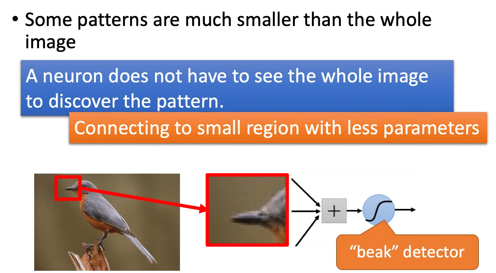
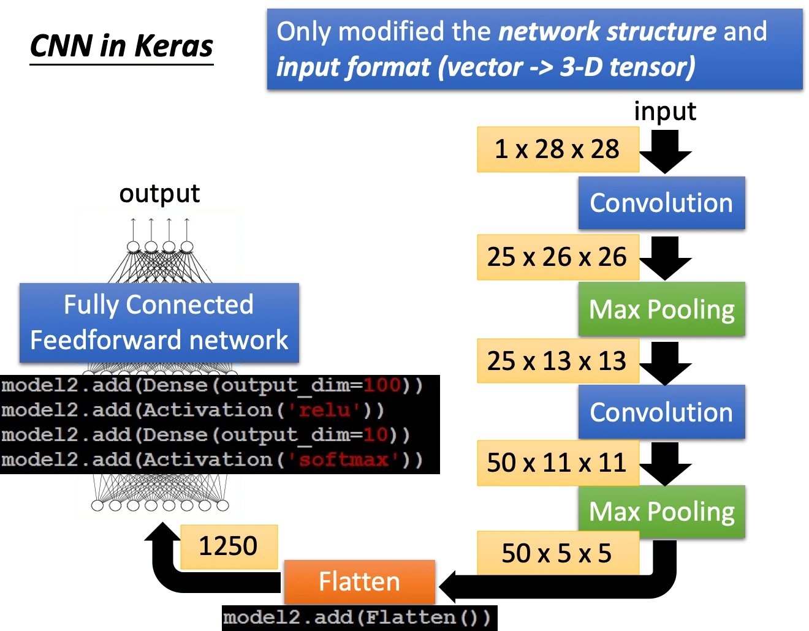

## Why CNN for Image?

一般来说，如果将图像直接送入逻辑回归/线性回归的模型中，会导致整个网络变得很大。那么是否可以通过考虑图像的某些属性，来简化我们的网络？

- 一般来说，「模式」是比图片要小得多的，神经元不需要看到整个图像就能够识别某些「模式」。

  

- 对图片进行下采样不会改变目标本身的特征，而输入图像变小可以使得我们的网络参数减少。

  

一个常见的 CNN 结构是：

输入图像会反复经过 **卷积（Convolution）**和 **池化（Pooling）**，然后 **展平（Flatten）** 后丢到全连接网络里面，得到最后的分类输出。设计这种网络结构是基于三点的考量：

1. 某些「模式」比图像本身要小得多
2. 相同的「模式」会出现在图像的各处
3. 对图像下采样不会改变目标对象

## CNN - Convolution

左图是一个 6x6 的图像输入，右边是两个卷积核：

「卷积核」的想法就是应用了上述**「某些「模式」比图像本身要小得多」**的特性。它相当于一个滑动窗口，在整张图像上滑动计算。而这种计算方法是应用了**「相同的「模式」会出现在图像的各处」**的特性。

我们以第一个卷积核为例，对整张图像做步长为 1 的卷积操作以后得到一个 4x4 的输出：

可以看到这个卷积核的对角线是 1，其他位置是 -1. 那么它做的事情实际上就是「检测对角线」。因此可以看到在原图中，存在对角线的区域其卷积后的值就比较大，反之则比较小。同理，第二个卷积核的第二列为全 1，其他位置为 -1. 因此它检测的就是竖直线。

我们将卷积操作以后的图像称为 **特征图（Feature Map）**，有几个卷积核，就会有几个特征图。

上图只考虑了单通道图像的情况，其对应的卷积核也是一个二维的矩阵。如果图像是多通道的，那么相应的，每个卷积核也要是多通道的，也就是三维的：

那么卷积操作和全连接有什么联系呢？实际上 **卷积就是拿掉了某些 weight 的全连接**。并且这些 Partly Connected 的神经元是共享参数的。因此我们说卷积操作可以减少参数量：

## CNN - Max Pooling

池化其实就是一个降采样的过程。比如我们采用 2x2 的 **最大池化（Max Pooling）**，就是在 2x2 的区域内取最大的值保留下来，丢弃其他的值。这样可以进一步缩小图像，但是保留了信号最强的那些值。

反复执行卷积和池化操作，我们就可以得到一个很小的 Feature Map. 它的通道数就是最后一层的卷积核的个数。

## CNN - Flatten

其实就是把 Feature Map 展平，这样才能送入全连接层。

那么一个简单的 CNN 结构如下。黄色方框内的是当前的 Feature Map 的维度（C, H, W），最后经过 Flatten 展平成一维。

## What does machine learn?

一个可行的做法是，在训练数据中找到一张 $x$ ，使得某一层 Feature Map 的所有值之和最大。然后再观察这个 Feature Map 的样子。这样可以观察每个 filter 到底学到了什么。这里是以 MNIST 为例：

这里可以看到，第二层的卷积学到的是不同角度的线条的特征。

那么在 Flatten 之后送入全连接层，这个全连接层又学到了什么？我们如法炮制，对某个神经元找使其输出最大的 Feature Map：

一个直觉是，在输出层，对应的图像看起来就应该像一个数字。但是实际上并不是这样的：

也就是说，神经网络学到的东西和人类的直觉并不完全是一致的。不过我们可以给它加一个正则项来约束我们找到的 Feature Map. 比如说，对于手写数字图像（黑底白字），大部分区域应该是黑色的（值 = 0），而有笔划的区域是白色（值 = 255）。那么我们希望找到的图像里白色的部分尽可能少，黑色的部分尽可能多，也就是对整张图像的像素值做累加以后，值越小越好。那么我们可以写出如下的最大化：

可以看到右图中，我们在找最大激活值的同时，希望图像中的白色部分尽可能地少。可以看到对应 0，6，8 的地方看起来已经很像是数字了。

其实这个想法就是 **Deep Dream** 的原理：

Deep Dream 的做法是强化某个神经元的正输出，弱化其负输出，然后得到一张新的图像：

另一个应用是 Deep Style，也就是风格迁移：

也就是，我们用一个 CNN 输出原图的内容，输出风格图的 Style，用另一个 CNN 同时拟合两者，就可以找到一张风格像风格图，内容像原图的图像。

也可以用 CNN 来下围棋：

要注意的是 Alpha GO 没有有池化。这也很好理解，否则 Pattern 就会被池化掉而消失了。：

## More Application

