## Example Application

### Slot Filling

当然可以用一个 FNN 来解决这个问题：

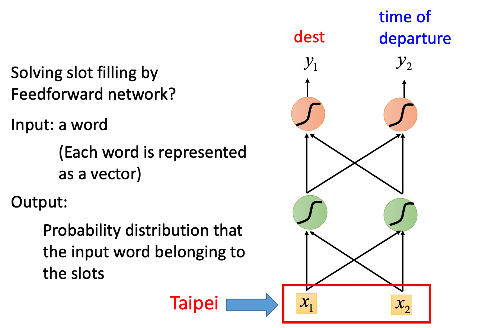

输入是表示单词的向量，输出是单词属于这个 slot 的概率分布。

那么首先就是要把一个 word 表示成向量的形式。这一步有很多种做法，常见的比如 1-of-N encoding:

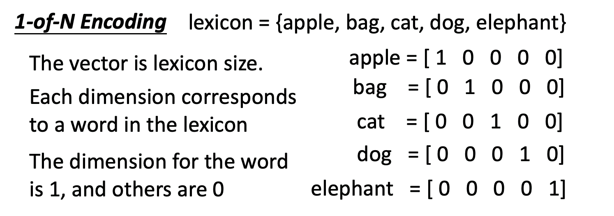

但是这个做法会有一点问题，比如它不能编码我们没有见过的单词。有两种做法可以解决这个问题。第一个是在编码里加一个 "other"，把所有没见过的单词都归到这一类里。另一种方法是做 word hashing：

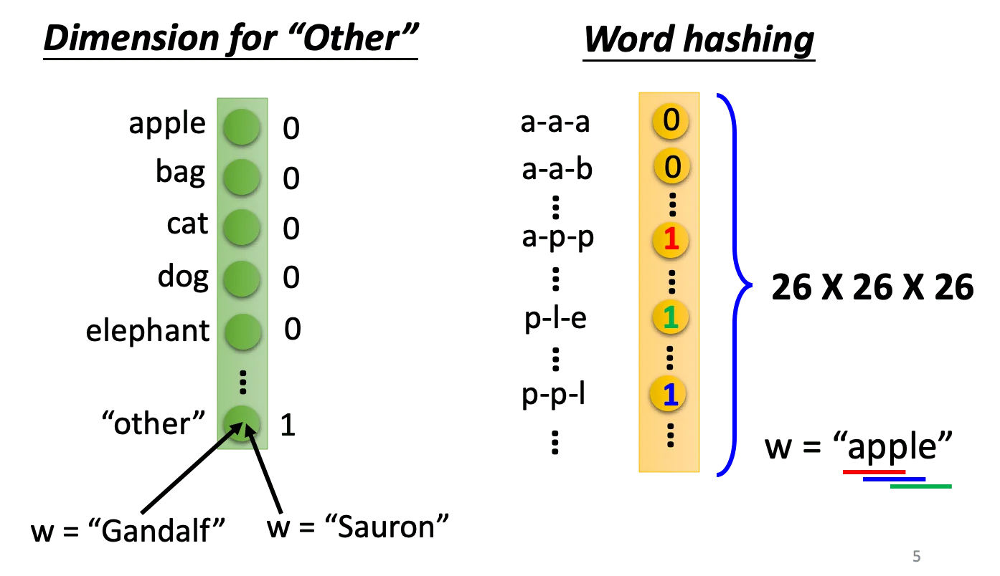

但是 FNN 的问题是，对于同样的输入，它的输出应该是相同的。那么对于以下的情况，FNN 只能对 Taipei 输出 dest 和 place of departure 的其中一者。

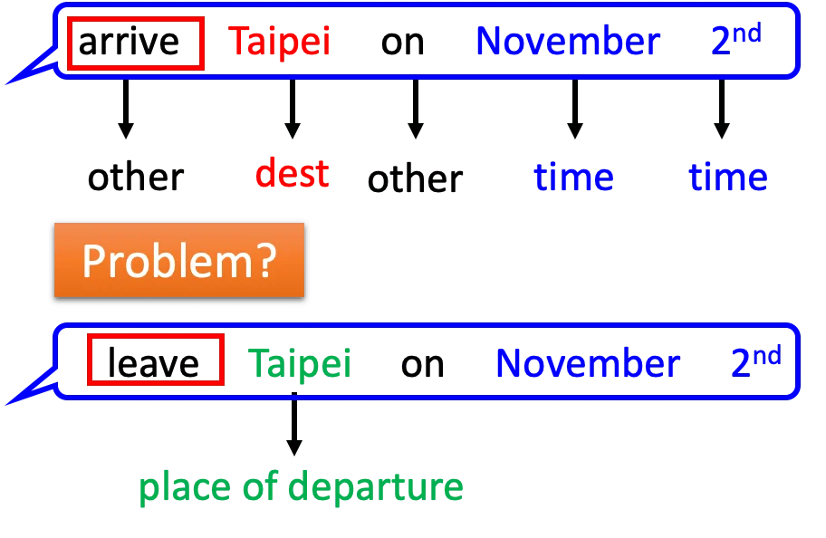

因此，神经网络需要有「记忆」。我们希望神经网络能够根据上下文（arrive/leave）来解决问题。因此我们引入记忆单元，也就是 hidden state：

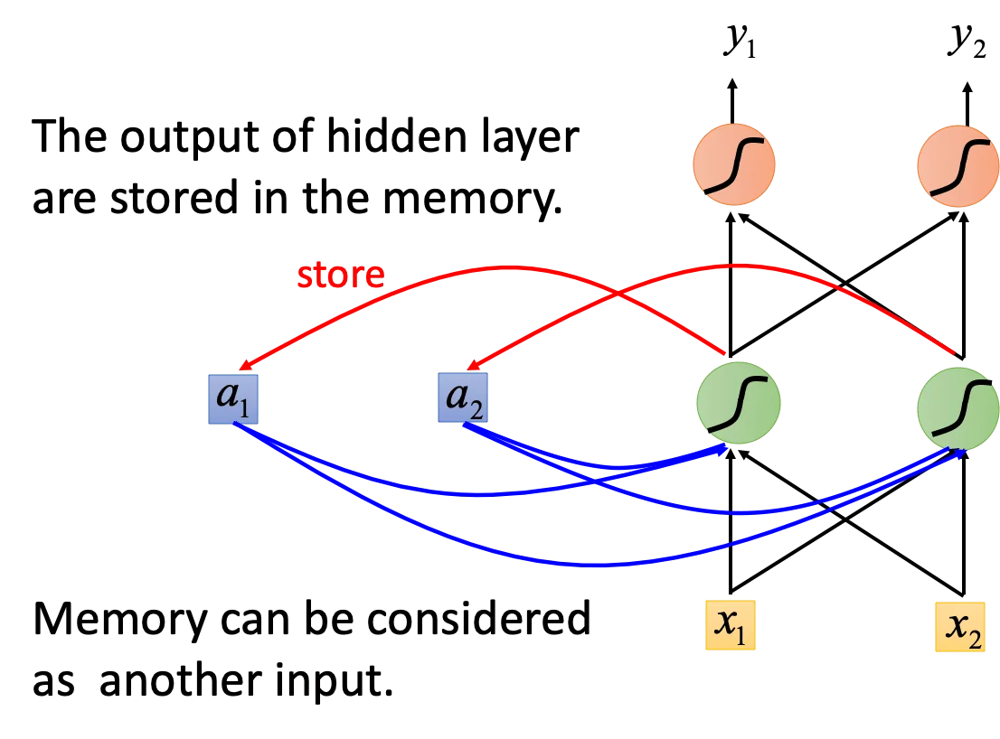

> 这里略过一个计算例子。结论是 RNN 会考虑输入序列的顺序。并且即使是相同的输入，如果他们出现在 RNN 中的位置不一样，那么得到的结果也是不一样的。

那么上面的问题可以建模成：

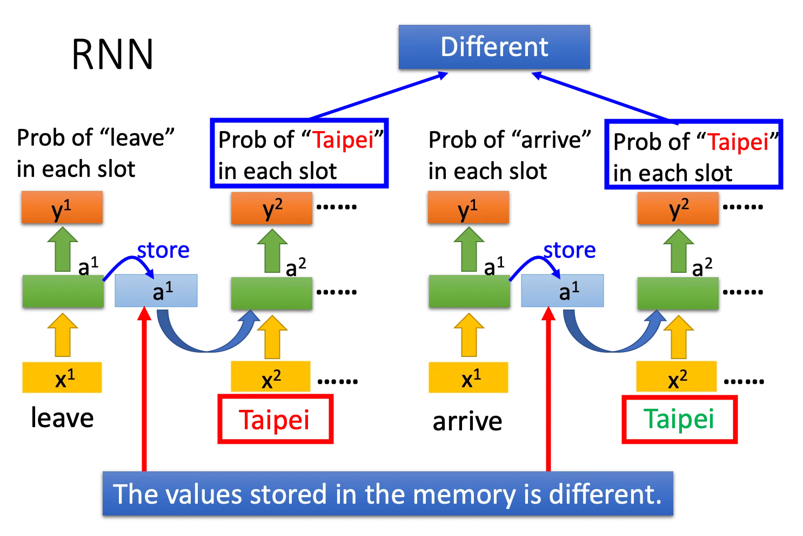

注意网络是复用的，并不是说每个时间片用不同的网络。当然这个网络本身也可以是 deep 的，不一定是只有一个 hidden layer.

RNN 有两种做法。一种是上述的 Elman Network，在时间轴上传递 hidden state. 另一种是把上一时刻的输出作为下一个时刻的 hidden state.

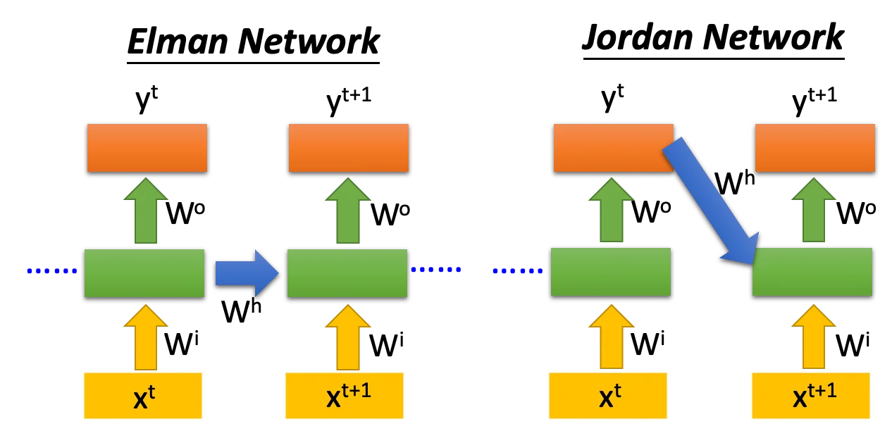

### Bidirectional RNN

我们可以同时训练正反向的两个 RNN，然后整合同一个位置的输出，送进 output layer 得到最终的输出。这样的好处是，它在时间上的感受野可以比较大：

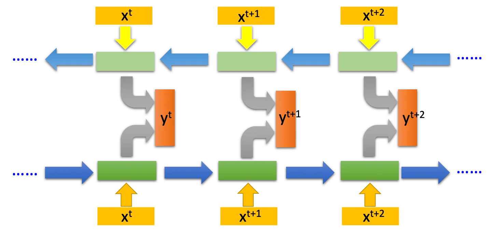

## LSTM

Long Short-term Memory（LSTM）是现在比较常用的 RNN 形式。它用三个门控 Input gate, output gate 和 forget gate 来控制数据的传递。

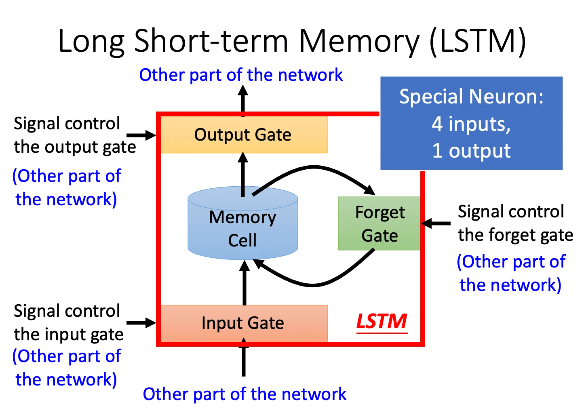

整个网络分别由 4 个输入（1 个数据流输入和 3 个门控信号输入）和一个输出组成。把这个网络详细展开来：

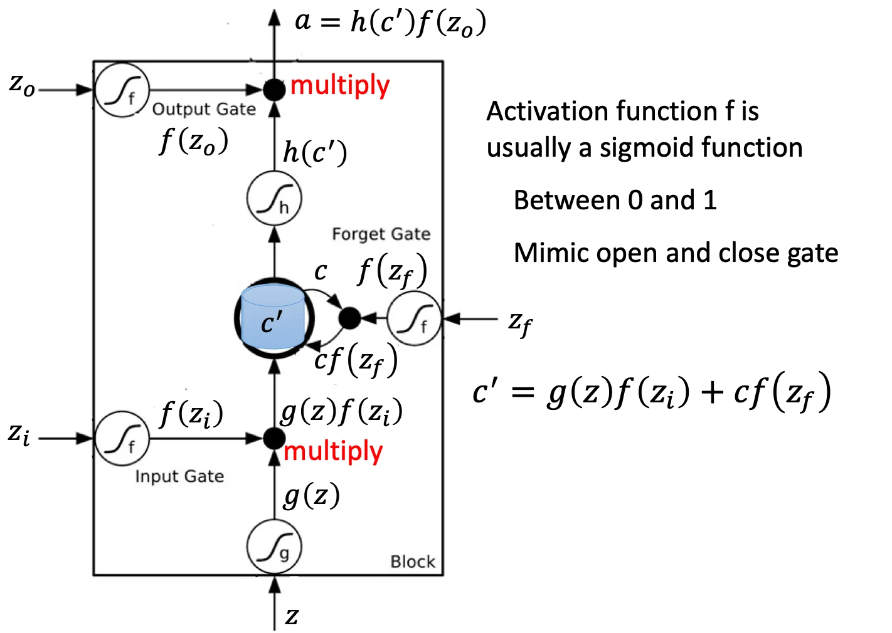

其中三个门控信号的输入都是 scalar，激活函数一般是 sigmoid，其输出代表这个门控打开的程度。

实际上，LSTM 展开来应该是下图这样的：

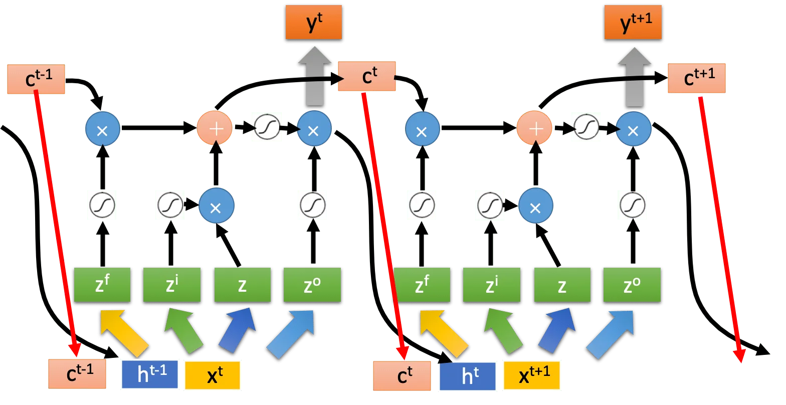

每个时间片上的输入 $x^t$、上一时刻的 hidden state $h^{t-1}$ 和 memory $c^{t-1}$ 同时用于控制三个门控的输入。

这里提了一下 GRU 其实就是简化的 LSTM，少了一个门控，但是 performance 差不多。

## Learning Target

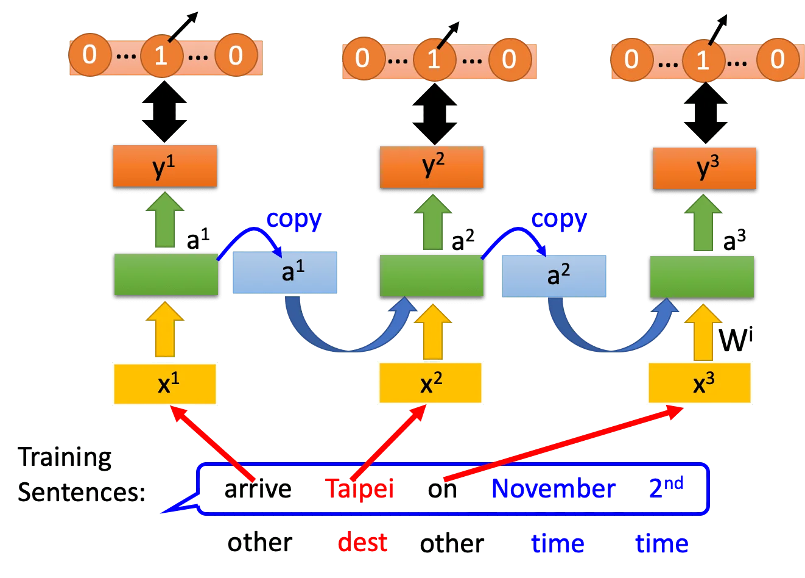

RNN 也是用 BP 来训练的（称为 BPTT），但是它的 error surface 要么就很陡峭，要么就很平缓。这就会导致下图的情况，在做参数更新的时候可能就一脚踩到高位，或者直接就飞出去了。一个简单的方法是梯度裁剪（Clipping），也就是手动限制梯度的最大值，如果超过这个值，就做裁剪。

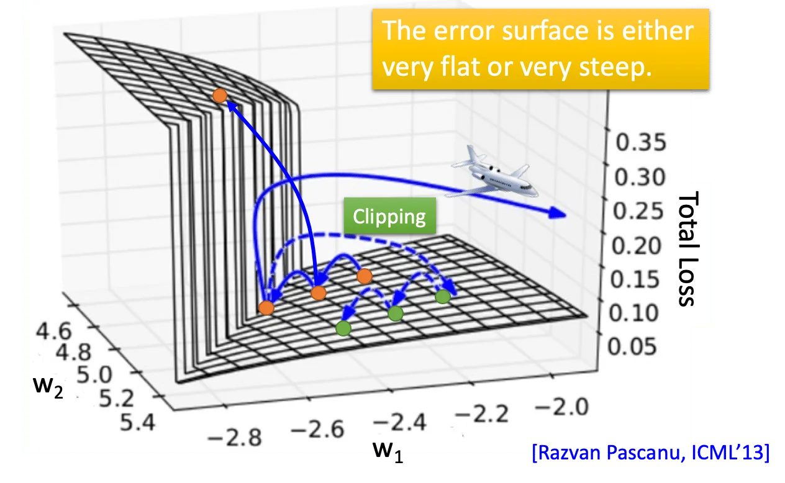

造成上面这种情况的一个原因是，当我们的参数维度很高的时候，由于这个时间维度的存在，小于 1 的权重的输出会被剧烈放大，而小于 1 的权重的输出会被压缩到 0。

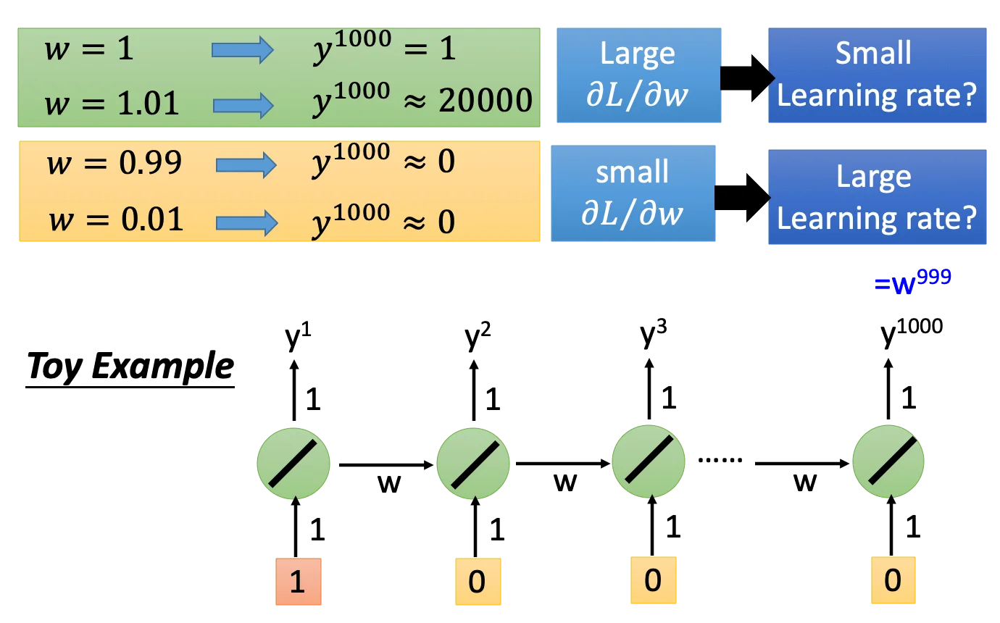

LSTM 可以解决梯度消失的问题（但不能解决梯度爆炸），因此在用 LSTM 的时候可以把 LR 设置得小一点。

一个简单的解释是，LSTM 的遗忘门控允许旧的信息留存在 memory 中直到它被洗掉，这边相当于一个动量的概念（其实也不算），但是普通的 RNN 会在每次更新后直接覆盖 memory. 也就是说 LSTM 把这个覆盖操作改成了一个历史结果和当前结果的加权和，从而保留了参数的低阶项（高阶项就接近 0 了），也就缓解了梯度消失问题。这里有一个无端联想，如果 forget gate 是完全打开的情况下，它和 resnet 的 skip connection 是很像的。因为 LSTM 本身有三个门控，需要的参数量比较大。GRU 只有两个门控，因此相比 LSTM 比较不容易过拟合。

GRU 的做法就是把 input gate 和 forget gate 联动，如果 input gate 打开，forget gate 就关闭，也就是旧的不去，新的不来。

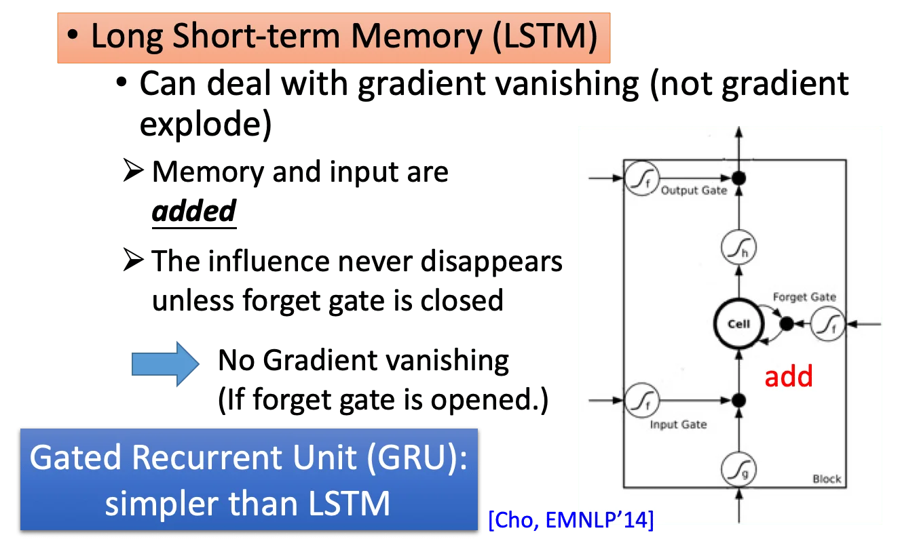

## Many to One

上面说到的例子是输出和输入序列等长的情况，RNN 也可以处理长序列输入，单个输出的情况。比如句子的情绪分析、文章的关键词提取、语音识别等。不过语音识别会出现一个问题，因为语音序列不好做分词，它的输入一般是直接切片的。这就会导致每一小段可能会映射到一个字上，那输出可能就会变成「好好好棒棒棒棒」。

一个简单的处理方式是直接做 trimming，把重复的字删掉，但是这样就不能处理叠词的情况，比如「好棒」和「好棒棒」是完全相反的意思，但是 trimming 会把两者都处理成「好棒」。

有另一种处理这个问题的方法是 Connectionist Temporal Classification (CTC)。它的做法是在输出的 target 中加入一项 NULL，因此输出就会变成：

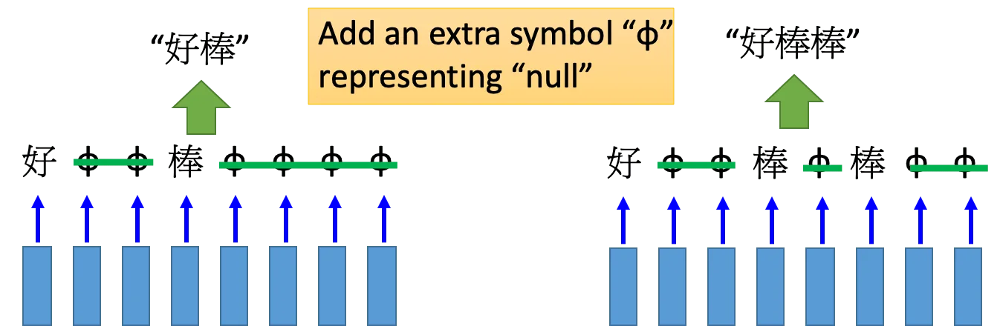

那这种方法要怎么训练呢？最朴素的办法是穷举。假设上面这个例子，一段声音讯号的 target 是好棒，我们就在不同的地方插空放进 NULL，然后把所有的情况都当成是正例来训练。当然也有方法可以减少穷举项，这里就不介绍了。

## Many to Many

同样的，RNN 也可以处理输入输出都是序列，但两者不等长的情况。比如机器翻译。不过要在什么时候停下来呢？可以在 output target 里面加一个停止符，输出停止符的时候就结束。

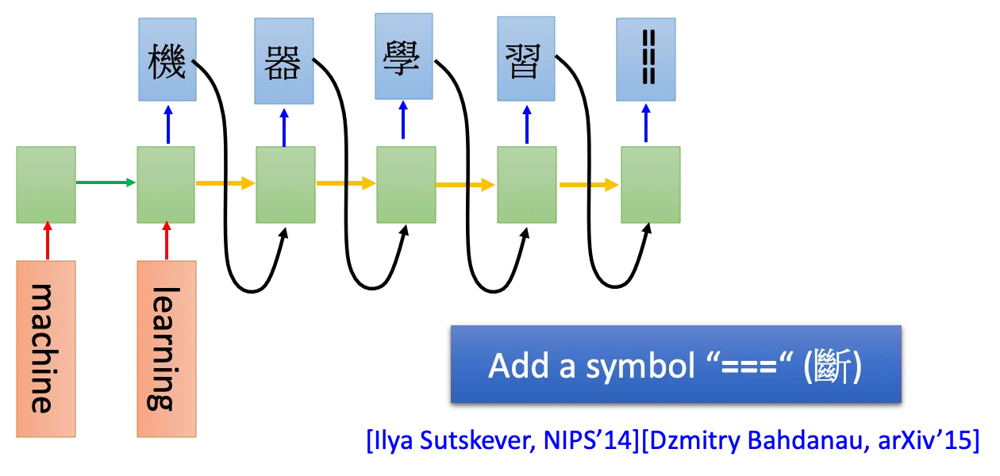

还可以做语音翻译，比如输出一段英文的声音讯号，直接 output 中文的文字结果。

还有 syntactic parsing，输入一段文字，输出语义分析树。

### Seq-2-seq auto-encoder

传统的词袋模型有个问题是会忽略文本的顺序。RNN 可以用来做考虑文本顺序的 encoder. 做法就是 train 一个 encoder，把文本变成因变量，然后用 decoder 把因变量重新展开成原始的文本。这样 train 出来的 encoder 就可以用来做文本编码。如果用 skip-thought 的技术可以用当前句子推断之前或之后的句子。

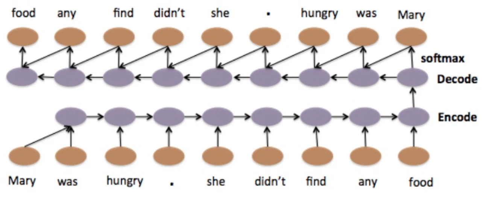

这种结构可以是层次化的，先用句子中词的 embedding 得到一个句子的 embedding，然后在 decoder 阶段把句子的 embedding 展开成词的 embedding，再去做推断。

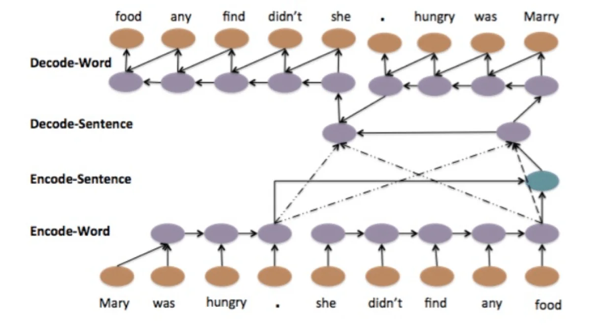

在语音领域，也可以用 auto encoder 来做语音片段到向量的映射，并且这个映射的结果是根据发音的相似程度聚类的。

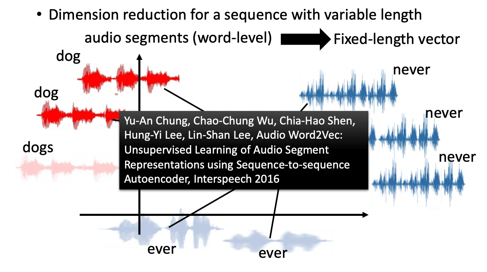

一个应用是语音查询。给定一段离线的声音数据库，把它们向量化以后保存。查询的时候输入一段向量化的声音序列，和数据库中的向量做相似度计算，就可以找到包含对应语音内容的片段。哼歌识别其实也是这样的。

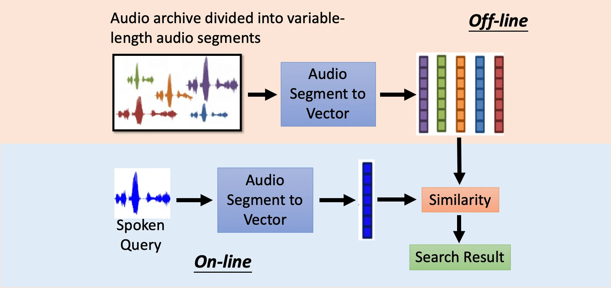

## Attention-based Model

基于注意力机制的模型是这样的：

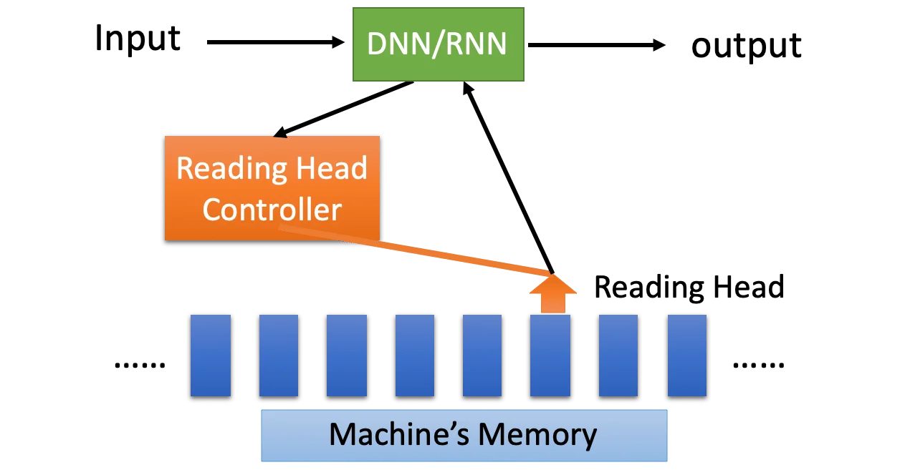

给定一段 Input，由一个 DNN 或者 RNN 输出一个读头控制，然后从 memory 中提取相应的记忆，再经过一个 DNN/RNN 得到对应的输出。

另一个版本也就是神经图灵机（NTM），它额外控制一个 write head 来更新 memory：

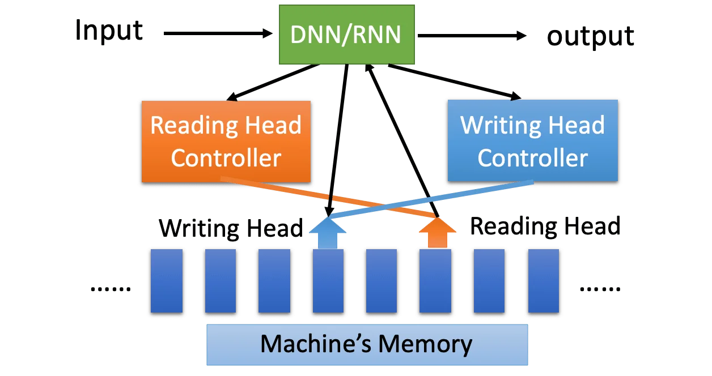

基于注意力机制的模型经常用于阅读理解。先把文档经过语义分析生成一些向量作为数据库，然后用 query 在这个数据库中查询，输出最匹配的内容。也可以用来做 VQA. 做法是先用 CNN 把图像抽取成 region vector，然后用 input query 去匹配图像的 vector 得到最后的输出。当然也可以做 SQA（Speech QA），原理是类似的。

