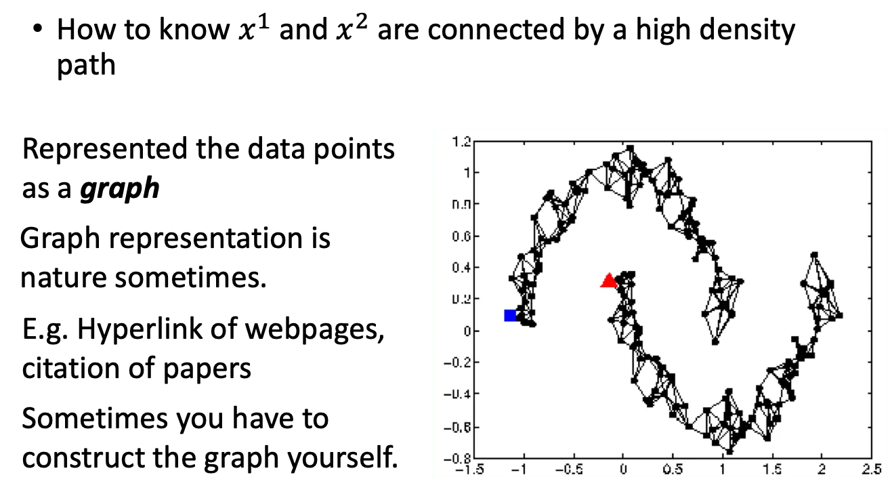

## Introduction

- 监督学习：$\{(x^r, \hat{y}^r)\}^R_{r=1}$

  比如说 $x^r$ 是图像，$\hat{y}^r$ 是类别标签

- Semi-Supervised Learning: $\{(x^r, \hat{y}^r)\}^R_{r=1}, \{x^u\}^{R+U}_{u=R}$

  也就是除了有标签数据之外，还有一组数量为 $U$ 的无标签数据，并且一般来说 $U$ 远大于 $R$，即无标签数据远多于有标签数据。

半监督学习可以分为两种，也就是 P18 里提过的 Transductive 和 Inductive Learning. 前者一般称为直推式，而后者叫归纳式。

两者的区别在于，测试阶段的时候，**训练集中的无标签数据** 就是 Transductive Learning 的测试数据。而 Inductive Learning 使用不属于训练集的其他 **有标签数据** 作为测试集。

那么为什么要做半监督学习？原因是，训练数据并不难获取，但是 **有标签的** 训练数据是比较难大量取得的。并且，人类在生活中其实也一直在做半监督学习（物体识别）。而且，无标签的数据是可以提供一些信息的，比如说数据分布。下图的猫狗分类中，如果我们用有标签数据，可能会得到一个垂直的边界，但是引入无标签数据的话，我们可能会得到一个有斜率的边界。

## Semi-Supervised Learning for Generative Model

先回顾一下监督学习中的生成模型：

- 给定有标签的训练数据 $x^r \in C_1, C_2$
  - 寻找最有可能的先验分布 $P(C_i)$ 和取决于类别的条件概率分布 $P(x|C_i)$
  - $P(x|C_i)$ 是一个参数为 $\mu^i$ 和 $\Sigma$ 的高斯分布（共享了协方差矩阵）

当我们有了 $P(C_1), P(C_2), \mu^1, \mu^2, \Sigma$，就可以用贝叶斯公式计算后验概率：
$$
P(C_1|x) = \frac{P(x|C_1)P(C_1)}{P(x|C_1)P(C_1) + P(x|C_2)P(C_2)}
$$

但是有标签数据估算出来的均值和协方差不一定能反应真实的分布，比如引入无标签数据后：

因此，无标签数据可以帮助我们重新估计 $P(C_1), P(C_2), \mu^1, \mu^2, \Sigma$，进而影响决策边界。

下面简单描述一下无监督的生成模型的训练步骤：

1. 初始化参数 $\theta = \{ P(C_1), P(C_2), \mu^1, \mu^2, \Sigma \} $，这个参数可以是随机初始化，也可以是从有标签数据中获得的。注意初始化参数对结果有一定的影响，但是一般来说这个模型一定是会收敛的。

2. 计算无标签数据的后验分布：$P_\theta (C_1|x^u)$

3. 更新模型：
   $$
   P(C_1) = \frac{N_1 + \sum_{x^u} P(C_1|x^u)}{N} \\
   \mu^1 = \frac{1}{N_1}\sum_{x^r\in C_1}x^r + \frac{1}{\sum_{x^u} P(C_1|x^u)} \sum_{x^u} P(C_1|x^u)x^u
   $$
   其中 $N$ 是总样本数，$N_1$ 是标签为类别 1 的样本数。（因为这个公式很直觉所以不解释了多看看就明白）用同样的方法可以更新其他的参数，然后回到第二步。重复上述更新过程直到收敛。

实际上上述过程就是一个 EM algorithm. 第二步是 Estimation，第三步是 Maximization.

那么为什么这个做法是可行的？我们仍然对比监督学习的做法：

- 监督学习中的极大似然估计是有闭式解的：
  $$
  log L(\theta) = \sum_{x^r} log P_\theta (x^r, \hat{y}^r)
  $$

- 无监督学习引入了无标签数据后，要先用全概率公式来算先验分布，因为无标签数据可能属于任何一个类别。而这会导致这个极大似然不是 Convex 的，因此只能用迭代的方式去计算它。
  $$
  log L(\theta) = \sum_{x^r} log P_\theta (x^r, \hat{y}^r) + \sum_{x^u}log P_\theta (x^u) \\
  
  P_\theta(x^u) = P_\theta (x^u|C_1)P(C_1) + P_\theta(x^u|C_2)P(C_2)
  $$

## Low-density Separation

核心思想是「非黑即白」。

这个 Setting 是说，两个类别之间一定会有一个低密度区域，而决策平面就在这个区域分割不同的类别。那么每一个样本一定是非黑即白的，它不可能是依概率属于不同的类别（也就是样本一定是硬标签）。

一个最简单的实现就是 Self-training

### Self-training

- 给定有标签数据和无标签数据 $\{(x^r, \hat{y}^r)\}^R_{r=1}, \{x^u\}^{R+U}_{u=R}$
- 重复以下步骤：
  - 用有标签数据训练模型 $f^*$
  - 用模型 $f^*$ 标注无标签数据，得到 $\{(x^u, y^u)\}^{R+U}_{u=R}$，也就是打伪标签（psuedo-label）
  - 把一部分有伪标签的无标签数据作为有标签数据，进入下一轮训练。至于如何选取这些加入训练的数据的方法不是固定的，训练的时候还可以给这些数据加上比较小的权重，让有标签数据仍然占主要影响。

注意这个方法不适用于回归。因为回归输出的是实数，因此打上标签的新数据再丢进回归模型，它输出的值并不会有变化，也就不会对模型产生任何影响。

这个方法和上面提到的，用于生成模型的半监督学习是很类似的。区别在于，self-training 用的是 hard label，我们给无标签数据赋予类别后，让它们进入训练数据重新训练。而生成模型中，我们是用 soft label，也就是对于一笔无标签数据，我们仍假定它有可能从所有的类别中采样，所以是用全概率公式计算的先验。那么神经网络中要用硬标签还是软标签呢？答案是 **硬标签**。

这是因为，如果我们使用软标签，给一笔数据 assign 一个 softmax 的分布（硬标签相当于 one-hot label），那么将这笔数据用于训练将不会给模型带来新的增益，因为不管有没有这笔新数据，它预测出来的结果都会是同一个 softmax.

### Entropy-based Regularization

Self-training 有一个进阶的版本让我们仍然可以使用 soft label，就是引入 Entropy，用来评估模型输出的分布 $y^u$ 是不是足够好（足够有区分度）。

对于某个输出的分布，它的 Entropy 就是对应不同类别的输出与其 log 相乘后求和再取负。对于前两种分布差异很明显的情况，他们的熵就是 0. 而对于均匀分布的情况，它的熵就会比较大。由此我们可以重新设计 Loss Function. 对于有标签数据，我们仍然用硬标签来计算距离或者交叉熵，对于无标签数据，我们希望尽可能地最小化输出分布的熵，也就是我们希望模型对样本的输出的区分度尽可能大。

因为新加上去的这一个熵的和项，它做的事情很像是正则化，因此我们称之为 Entropy-based Regularization.

### Semi-Supervised SVM

核心思想就是穷举无标签数据的可能情况。

## Smoothness Assumption

核心思想是 「近朱者赤近墨者黑」（You are known by the company you keep.）

我们假设，相似的输入应该会有相似的输出。这里「相似」的定义是：两组数据在高密度区域是相近的。比如下图的 $x^1, x^2$ 通过一组高密度区域相连，因而他们的输出相似。而 $x^3$ 和两者之间都隔着一组低密度区域，所以他们的输出是不相似的。

举个例子。比如下面最右边的 2 和 3 其实只看像素的话是比较接近的。而最左边的 2 和最右边的 2 是不太像的。但是在 data 里面可以找到很多数据，这些数据可以在形态上将两者相连，所以二者实际上是相似的。而右边的 2 和 3 之间就无法从数据中找到过渡形态，因此他们实际上是不相近的。

而人脸也是，我们可以从左脸到右脸之间找到一些过渡的形态，从而判定两者是同一张人脸。

另一个例子是文档分类。一个简单的做法是计算两个文档出现的词汇的重复程度。但是有可能两篇主题类似的文档在措辞上有很大的不同，就会导致相同的单词出现次数并不多。但是如果我们能够搜集到足够多的 data，通过文档间相似度的不断传播，就有可能归类出两篇措辞不同，但是内容相同的文章。

### Cluster and then Label

一个简单的实现方法称为 cluster and then label. 顾名思义就是先聚类再打标签。然后用这些「有标签」数据进行训练。

这种方法并不能保证效果会好，不过实现起来很简单。这里不展开了。

### Graph-based Approach

也就是通过图将数据联系起来，从而判别两个点是否在高密度区域是相连的。有时候数据的图结构是很自然的，比如网页超链接、论文引用就可以表示为图连接的形式。

如果要自己构造数据的图结构，其做法一般是启发式的。这里给出一种方法：

1. 定义 $x^i$ 和 $x^u$ 之间的相似度 $s(x^i, x^j)$。（一般用 auto-encoder 得到的 feature 来计算效果会好一点）

2. 加边。比较常见的做法有 K 近邻（最近的 K 个节点是邻居）或者 $\epsilon$ 近邻（半径在 $\epsilon$ 内的节点都是邻居）

   

3. 边的权重和相似度 $s$ 是正相关的。一个常见的相似度函数是径向基（Gaussian Radial Basis Function）：
   $$
   s(x^i,x^j)=exp(-\gamma ||x^i - x^j||^2)
   $$
   用指数函数的原因是，我们希望只有真的很靠近的点它们的相似度才比较小（离得远的话这个距离会被指数函数放大）。也就是说，用指数函数可以缓解 跨密度区域 的两个点被连起来的可能性。

Graph-based 方法的优点在于，有标签的数据的影响会随着边传递。右下角的图显示，如果我们收集足够多的 data，那么标签就可以顺利地传递到大部分的数据中。否则，如果我们的数据不够多或者不够 general，这个传递的过程就可能会断开，影响到我们的训练。

上面讲了定性的做法，接下来要说一下如何定量地使用 Graph-based Approach.

首先定义图中的标签的 smoothness：
$$
S = \frac{1}{2}\sum_{i,j}w_{i,j}(y^i-y^j)^2 = \bold{y}^TL\bold{y} \\
\bold{y} = [...y^i...y^j...]^T \\
L = D - W
$$
其中 $\bold{y}$ 是一个 $R+U$ 维的向量，表示有标签和无标签数据的 label（无标签的就是伪 label）组成的向量。

$L$ 是 graph laplacian，也就是 Degree 矩阵减去邻接（权重）矩阵。具体看 P18 GNN 的部分。

其实 $D$ 就等于 $W$ 每行的和放在对角线。

这一步对所有的数据（包括有标签和无标签）都要做。值越小图就越平滑。所以上图中，左边的图是更平滑的。（直觉上来说，左边的三角形中的三个数据标签都一致，而右边的图的三角形中存在标签不一致的情况，所以左边的图是更平滑的）

由于这个平滑度是取决于模型参数的，因此我们在训练的时候要在 Loss 里面加入这个平滑度作为正则项使用：
$$
L = \sum_{x^r} C(y^r,\hat{y}^r) + \lambda S
$$
也就是说，我们不仅要考虑有标签数据中的 GT 和预测标签的相似程度，还要考虑这个模型对所有数据（包括无标签）的预测标签的平滑程度。当然这个平滑度不一定要加在最后的 Loss Layer，也可以把它放在中间层，如果中间层是平滑的，我们也认为输出层是平滑的。

## Better Representation

核心思想是「去芜存菁，化繁为简。」

我们希望能从观察中找到真正有影响力的隐变量（Laten Factors），这些隐变量通常就是一个更好的 representation. 这个部分在无监督学习中会继续讲。

这里提到了一个神雕侠侣的例子，简单说就是杨过要剪一个老头的胡子，虽然胡子是千变万化的，但是老头的动作是比较少的，所以只要看透了老头的动作，胡子的运动就比较好预测。所以胡子的动作是 Observation，而老头的动作是 Laten Factor.