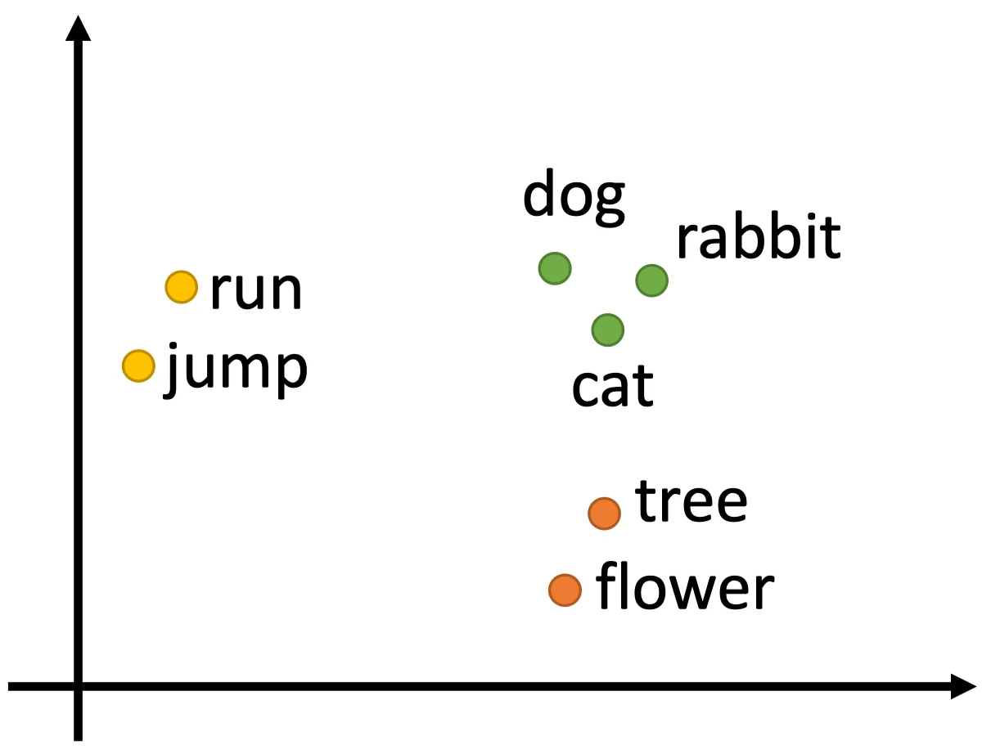
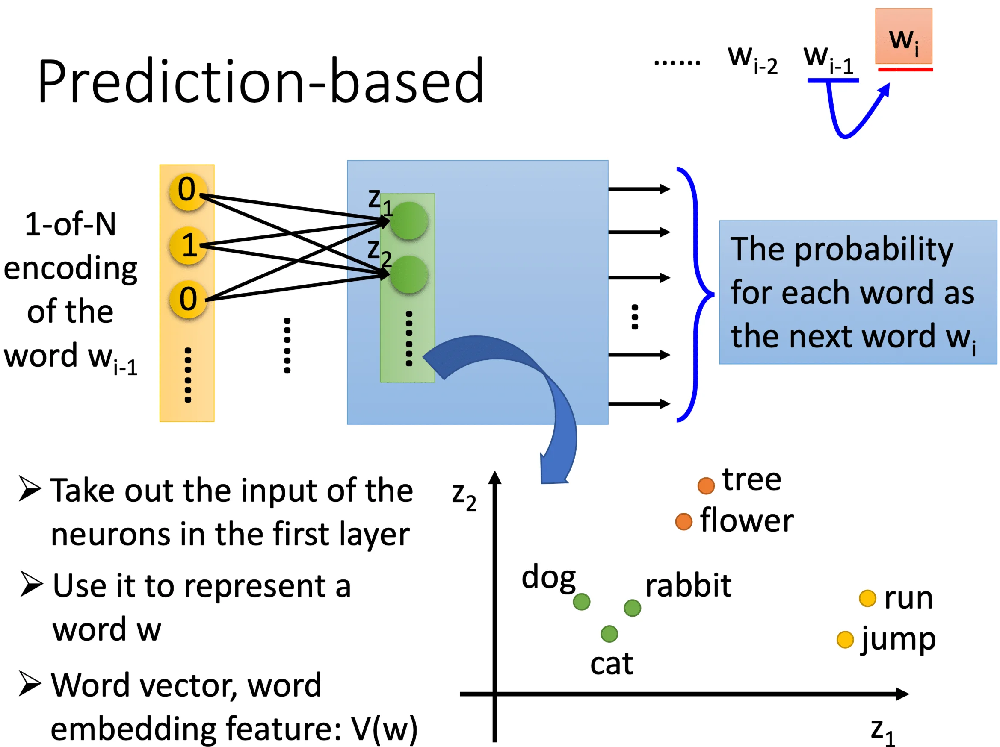
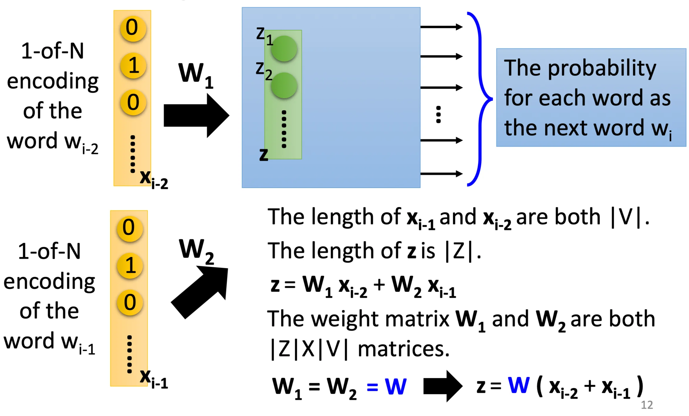
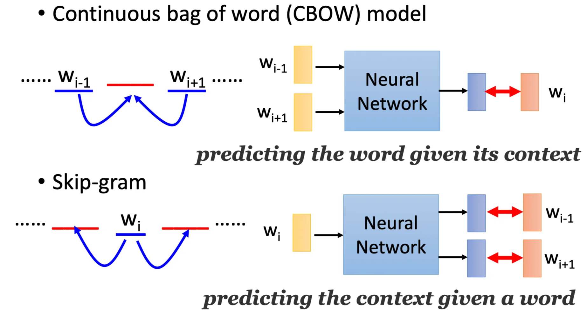
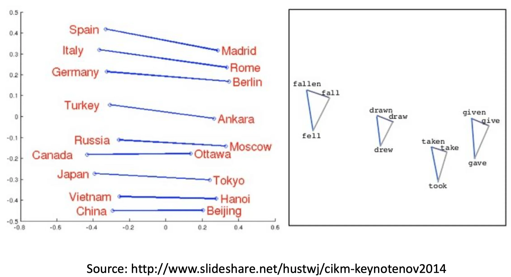
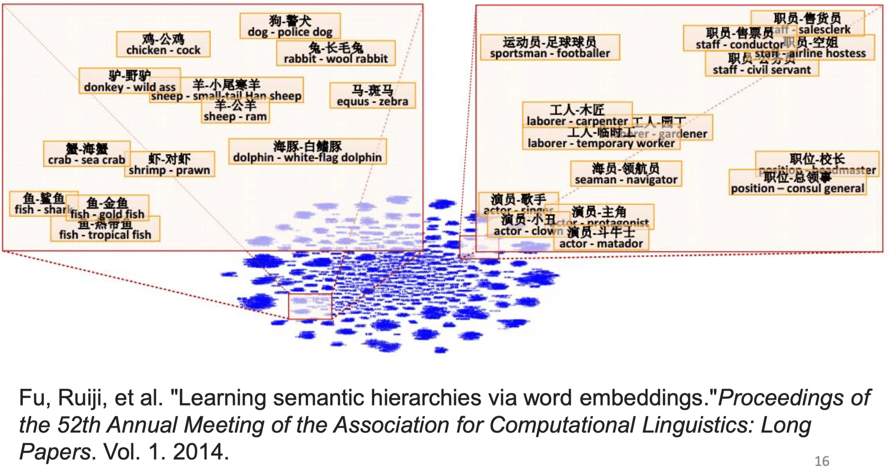

> 看本节前可以先看 P56~58 节

词嵌入（Word Embedding）是向量降维（Dimension reduction）一个很常用的方法。最常见的做法是 1-of-N encoding 

```
apple = [1 0 0 0 0]
bag   = [0 1 0 0 0]
cat   = [0 0 1 0 0]
dog   = [0 0 0 1 0]
elephant = [0 0 0 0 1]
```

但是这个方法有很明显的问题，就是这种编码无法表示两种类别的相似程度。比如 cat 和 dog 都是动物这件事就看不出来。所以有另一种做法叫 word class。简单说就是把同类的物体聚类（Cluster），再用这个聚类的类别去表示它们。

```
class1: dog, cat, bird
class2: ran, jumped, walk
class3: flower, tree, apple
```

但是这个方法还是有问题。比如 class1 是动物而 class3 是植物、class2 是 class1 可以执行的动作而 class3 不行，等等这一些知识还是无法表示。所以我们需要用 Word Embedding，也就是把每个单词投射到一个高维的语义空间中：



相比 1-of-N encoding 有几个单词就需要多少的维度，word embedding 的维度一般是比较少的。我们希望一个好的 word embedding 在语义空间中的聚类关系和位置关系能够反映物体的某些信息。比如上图中，我们认为横轴可能表示的是名词和动词之间的区分，而纵轴表示的是可动和不可动词汇的区分，而聚类则表示对应词汇的大类关系。

那么 Word Embedding 要怎么做？一般来说这是一个无监督（Unsupervised）的学习过程。我们希望机器可以通过阅读大量的文章来得到一个良好的词嵌入模型，但我们并没有对应的词嵌入向量的标签。这里会很直觉地想到使用 auto-encoder，但实际上是不行的。因为找不到一个适用于 auto-encoder 的良好的输入格式。如果使用 1-of-N encoding 作为 auto-encoder 的输入，它很难得到一个好的结果。（这里我没听懂，因为下面的 prediction based 看起来也是 auto-encoder 的样子）

一个切入点是，单词之间虽然不一定能直接看出联系，但是文章是有上下文结构的。我们可以通过结构相似的文章或者句子来推断两个具有相同成分的单词是类似的。

## How to exploit the context?

有两种方法可以做上下文分析：

1. Count Based

   如果 $w_i$ 和 $w_j$ 频繁地共同出现，那么 $V(w_i)$ 和 $V(w_j)$ 应该是相似的。

   一个典型的做法是 Glove Vector，它的原则是，两个相似的向量的內积应该接近两个单词同时出现的频次：
   $$
   V(w_i)\cdot V(w_j) \approx N_{i,j}
   $$

2. Prediction Based

   简单说就是用一个多层感知机，通过前一个单词预测下一个单词，然后把第一个 hidden layer 的输入 $z$ 作为这个输入单词的 embedding. 这个 $z$ 是一个 $V$ 维的向量，一般来说 $V$ 是远小于 $N$ 的（因为我们要做降维）。

   注意不是用输出，因为输出是对应 1-of-N encoding 的一个 $N$ 维向量，表示对应位置的单词是下一个单词的概率。

   训练的 label 很自然的就是用 $w_i$ 的 1-of-N encoding.（所以这个为什么不叫 auto-encoder？）

   

   

   当然只用前一个单词预测下一个单词这件事看起来比较没道理，所以我们可以扩展这个问题，用连续多个单词去预测下一个单词。这里以两个单词为例。

   假设我们的输入是 $x_{i-1}, x_{i-2}$ 两个单词，那么第一个 hidden layer 的输入 $z = W_1 x_{i-2} + W_2x_{i-1}$. 这里我们强行要求$W_1 = W_2$，也就是强制两个输入共享参数，那么 $z = W(x_{i-2}+x_{i-1})$.  注意这里的 $z$ 不再作为某个单词的 embedding 使用，而只作为训练的一个中间结果。而现在 $x_{i-1}$ 的 embedding $z = Wx_{i-1}$. 

   至于为什么要强制共享参数？这样做有两个考量。第一个是为了降低参数量。而第二个原因是，如果不同位置对应的 $W$ 不同，那么同一个单词在不同位置出现的话，它最后得到的 embedding 就会不一样，而这是我们所不希望的。

   

   那么如何确保这两组参数在训练的过程中保持一致？答案是用相同的初始化，然后做相同的参数更新。也就是在做梯度更新的时候，要减去输出对所有输入（而不是只减去这组参数的对应输入）的梯度。这样就可以保证多组参数永远保持一致。
   $$
   w_i \gets w_i - \eta\frac{\partial C}{\partial w_i} - \eta\frac{\partial C}{\partial w_j}\\
   w_j \gets w_j - \eta\frac{\partial C}{\partial w_j} - \eta\frac{\partial C}{\partial w_i}
   $$
   

## Prediction-based Various Architectures

常见的有两种：

- Continuous bag of word（CBOW）：用相邻的单词预测中间的单词

- Skip-gram：用中间的单词预测相邻的单词

  

这里仍然有一个小问题，就是图上的神经网络是深层的吗？答案是否定的。实际上上图就是一个三层 MLP，也就是只有一层的 hidden layer. 这其实是一个历史问题，因为原来做 word2vec 确实是用深层网络来做的，但是计算量变大以后不仅效率低下，结果也并没有比较好。反而用简单的三层 MLP 效果还不错。


## Word Embedding

上面说到，相似的单词也会有相似的 Embedding. 通过观察词嵌入的结果，我们确实可以发现一些有趣的现象：



比如说国家和对应首都两个词之间的关系是相似的，同一个单词及其过去式和过去分词也有相似的三角形结构。

再比如说，有包含关系的两个词的词向量相减后会落到相同的区域内。比如同属动物的大类减去小类的 Embedding 会落到左下角，同属职业的大类减去小类会落到右上角等等。



我们可以做一些简单的推论：

- Characteristics:
  $$
  \begin{aligned}
  V(hotter) - V(hot) &\approx V(bigger) - V(big) \\
  V(Rome) - V(Italy) &\approx V(Berlin) - V(Germany) \\
  V(king) - V(queen) &\approx V(uncle) - V(aunt)
  \end{aligned}
  $$

- Solving analogies

  比如我们今天想知道 Rome 之于 Italy 相当于 Berlin 之于 ？，我们可以计算 $V(Berlin) - V(Rome) + V(Italy)$

  最后我们期望会得到 $V(Germany)$


其他的应用还有：

- Multi-lingual Embedding 多语种的词嵌入：先分别 train 两个语种的 word embedding，然后再训练一个模型把两个语种的同义单词投射到语义空间的同一处。这样可以用来做机器翻译。
- Multi-domain Embedding：就是跨模态的 Embedding. 比如说做图像分类，先 train 一个 word embedding，然后 train 另一个 model 把图像投射到相同的语义空间中，并且要求狗的图像的 Embedding 在「狗」这个字的 Embedding 周围。这样有新的图像来就可以按照和文本 Embedding 之间的距离做分类了。这种模型会找到 image 和 word vector 之间的映射关系，即使测试图像是它从未见过的类别（但是在文本里出现过），它也有可能可以正确分类。
- Document Embedding：先把文档变成词袋，然后就可以对这个词袋做 auto-encoder 得到文档的 embedding. 但在 RNN 一节我们也说过了，词袋模型不能处理文本顺序。所以一般可以用其他的方法比如 Paragraph Vector、Seq2seq auto-encoder、Skip-thought 还有 Bert 来做文档嵌入。