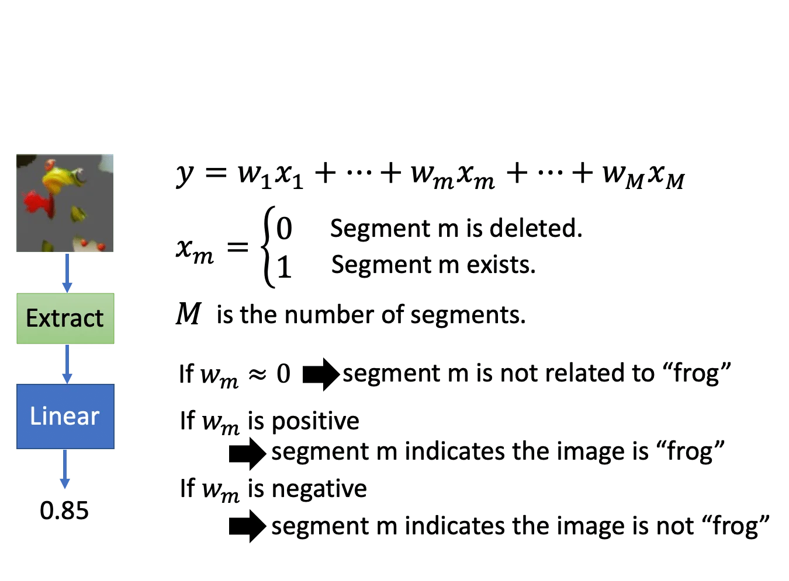

> 本节包含 P24~P31 的内容

比如说我们现在训练了一个猫猫的分类器。那除了分类结果之外，我们还想知道两件事情：

- 局部可解释性：为什么机器觉得「这张图片」是一只猫
- 全局可解释性：机器觉得「猫」应该长什么样？

可解释机器学习还有很多其他的应用：

- 用机器来判别简历：能力？还是性别？
- 用机器来判断罪犯是否可以被假释：具体事实？还是肤色？
- 金融相关的决策常常依法需要提供理由：为什么拒绝给默认放贷？
- 模型诊断：机器到底学到了什么？

## Lee's point of view

可解释性机器学习并不是说我们要完全了解模型是怎么做的，其实这是没有必要的。有些人不相信机器学习是因为它是一个黑盒模型，但人脑其实也是一个黑盒模型。

所以李老师认为可解释性机器学习是为了让用户觉得有道理，不同的数据要对不同的使用者做出个性化的解释，这才是可解释性机器学习的目标。

### Interpretable v.s. Powerful

有一些模型天然是可解释的：比如线性模型，我们可以直接看出它对不同的 feature 分配的权重。但是线性模型不够强。

而深度网络是比较难解释的，但是深度网络比简单的线性模型要强大得多。我们不应该因为深度网络是一个黑盒子就抛弃它，而是要想办法给它赋予可解释性。

是否有一种模型，它既有强大的建模能力，也有很好的可解释性？简单的决策树其实是可以的，但是决策树变得很复杂（比如变成决策森林）的话它也是很难解释的。

## Local Explanation: Explain the decision

> What makes the model think that "this picture" is a cat.

### Basic Idea

假设我们现在有一个 Object，它有一些 Components. 我们想知道机器在判断 Object 属于哪个类别的时候，哪些 Components 起到重要作用。

对于图像来说，一个 Component 可能是一个像素，或者是一些区域。对文本来说，一个 Component 可能就是一个单词。

我们的做法就是，拿掉或者是对某个 Component 做改动，如果机器做出的决策有很大的变化，就说明这个 Component 是重要的。

比如我们用一个灰色的方块对图像做遮挡，然后看看分类的热力图。蓝色的部分表示机器认为这个位置对分类是重要的。至于这个遮挡的大小和形状要如何选取，这是实验中需要自行设定的部分。

另一个做法是，我们对图像的像素值做轻微的扰动，然后用改变后的结果对这个扰动像素求梯度，作为这个像素的重要程度。并且我们可以画出一张显著图（Saliency Map）来可视化这个结果。其中这个梯度的绝对值越大，在显著图里的亮度越高。

其实用梯度来判断 component 重要性的方法还有很多，比如 Grad-CAM, SmoothGrad, Layer-wise Relevance Propagation, Guided Backpropagation 等。

### Limitation of Gradient based Approaches

- Gradient Saturation

也就是梯度饱和。比如说我们要判断一张图片是不是大象。那很自然地，当鼻子长度达到一定程度是时候，这个特征可能就饱和了。换句话说，当鼻子长到一定程度的时候，我们略微拉长或者缩小鼻子不会对结果产生很显著的影响，对应的梯度就会趋于 0. 但这显然是不对的。

有一些工作致力于缓解这个问题，比如 Integrated Gradient, DeepLIFT 等

另外，局部解释性是可以被攻击的。比如下面是一个卡车识别和对应的显著图。原本的显著图可以很好地 focus 到卡车的位置，但是我们可以通过一些特殊的噪声让显著图 focus 在云的位置（反正不是卡车的地方）。那么如果在加了扰动以后的图里面干脆把卡车拿掉，模型仍然会以为它看到了卡车。

### Pokemon vs Digimon

这里讲了一个宝可梦和数码宝贝分类的例子。我们发现 train 出来的模型能够很好地分辨宝可梦和数码宝贝，但是看一下 saliency map 会发现显著像素根本不落在本体上，而是落在周围。

原因是数码宝贝的数据格式是 jpeg，而宝可梦是 webp，读进去以后透明背景会变黑，模型学到的根本就是看背景。所以说 saliency map 确实在一定程度上可以解释模型的工作原理（？

## Global Explaination: Explain the Whole Model

> What dose the model think a "cat" looks like?

### Activation Maximization

假设我们现在有一个手写数字识别的网络，activation maximization 要做的事情就是找出一个 $x^*$ 使得 $x^* = arg\max_{x}y_i$.

那么我们找出来的图像可能会是这样的：

我们在分类那一节也讲过，如果要使得找到的图像尽可能地像数字，我们可以给它加上一些其他的约束。比如说，我们要求：
$$
x^* = arg\max_x y_i + R(x) \\
R(x) = -\sum_{i,j}|x_{i,j}|
$$
也就是说，我们要让图像中像素值不为 0 的部分尽可能地少（黑底白字，白色像素值 255），也就是说尽可能多地是背景（黑色），尽可能少地是笔画（前景白色）。这样我们找到的图像是：

### Regularization from generator

如果我们现在想让机器自己学会生成某种类别的图像，并且要让它看起来有意义，要怎么做呢？

我们可以在生成模型的后面再套一个分类器，来约束生成的结果：

这样一来，我们的优化目标就从找到一张图像 $x$，变成找到一个低维向量 $z$，这个低维向量经过一个生成器会得到一张图像 $x$，我们再把这张生成图像用来做分类，去优化这个分类器，从而反过来优化生成器。找低维向量而不是直接找图像的优点在于，如果这个生成器足够强大，它真的可以生成很有道理的图像。但我们直接找图片的话，通常这个图像是无规则的。

## Using a model to explain another

前面也说过，有一些 Model 的可解释性是比较好的（比如线性模型）。那么我们可以用一个可解释的模型去模拟一个难以解释的模型，让后者变得可解释。

具体的做法是，假如说我们现在有一组数据 $X$，和一个黑盒模型（比如说神经网络）对这组数据的输出 $Y$。那我们可以用一个可解释的线性模型去拟合这个黑盒模型，也就是用 $X$ 做输入，用 $Y$ 作为 GT. 

但问题是，线性模型是很难拟合神经网络的，因为它的复杂度不够高。换种角度说，如果真的可以用线性模型拟合神经网络，那还要神经网络做什么呢。不过虽然我们没办法拟合整个神经网络，我们仍然可以用线性模型去拟合部分的神经网络。

一个可行的做法是 Local Interpretable Model-Agnostic Explanations（LIME）

我们假设一维的输入输出。很显然线性模型是不可能完全拟合整个函数曲线的。但是我们可以对某个区域做局部拟合：

1. 先选取一个想要拟合的数据点（这里我们选取的是最中间的那个点）
2. 在该点的附近采样一批数据
3. 用线性模型（或者其他可解释模型）拟合这组数据
4. 解释这个线性模型

很显然，这个方法的好坏取决于第二步的局部采样。对「附近」的定义不同，采样的数据分布就不同，拟合的结果就不同，最后解释的结果也会不一样。

### LIME - Image

下面举一个图像识别的例子。比如说我们想知道一个黑盒模型为什么能识别一张图像是青蛙。

上面也说过了，LIME 最关键的是如何去做数据采样。对于图像来说，可以是加噪声，或者是随机删除一些像素。但是很明显，随机删除一些离散的像素对结果应该是不会有太大的影响的，所以一般来说，我们的第一步是先对图片做 segment，然后随机删除或者遮挡一些区域。

用这张遮挡过的图像去训练一个分类器，我们就会得到一组分类的分数。

接下来，我们要用一个线性模型（或者其他容易解释的模型）来拟合这个神经网络。以线性模型为例，如果我们是直接把图像展平再输入，那这个输入维度就有点太大了。而且就算这个线性模型能 Train 起来，我们也很难说清楚对应每个像素的权重是什么意思。

所以一般来说，我们要先对图像做一次特征提取。一个比较简单的特征编码方式是对我们预先分好的 $M$ 个 segmentation 构造一个 $M$ 维的向量，如果这个小块被删除了，那么对应的元素就是 0，否则就是 1.

比方说我们现在得到了一个 Train 好的线性模型，那我们就可以来解释模型了。很直觉地，如果某个 segment 对应的权重为 0，就说明它对模型判断这张图像是否是一只青蛙的帮助不大。而权重为正负值，就表示它对模型辨识青蛙起到了正向或负向的影响。

## Decision Tree

刚才也说过了，除了线性模型以外，决策树也是一个可以用来模拟黑盒模型的可解释模型。事实上，只要决策树的深度无限深，那么它一定可以完全模拟一个神经网络。但是这就变得本末倒置了，因为这样的决策树会因为过大过深反而难以解释。

我们用 $\theta$ 来指代这个黑盒模型，表示它取决于参数 $\theta$. 类似的，我们用 $T_\theta$ 来指代这棵决策树，表示它要模拟这个取决于 $\theta$ 的黑盒模型。

我们定义 $O(T_\theta)$ 表示 $T_\theta$ 的复杂度，比如它的平均深度。那么我们的目标就是希望 $O(T_\theta)$ 尽量小。

一个有意思的[做法](https://arxiv.org/pdf/1711.06178.pdf)是，在训练这个神经网络的时候就给它施加一个包含 $O(T_\theta)$ 的正则项。这个正则项的意义是，我们在训练黑盒模型的时候就事先考虑它将要被一个决策树模拟。因此我们的训练目标不仅是要最小化网络本身的损失，还要最小化决策树的复杂度（其实也就是要求网络的参数不要太复杂）。
$$
\theta^* = arg\min_\theta L(\theta) + \lambda O(T_\theta)
$$
不过，这个正则项是不可微的，这篇文章的做法是，训练了另一个网络，它接受一个网络的参数 $\theta$ 作为输入，输出用于模拟这个网络的决策树的平均深度 $O(T_\theta)$. 然后联合训练这个网络和原来的神经网络。（？

