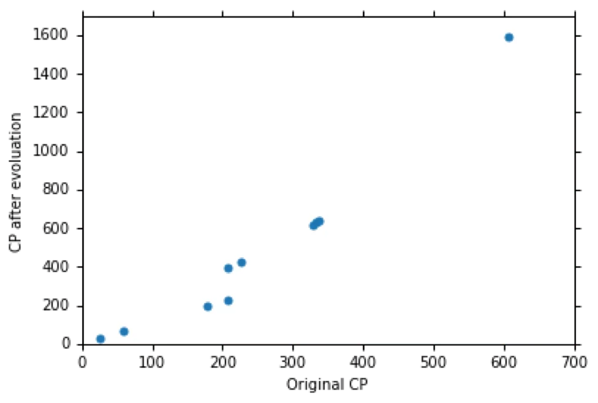

## Regression

回归可以用来做什么？

- Stock Market Forcast：输入一系列资料，输出明天的股指
- Self-driving Car：输入车辆的各种传感器信息，输出方向盘的角度
- Recommendation：输入（使用者，商品）的 pair，输出使用者购买商品的可能性

以上的种种应用都可以被写作以下形式： 
$$
f(input) = output
$$

## Example Application

预测宝可梦的 CP 值

以上就是一个 $f(input) = output$ 形式的 Model. 我们用 $x$ 表示某个宝可梦，其下标表示对应的一些 component. 那么我们的目的就是要找出一个函数 $f$，可以根据这些 component 得到宝可梦 $x$ 进化后的 CP 值。

**Step 1**

### **Step 1: find the function**

第一步就是要从一堆函数中找出我们需要的 Model. 我们先假设使用一个简单的一阶线性函数 $y = b + w*x_{cp}$. 其中的 $b$ 和 $w$ 都可以任意取，因此这个 function set 是无限大的。

这样的 Model 被称为 Linear Model （线性模型），它的通用表示形式是：
$$
y = b + \sum w_ix_i
$$
$x_i$：输入 $x$ 的一个**属性（feature)**

$w_i$：权重（weight）

$b$：偏置（bias)

### **Step 2: Goodness of function**

以上的线性模型的输出是一个标量（scalar）。那定义好模型后，我们还需要一个评估模型好坏的方法。

我们用上标来表示一个宝可梦，用 $\hat{y}$ 来表示 ground truth 的 CP 值。因此我们的数据集可以表示为：
$$
(x^i, \hat{y}^i)
$$
下面是一批示例数据，横轴为进化前的 CP 值，纵轴是进化后的 CP 值：

为了评估我们的 Model，我们还需要定义一个 **损失函数（Loss Function）** 。损失函数是函数的函数，也即它的输入是一个函数，输出是这个函数的好坏程度。一个常见的损失函数形式是 **平方损失函数（Mean Square Error, MSE）**：
$$
L(f) = L(w, b) = \sum_{n=1}^{10}(\hat{y}^n-(b+w *x^n_{cp}))^2
$$
MSE 计算的是模型的预测值与 GT 之间的误差的平方，它的一个等高图如下：

颜色表示 Loss 的大小，红大蓝小。可以看到 X 的位置是 Loss 最小的地方。

### **Step 3: Best function**

有了模型和损失函数以后，我们就可以去找到一个对数据拟合得最好的模型。也就是说，我们要找一个
$$
\begin{aligned}
f^* &= arg \min_f L(f) \\
w^*, b^* &= arg \min_{w, b} L(w, b) \\ &= arg \min_{w, b} \sum_{n=1}^{10}(\hat{y}^n-(b+w *x^n_{cp}))^2
\end{aligned}
$$
实际上这是一个最小二乘问题，它是有闭式解的。但如果我们的 Model 很复杂，它不一定有闭式解。因此在机器学习中一个常用的求解最优函数（最小化损失函数）的做法是用 **梯度下降法（Gradient Descent）**。

#### **Gradient Descent**

假设现在是一阶线性函数，只有一个 weight，我们可以画出一个趋势图：

> 对于 MSE 来说 Loss 不可能是负数，这里只是一个示意。

显然右侧的波谷是 Loss 最小的位置。

那么梯度下降的做法就是：

1. 随机选取一个初始权重 $w^0$

2. 计算此处 Loss 对 weight 的梯度 
   $$
   \frac{dL}{dw}|_{w=w^0}
   $$

3. 沿着梯度的**反方向**更新权重
   $$
   w^1 \leftarrow w^0 - \eta\frac{dL}{dw}|_{w=w^0}
   $$
   其中 $\eta$ 被称为**学习率（Learning rate)**，是事先指定的数值，决定参数更新的幅度。

4. 重复 2、3 步直到梯度为 0（一般情况下不会等于 0，而是当小于某个事先指定的阈值就停下来）

这样做以后可能会得到如下的结果：

也就是我们的参数卡在**局部极小（Local Minima）** 而没有达到全局最小（Global Minima）。但是请放心，在线性回归中，这种情况其实是很少见的。

以上示例是只有一个参数的情况。那如果我们有多个参数，其实也是一样的。假设现在有两个参数 $w, b$：

1. 随机初始化 $w^0, b^0$

2. 计算此处 Loss 对两者的梯度：
   $$
   \frac{dL}{dw}|_{w=w^0, b=b^0} \quad \frac{dL}{db}|_{w=w^0, b=b^0}
   $$

3. 沿着梯度的反方向更新参数：
   $$
   w^1 \leftarrow w^0 - \eta\frac{dL}{dw}|_{w=w^0, b=b^0}\\
   b^1 \leftarrow b^0 - \eta\frac{dL}{db}|_{w=w^0, b=b^0}
   $$

4. 重复 2、3 步直到收敛。

这里要指出的是，我们所说的 **梯度（Gradient）** 就是
$$
\triangledown L = [\frac{\partial{L}}{\partial{w}}, \frac{\partial{L}}{\partial{b}}]
$$
同样的，我们可以用一个等高图来表示上述的更新过程：

而梯度方向其实就是垂直于等高线指向值更低的位置的方向。

但是梯度下降有一个问题，如果我们的 Loss Function 对参数的梯度是下图这个形式：

那就意味着梯度下降的结果可能是不固定的。

但实际上在线性回归中，一般情况下 Loss 是 Convex 的（也即有且只有一个最小值）。也就是说，只要我们定义的损失函数是凸函数，那么就不用担心局部最小的问题。

#### **How's the results?**

使用上述梯度下降的方式我们可以得到一个最终的函数 $y = 2.7 * x_{cp} - 188.4$：

可以看到它并不能完全拟合所有的数据，不过基本上也大差不差。如果想要计算 Error 的话可以像上图这样对每个 case 分别计算距离，然后累加做平均。
$$
E = \sum_{n=1}^{10}e^n = 31.9
$$
这样的模型在测试数据上的结果：

经过计算可以得知，在测试数据上的 Error 是 35.0 ，要比训练数据上的大一些。这是很正常的，因为最佳模型是在训练数据上找到的，因此模型对训练数据的拟合程度就是应该优于测试数据。

但我们仍然可以看到，在进化前的 CP 值较大或者较小的时候，我们的模型预测误差是很大的。那么一个可能的原因是：一阶线性模型过于简单了。

### **<u>*Selecting another Model*</u>**

我们可以尝试使用更复杂的模型，比如引入二次项：
$$
y = b + w_1*x_{cp} + w_2 * (x_{cp})^2
$$
我们可以用一模一样的方法找出拟合训练数据的最好模型。比如说我们找到的最好的模型是 $b = -10.3, w_1 = 1.0, w_2 = 2.7 * 10^{-3}$，那么画出这个函数可以看到：

上图是在训练数据上的结果，下图是在测试数据上的结果。分别计算 Error 可以得到训练数据上的 Error 为 15.4，测试数据上的 Error 为 18.4. 显然这个结果比一阶线性模型来得好得多。那我们是否有可能通过引入更高次的项得到更好的模型呢？

结果是，引入 3 次项以后结果变得更好了，但是引入 4 次项和 5 次项以后结果反而变得更差了。例如引入 5 次项以后的最优函数为：

显然出了一些问题，而且 Testing Error 也变得非常大。

将 1 到 5 次的函数及其对应的平均误差折线图画出来，我们可以看到，如果真的能够用梯度下降找到最有函数的话，更高次的函数在训练数据上的误差是越来越小的。这也是符合直觉的，因为更复杂的函数实际上包含了简单的函数（比如 5 次函数的 5 次项系数为 0 的时候就等于 4 次函数）。

但是在测试数据上，情况却不是这样的：

可以看到 4 次和 5 次项的函数的 testing error 不增反降。也就是说，越复杂的函数不一定能在测试数据上得到更好的效果。这种情况就称作 **过拟合（Overfitting）**。

因此，Model 并不是越复杂越好。在上面这个例子中，3 次函数的结果是最好的。

### Back to step1: What are the hidden factors ?

但问题并没有因此结束。当我们收集都更多的数据时，我们会发现数据有完全不同的分布：

很显然，只考虑 CP 值是不够的，因为不同的 PM 的 CP 值有不同的分布。因此我们要回到第一步，重新找模型。比如，我们可以定义一个函数：

其中 $x_s$ 仅当输入的宝可梦类别是对应类别时为 1，否则为 0. 因此该函数就是一个带条件判断的线性函数的组合。

那么我们最终的结果是：

也就是，当我们考虑了 PM 的种类时，我们得到了比只考虑 CP 值时更好的结果。

当然我们可以看到这个模型还是存在一些问题。比如右上角的伊布的预测值还是有较大的误差，这可能是因为伊布的不同进化型对应不同的模型。左侧的一些不够 fit 的值可能是因为进化后 CP 值的计算本身存在一个随机扰动。或者，是否有其他因素是我们没有考虑，但是却对 CP 值有影响的？比如 PM 的身高、体重和血量：

当然这需要 domain knowledge 才行。一个朴素的办法就是把所有能想到的东西通通丢进去：

结果就是在训练数据上拟合得非常好，但是在测试数据上爆掉了。那么如果你是大木博士，你可以删掉一些多余的 component 来避免过拟合，但我们不是大木博士，所以我们要用另一个方法来处理这个问题。

### Back to step3: Regularization

假设我们的函数形式为 $ y = b + \sum w_ix_i$

我们可以在原来的 Loss Function 上加入**正则项**来缓解过拟合现象：
$$
L = \sum_{n=1}^{10}(\hat{y}^n-(b+w *x^n_{cp}))^2 \qquad + \lambda\sum(w_i)^2
$$
其中 $\lambda$ 是一个超参数，决定正则化的程度，其值越大得到的函数就越平滑。这个正则项的意义就是，我们不仅希望损失函数本身最小化，我们还希望得到尽可能接近 0 的参数 $w$。参数 $w$ 接近 0 就意味着这个函数是比较 **平滑** 的，也就是说，函数的输出对输入变化比较不敏感。但是为什么我们会希望比较平滑的函数？这是因为数据通常是存在一定的噪声的，那么一个平滑的函数对噪声的鲁棒性就更好。

可以看到，当 $\lambda$ 变大的时候，training error 也变得更大。这显然是合理的，因为 $\lambda$ 越大，正则项的权重就越高，原先的 loss 的权重就越低，error 就会变得更大。但是，虽然 training error 提高了，testing error 却降低了。这就是说，testing data 可能存在比较大的噪声，而比较平滑的函数对这样的噪声的敏感度更低。

但同时我们也不希望模型过于平滑，否则它的表现又会变差。因此我们要通过调整 $\lambda$ 的值来找到一个比较好的正则项。

另外需要注意的是，正则项是 **不考虑 Bias** 的，因为对 Bias 的调整不会影响函数的平滑度。

那么，如果这个系统正式上线，我们其实应该预期得到比 11.1 更高的 Testing Error. 至于原因会在后续的课程中解答。