> 本节包含 P33~P40 的内容

## Motivation

我们希望能够把 ML 模型部署到真实世界中，但是如果我们只是在实验环境下得到了「大多数情况下能行」的模型，这是远远不够的。

我们希望模型不仅能够强，还要能够抵抗一些恶意要骗过模型的攻击。尤其对于一些本来就是要防止恶意行为的应用来说，这是非常重要的。比如垃圾邮件分类、恶意软件检测、网络攻击检测等等。

## Attack

这里用一个分类器为例。我们将原始图像 $x_0$ 输入到一个分类器，它给出了 0.64 置信度的 Tiger Cat. （先不管它到底对不对，至少能得到一个 Cat 就说明这个分类器不算很糟糕）

那么现在我们给这个原图加上一些「设计好的、非随机的噪声」，然后把它输入给这个分类器，它就会得到完全不同于原来的结果。这就叫做对模型的攻击。

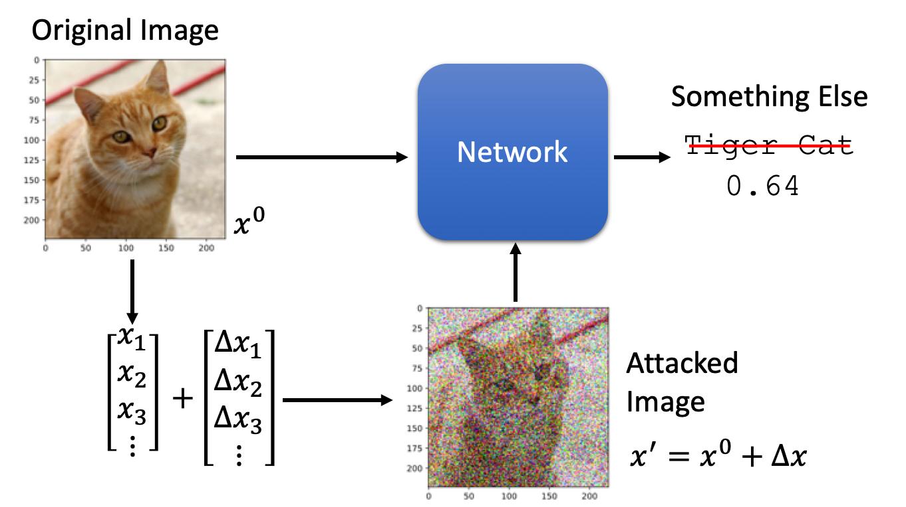

那这个设计好的噪声是怎么得到的？

我们先回顾一下一个普通的分类器是怎么训练的：

输入图片 $x_0$，经过一个分类器 $f_\theta$，输出结果 $y_0$，我们希望这个 $y_0$ 和标签 $y^{true}$ 越接近越好。训练最小化的目标就是 $y^0, y^{true}$ 之间的距离。

如果要对这个网络做非定向攻击（Non-targeted Attack），我们的目的是找到一张图像，使得这个分类器 $f_\theta$ 输出的结果 $y’$ 尽可能地和标签 $y^{true}$ 不一样。此时训练的目标就是最大化 $y^0, y^{true}$ 之间的距离。

如果要对这个网络做定向攻击（Targeted Attack），我们不仅要让输出的结果和标签不一致，我们还希望这个输出能跟某个错误的标签距离越近越好。除此之外，我们希望找到的这个新的图像能够和原始图像尽可能地相似，以至于人类肉眼无法分辨出两张图像的区别，但它却能够骗过分类器。

> 注意，在做普通训练的时候，我们是固定输入，更新网络的参数。在做攻击（找噪声）的时候，我们是固定网络，改变输入。

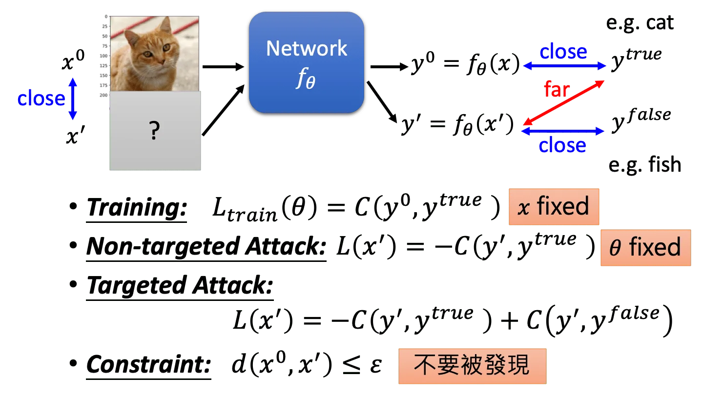

所谓的「新的图像和原图尽可能相似」的相似度度量 $d(x^0, x')$ 一般有两个常见的做法：

- L2-norm
  $$
  d(x^0, x') = ||x^0-x'||_2 = (\Delta x_1)^2 + (\Delta x_2)^2 + (\Delta x_3)^2 + ...
  $$

- L-infinity
  $$
  d(x^0, x') = ||x^0-x'||_\infin = max\{\Delta x_1,\Delta x_2,\Delta x_3,...\}
  $$

阈值 $\varepsilon$ 是一个超参数。

直觉上来说，L-infinity 是一个比较好的选择。举例来说，对左边这张图像做两个不同的扰动。可以看到右上角那张图片和原图是比较接近的，而左下角那张图的绿色色块明显饱和度变低了。但实际上两张图像和原图的 L2 distance 是一样的。

而如果是计算 L-inf，由于右上角的图像每个色块的像素值改变都比较少，因此算出来的 L-inf 就比较少。而右下角图片的绿色色块的像素值改变比较大，L-inf 就会比较大。

也就是说，L2 不能很好地描述人眼对图像差异的感知。所以用 L-inf 来做这个度量会好一些（不过还是取决于具体的任务啦）。

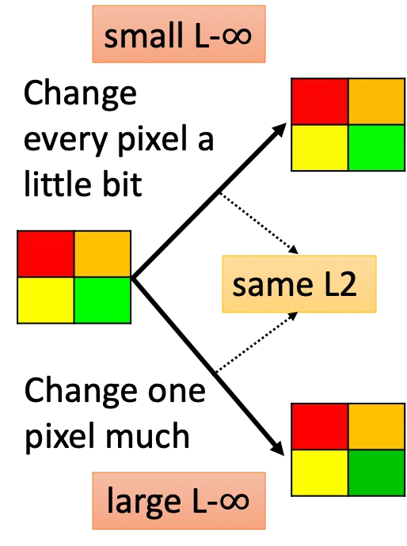

### How to attack

和训练神经网络是类似的，只不过我们要更新的参数从网络参数 $\theta$ 变成了输入 $x$. 我们的目的是要找到一个 $x^*$ 使得： 
$$
x^* = arg \min_{d(x^0,x')\le\varepsilon}L(x')
$$
要同时最小化 Loss，并且要满足相似度的约束，我们用修改过后的梯度下降法来训练。

从原始的 $x^0$ 开始，对每个时刻 $t$：
$$
x^t \gets x^{t-1} - \eta\triangledown L(x^{t-1})
$$
并且在更新 $x^t$ 的时候我们要检查当前的 $x^t$ 是否满足 $d(x^0, x^t) \le \varepsilon$. 如果违反约束，那么 $x^t \gets fix(x^t)$

其中，这个 $fix(x^t)$ 是检查所有满足约束的 $x$，并将距离 $x^t$ 最近的一个$x$ 返回。对于不同的度量函数，其形式也不同：

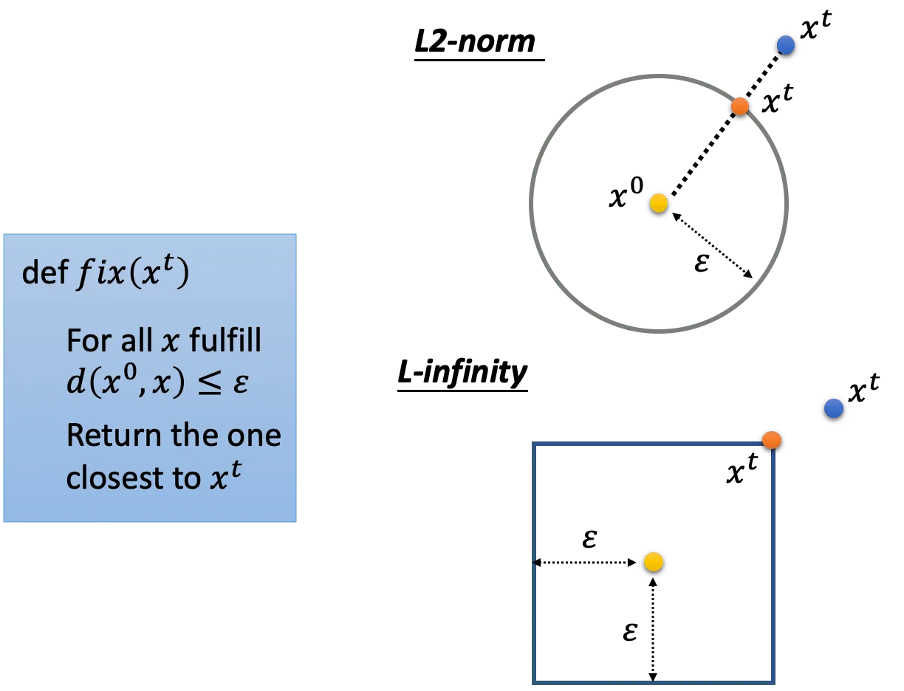

### Example

我们用这样的方法去攻击一个 ResNet-50 的分类器，目标是希望分类器把这张图分类成海星。我们得到的图像就是右图。人眼基本无法看出它和原图的差异，但是模型却会把它当做是海星。

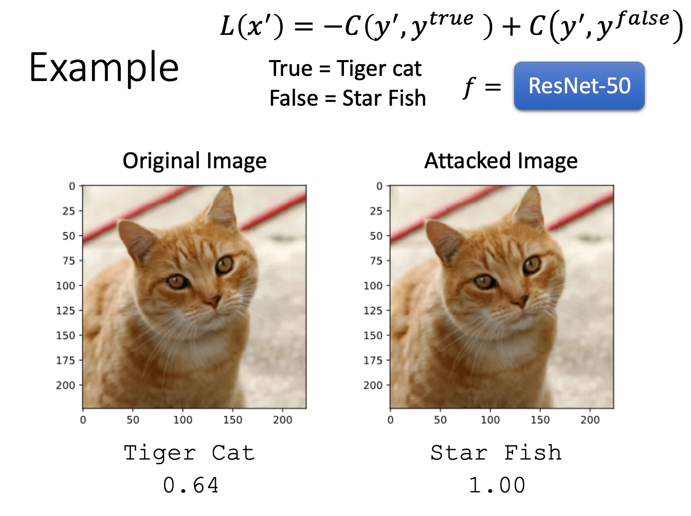

我们把两张图像的差异做一个放大。可以看到它确实是有不同。

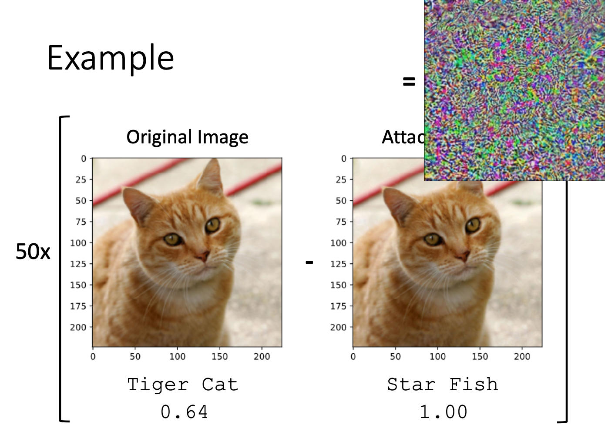

> 这里还用 Keyboard 作为攻击类别又做了一次实验，结果是模型以 98% 认为改变后的图像是一个键盘。因为图长得真的没什么区别这里就不贴了。

如果我们只是对原图增加一些非设计的随机噪声，那么模型对这种噪声其实是有一定抵抗性的。

如下图我们可以看到，加的噪声没有很夸张的情况下，模型仍然能把大类分对（猫）。

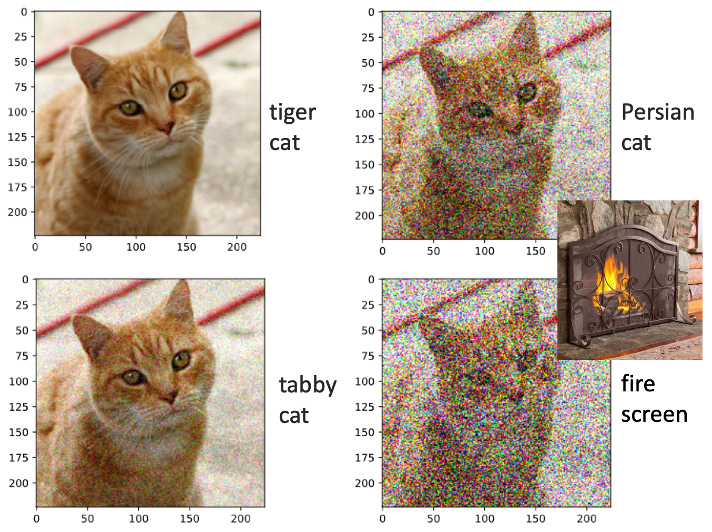

### What happened?

那么到底图像被攻击的时候发生了什么？

我们说图像其实可以看做是一个高维空间中的点（比如对 225x225 的图像，它就是一个四万维空间中的点）。那么在这个高维空间中，可能有大多数方向会使得这个 $x^0$ 在变化的时候，它对应原来的类别的分数仍然是很高的。而就算是加上了比较大的扰动，它可能会在其他类别上的线性分数高，但仍然和正确的类别在同一个大类中。

但是这只是在随机的方向上成立。在这种高维空间中，可能会存在某些神奇的方向，使得正确类别的线性分数高的范围很窄，而只要偏移一个很小的距离，它就会落到另外一个完全不相干的类别上。

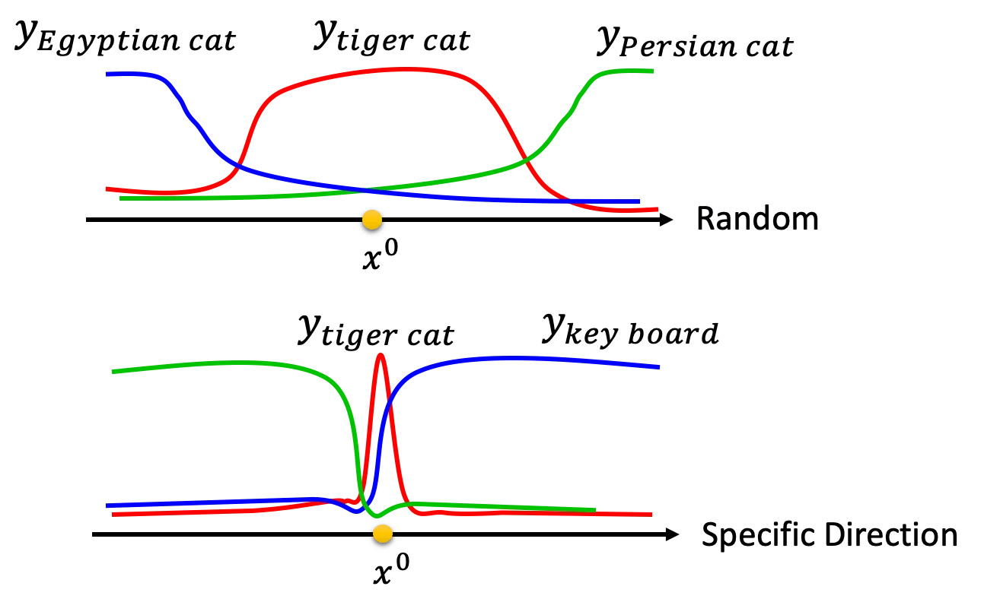

以上只是试图解释现象，至于为什么神经网络会出现这样的问题，仍然有待研究。

## Attack Approaches

### Refs

[FGSM](https://arxiv.org/abs/1412.6572)

[Basic iterative method](https://arxiv.org/abs/1607.02533)

[L-BFGS](https://arxiv.org/abs/1312.6199)

[Deepfool](https://arxiv.org/abs/1511.04599)

[JSMA](https://arxiv.org/abs/1511.07528)

[C&W](https://arxiv.org/abs/1608.04644)

[Elastic net attack](https://arxiv.org/abs/1709.04114)

[Spatially Transformed](https://arxiv.org/abs/1801.02612)

[One Pixel Attack](https://arxiv.org/abs/1710.08864)

本节主要以 FGSM 为例.

不同的攻击方法实际上就是用不同的优化方法，或者是用不同的约束条件 $d$。

### FGSM

并不是效果最好的，但是是最简单的一种方法。它的参数更新是：
$$
x^* \gets x^0 - \varepsilon \Delta x \\
\Delta x = 
\begin{bmatrix}
sign(\partial L/\partial x_1) \\
sign(\partial L/\partial x_2) \\
sign(\partial L/\partial x_3) \\
...
\end{bmatrix}
$$
也就是说，$\Delta x$ 只包含正负一。这种方法只需要攻击一次就可以达成目标。

当然攻击多次结果会更好，这种方法叫 Iterative FGSM.

我们可以认为这种方法是设置了一个非常大的 LR（因为正负 1 一定是远大于 $\varepsilon$ 的，所以只要一次更新，这个 $x^*$ 就会飞出 L-inf 所约束的方形范围，它就会被 $fix$ 回方形的角点（一般来说不会落到边上）。所以 FGSM 是只关心梯度方向，而不关心梯度大小。

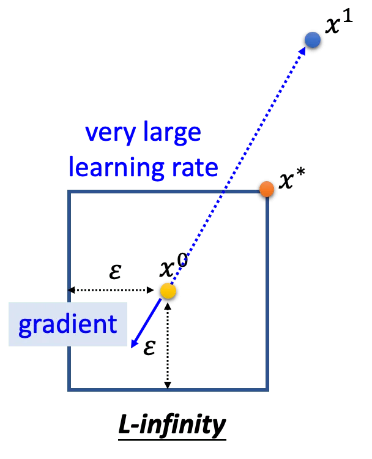

### White Box v.s. Black Box

前面讲到的方法都需要已知网络的参数 $\theta$ 去训练 $x'$，这种攻击叫 **白箱攻击**。如果可以在不需要知道网络参数的情况下发起攻击，那就叫做 **黑箱攻击**。

黑箱攻击的做法是，假设**已知某个要攻击的黑箱网络的训练集**，我们可以自己 Train 一个 proxy network，然后去攻击这个 proxy network. 那么使用攻击代理网络的输入去攻击黑箱网络，往往是会成功的。

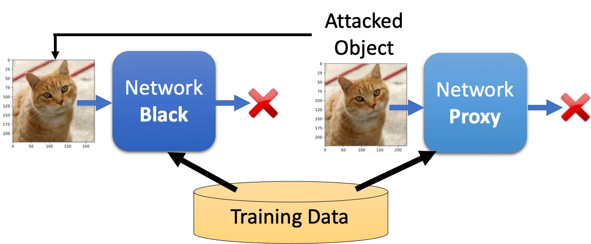

即使我们不知道黑箱网络的训练集，我们仍然可以给它喂一组输入，得到一组输出，然后用这一堆输入输出的 pair 来训练我们自己的代理网络，然后再发动攻击，这样的做法也是可行的。

另外，我们甚至可以做 Universal Adversarial Attack（Arxiv 1610.08401），也就是说，可以找到一个万能的噪声，使得所有输入加上这个噪声以后，经过网络的结果都会产生错误。这种做法在黑箱和白箱攻击中都是适用的。

### Adversarial Reprogramming

我们甚至可以通过攻击某个网络，让这个本来要做任务 A 的网络去做任务 B.

比如我们可以让一个做分类的网络去数方块：

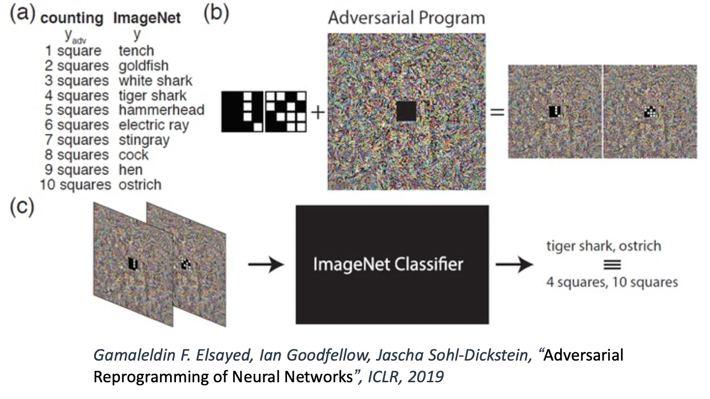

## Attack in the Real World

可能会有人想说这些杂讯在经过真实的相机以后会不会因为成像的原因被消除？https://arxiv.org/abs/1607.02533 这篇文章做了一些实验，结果是，攻击图片在经过相机成像后仍然能够对网络识别的结果造成影响。

攻击同样可以用来干扰人脸识别系统（face-rec-ccs16）。我们甚至可以把噪声变成一副眼镜，如右图，我们希望加了眼镜噪声以后，左边的人脸识别结果会变成右边的人。下面是做出来的一副实体眼镜。

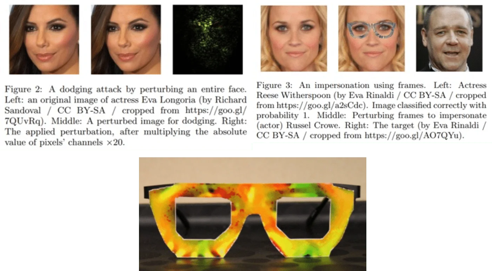

攻击的结果是，确实是可行的。这篇文章为了达成干扰人脸识别的目标，做了如下的工作：

1. 攻击信号需要对不同角度的人脸都起作用，因此需要找到一个对所有角度的人脸都适用的扰动。
2. 干扰信号需要足够强以避免因为分辨率的原因而无法被相机捕捉。因此这幅眼镜中的干扰信号都是以大片色块的形式呈现的。
3. 尽量保证干扰信号所用的颜色是可打印的，避免由于打印失真导致攻击失败。

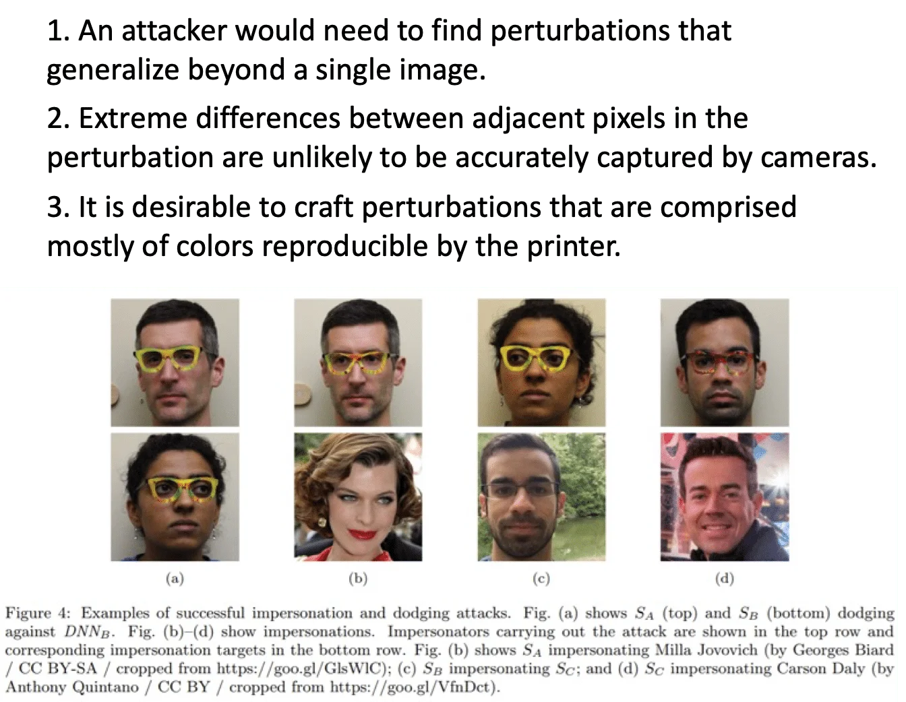

同样的，也可以对交通标识牌做攻击，这里不贴例子了。

另外，对声音和文本的攻击也是可以做的，这里列两个 ref：

- audio

  - https://nicholas.carlini.com/code/audio_adversarial_examples/
  - [https://adversarial-attacks.net](https://adversarial-attacks.net/)

- Text

  https://arxiv.org/pdf/1707.07328.pdf

## Defense

有人会认为，网络能够被攻击的原因是模型对训练集产生了过拟合。但实际上，即使我们对模型做 weight regularization, dropout 和 model ensemble，网络仍然是有可能被攻击的。

有两种方法可以来防御攻击：

- 被动防御：不改变网络本身，只是找出那些可以用于攻击的图像。这是 Anomaly Detection 的一个特例。
- 主动防御：训练一个对对抗攻击有鲁棒性的网络。

### Passive Defense

我们可以给原来的模型的输入加上一个过滤器，如果是普通的图像经过过滤器以后不会产生很大的影响，而如果是攻击图像经过过滤器以后，我们希望它可以减轻攻击信号带来的影响。

一个简单的过滤器可以是做图像平滑。

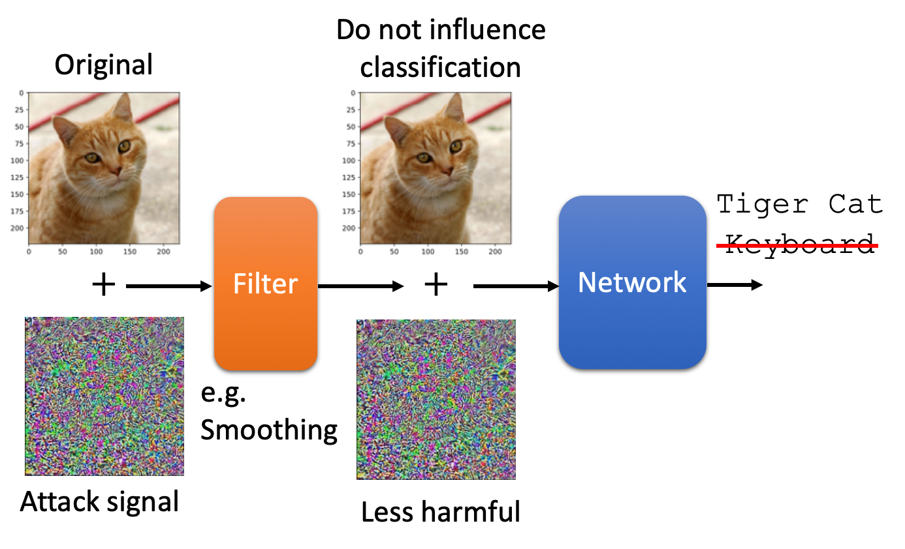

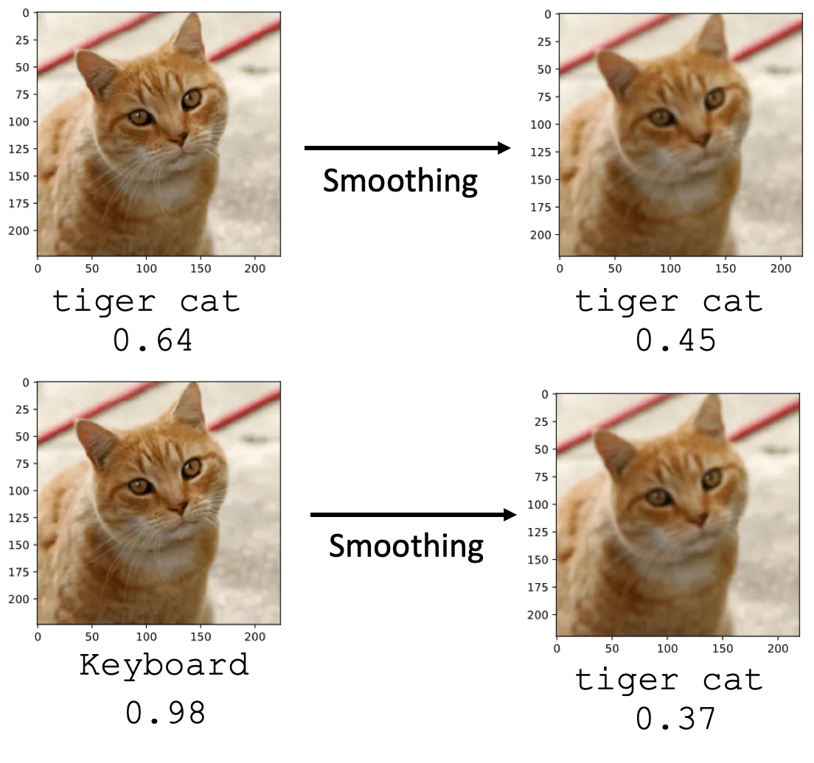

首先，平滑化对原图带来的影响并不大。而攻击信号在前面也说过，它可能只在某几个高维的方向上是有效的，而我们经过平滑化改变了这些信号，就会使得攻击失效。

一个引申的方法是做 Feature Squeeze。

我们给模型加上不同的过滤器（这里是 Squeezer1, 2），然后分别用原网络和加上不同过滤器的网络去辨识图像。如果发现经过过滤以后的模型和原模型对一张图片的输出差别很大，那就说明这张图像可能是被攻击了。

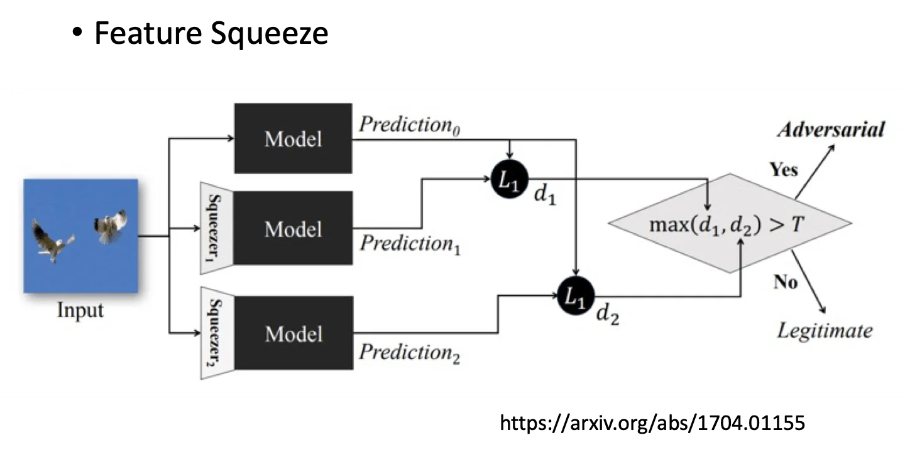

还有一个方法是在**推断阶段**做 Randomization。

也就是给输入图片做随机的 resize 和 padding，再随机选取其中一个 pattern 作为真正的测试图像输入到网络中。这样也是基于攻击信号只在原图的某几个高维方向上是有效的这一性质。这样的 randomization 可以破坏攻击信号使其失效。

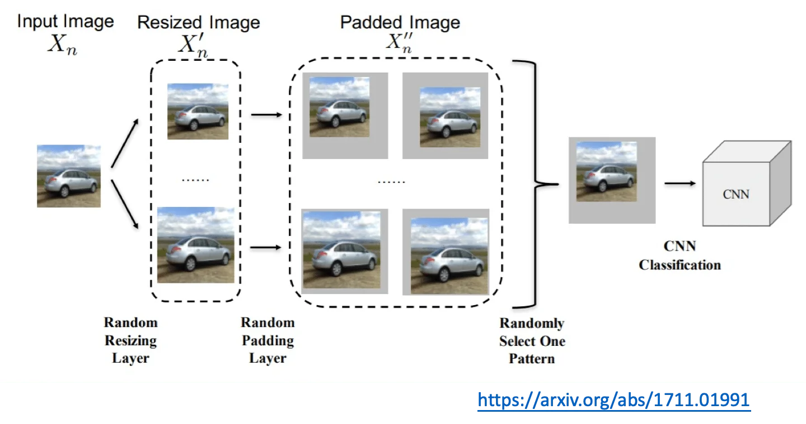

但是被动防御仍然有一个问题。如果将 Filter 或者 Randomization 看做是网络的第一层，那么只要对这个新的网络做攻击训练，那么攻击仍然有可能成功。

### Proactive Defense

主动防御的精神就是找出漏洞，然后补起来。

它的做法是，当我们训练好一个模型以后，主动使用某种攻击算法去攻击这个网络，我们会因此得到一些攻击图像 $\tilde{x}$，用这组攻击图像和它原始的 Label 组成新的训练集，再对网络进行训练（一共训练 T 个 epoch）。

这样的做法有点像是数据增广。这样做的问题在于我们选取的攻击算法是否足够 general，否则如果我们选用了某个攻击算法 A 来训练这个网络，网络仍然可能被攻击算法 B 攻击。所以主动防御仍然是一个尚待解决的问题。

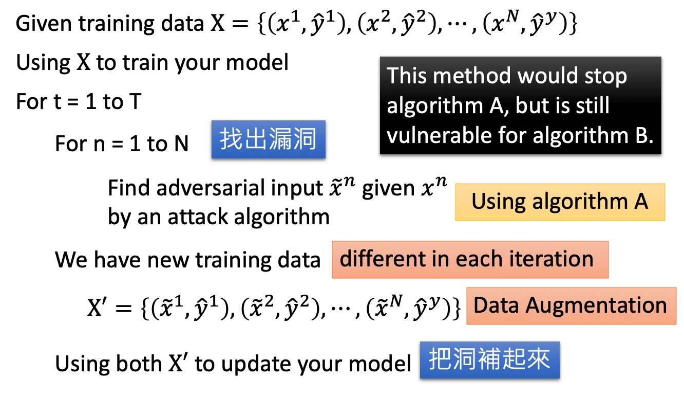

