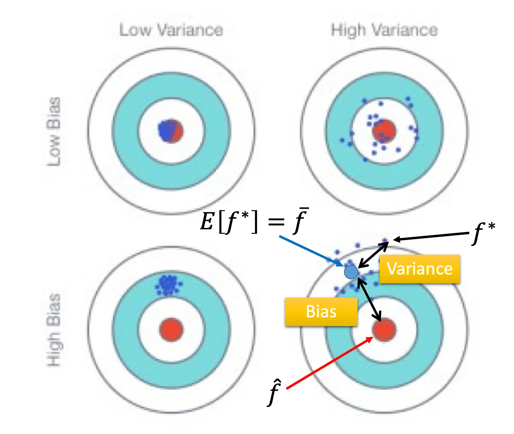
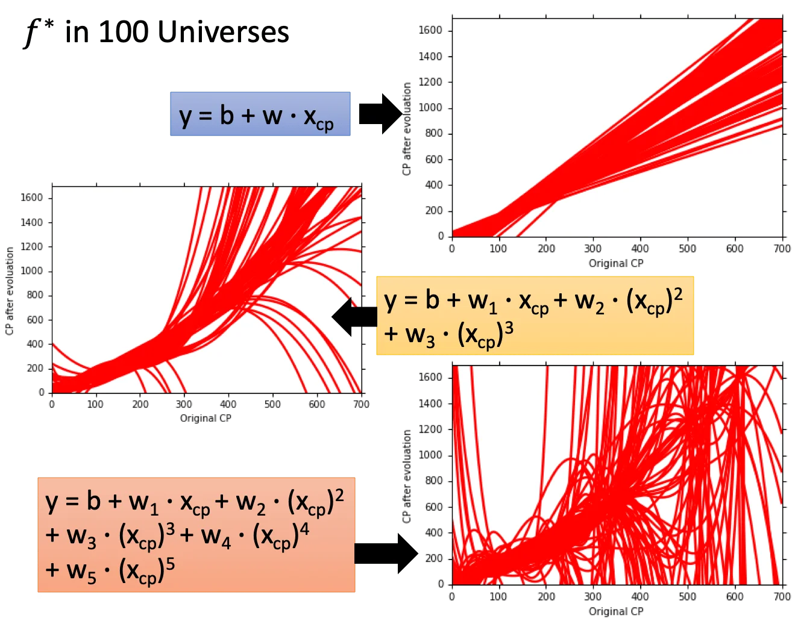
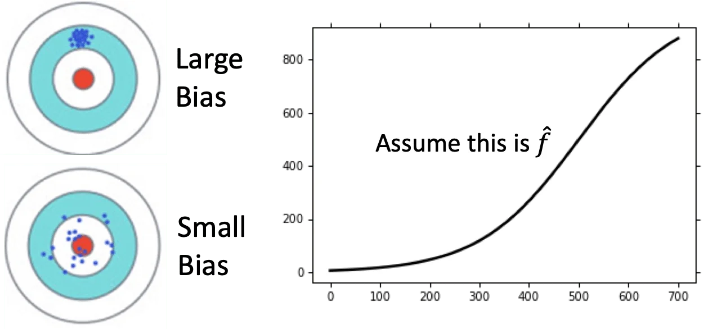
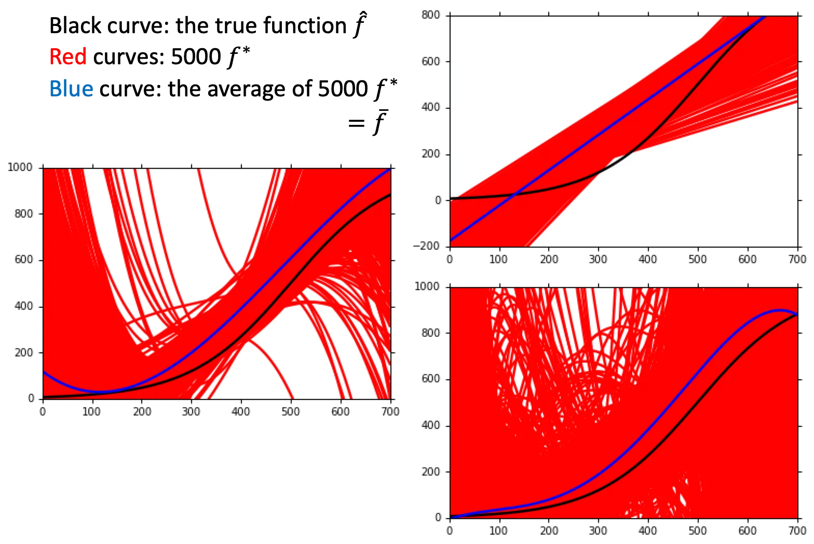
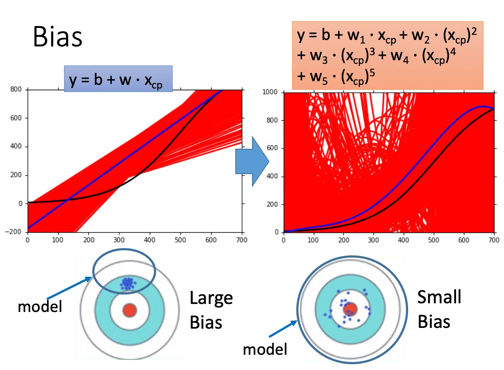
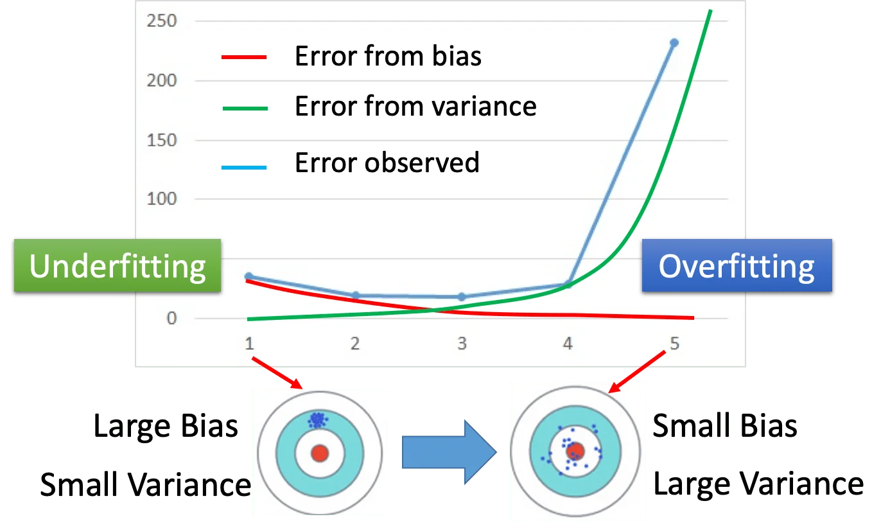
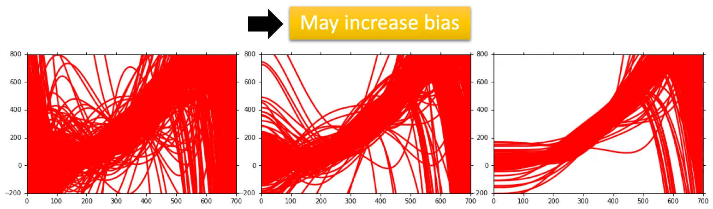
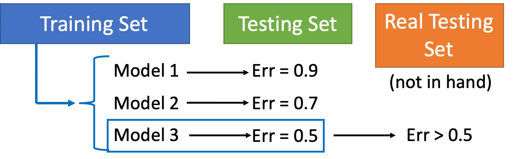
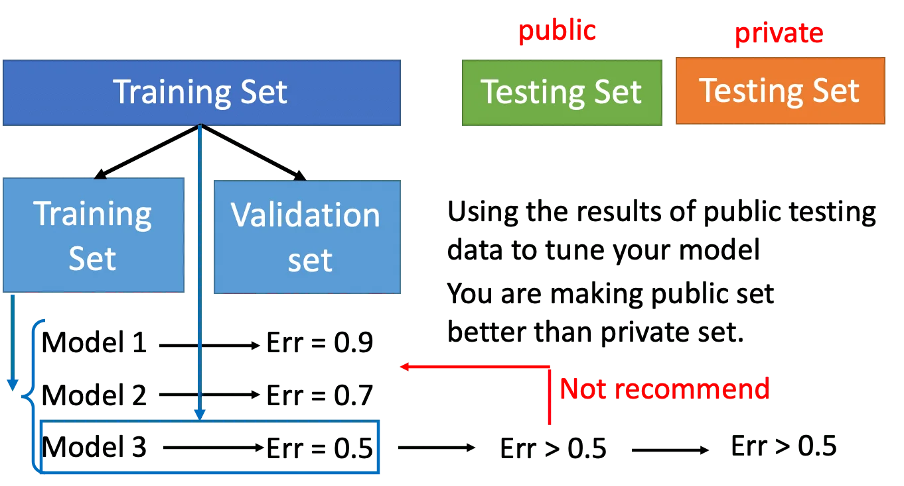
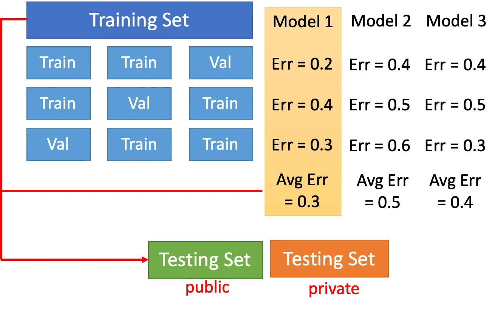

上节课讲到，不同的 function set 会得到不同的 Error，而且复杂的模型并不意味着更低的 Error. 本节要讨论的就是 Error 从何而来。

其实 Error 有两个来源，一个是来自于 **Bias**, 另一个是来自于 **Variance**. 如果能够明确 Error 的来源，那么就可以适当地调整 Model.

## Estimator

假设存在一个计算宝可梦进化后 CP 值的 GT 函数 $\hat{f}$，那么
$$
\hat{y} = \hat{f}(宝可梦)
$$
这个函数只有 GF？（Niantic）知道。从训练数据中我们可以拟合出一个函数 $f^*$，但是 $f^*$ 不可能完全等同于 $\hat{f}$. 我们说两者之间的距离来源于 Bias 和 Variance.

### Bias and Variance of Estimator

这一节是统计学原理，略过。简单说就是样本均值/样本方差与真实的均值/方差并不等同，但是根据大数定律，只要 data 够多，那么样本均值/方差可以认为是均值/方差。 

那么 Bias 和 Variance 对误差的影响可以用下图来概括：

我们做多次试验得到多个 $f^*$，对其求期望得到 $\bar{f}$，它和 $\hat{f}$ 之间的距离就是 Bias. 而各个 $f^*$ 之间分散的程度就是 Variance. 我们期望的就是一个 low bias & low variance 的 function, 换言之就是我们希望找到的函数又稳又准。

假设我们的用不同的 Model 分别做了 100 次的实验（用不同的数据集），把他们画出来的结果是：

可以看到一次函数的分布是比较集中的，也就是说它的 Variance 比较小。相对的五次函数的分布是比较散乱的，也就是它的 Variance 比较大。直觉上来说，这是因为简单的 Model 比较不容易受到 data 的影响，也就是对离群点的鲁棒性比较高。

由于我们并不知道真实的 $\hat{f}$，因此我们假设一个作为 GT. 然后我们计算上述 $f^*$ 的期望：

可以看到五次函数和 $\hat{f}$ 的距离最近，也就是 Bias 最小；而一次函数的最远，也即 Bias 最大。换言之，简单的模型具有比较大的 Bias，复杂的模型具有比较小的 Bias. 造成这种结果的原因是，当我们设定了 Model 的形式，也就已经设定好了它的 function set. 越简单的模型，其 function set 的空间也就越小。因此，有可能 $\bar{f}$ 根本不在这个 space 当中，也即无论我们找到多好的 $f^*$ 它都和 $\bar{f}$ 有比较大的差别。而比较复杂的 Model 就有比较大的 function space，它就有可能包含目标函数。虽然复杂模型的 Variance 比较大，但是多次试验取平均后仍有可能得到和 target 比较近的 function.

小结一下，简单的模型有大的 Bias，但是有小的 Variance. 而复杂的模型具有小的 Bias，但是有大的 Variance. 可以看到下图中，随着模型变得复杂，Bias 在下降，而 Variance 在上升。如果 Bias 很大，就称为 **欠拟合（Underfitting）**，如果是 Variance 很大，就称为**过拟合（Overfitting）**.

### What to do with large bias & variance?

如果模型连训练数据都不能拟合，则说明 bias 很大，是欠拟合。

这种情况说明模型的拟合能力不足，需要重新设计模型，例如使用更复杂的模型。（这种情况下增加训练数据不会有帮助）

如果模型在训练数据上的表现很好，但是在测试数据上有很大的 Error，则说明 Variance 很大，是过拟合。

这种情况说明模型产生了过拟合，有两种处理方法：

1. 使用更多的训练数据。（实际上不一定做得到，不过可以用数据增广。）

2. 使用正则化，但是这样做相对于缩小了 function space，使其只包含比较平滑的曲线，可能会导致 bias 增大。因此要适当地取正则项权重，在 variance 和 bias 之间取得平衡。

   

## Model Selection

通常 Bias 和 Variance 之间有一个 trade-off，我们要选取能够使得两者的 Error 都比较低的 Model. 但有一件事是不能做的：不能用 testing set 来评估 Model 的好坏。

这是因为，假设我们用手头上有的测试数据评估出了最优函数，而这个 testing set 本身有自己的采样噪声，但这个噪声和真实的 testing set 的噪声一般不相同。除非自己的训练数据能够很好地表示总体分布，否则在实际使用的时候 Error 一定是会变大的。

所以，一个常用的方法是做交叉验证（cross validation).

## Cross Validation

我们把训练数据分成 training set 和 validation set. 我们在 training set 上训练 Model，在 validation 上评估 Model. 如果担心这样会使得训练数据变少，就在选出 Validation Error 最小的 Model 后，用全部的训练数据重新 train 一次。

这样做以后，在 public testing set 上的 Error 可能会变大，但是这样的 Error 才能真正表示在 private testing set 上的表现。

当然，不建议再根据 public testing set 上的 error 回去调整 Model，这样相当于又一次引入了 public testing set 的噪声。

如果担心这样划分的 Validation Set 也存在噪声，那么可以用 N-fold 交叉验证。具体的做法是（以 3-fold 为例）：

把 Training Set 分成三份，第一次用前两份训练，最后一份评估。第二次用 1、3 份训练，第二份评估，以此类推，也就是，每一份 data 都会作为一次 Validation set 进行一次训练，有几个 fold 就训练几次。找出平均 Error 最小的那个 Model 作为最好的 Model.

