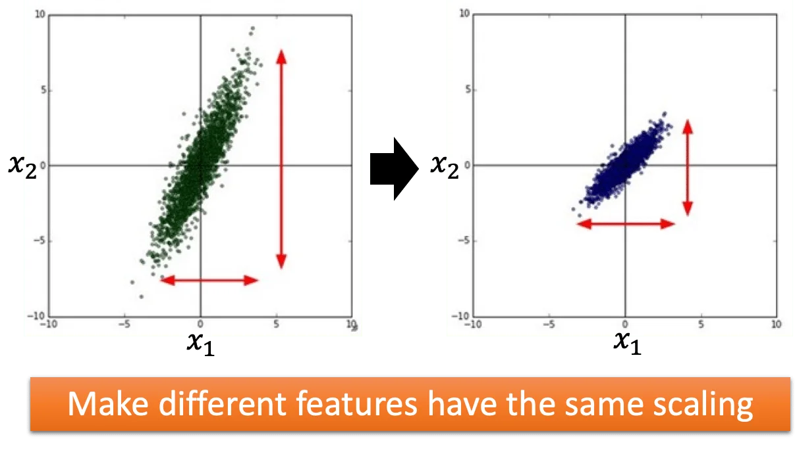
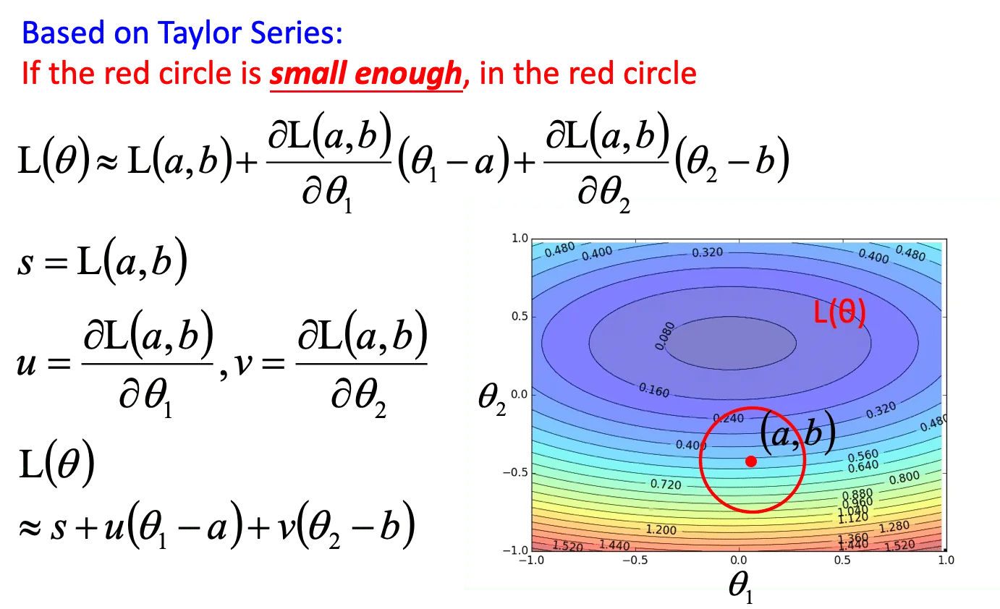

## Review: Gradient Descent

在上节我们提到，解一个 regression （或者说一个 machine learning 问题）的第三部是要解如下的一个优化问题：
$$
\theta^* = arg \min_\theta L(\theta) \\ L: \mathrm{loss\ function} \quad \theta: \mathrm{parameter}
$$
其中 $\theta$ 就是我们要优化的参数。假设我们有两个参数 $\{\theta_1, \theta_2\}$要优化，那么步骤入下：

1. 随机初始化 $\theta^0 = [\theta_1^0, \theta_2^0]$

2. 计算梯度并更新参数：
   $$
   {\left[ 
   \begin{matrix}
   \theta_1^1 \\ \theta_2^1
   \end{matrix}
   \right]} =
   {\left[ 
   \begin{matrix}
   \theta_1^0 \\ \theta_2^0
   \end{matrix}
   \right]} - 
   \eta{\left[ 
   \begin{matrix}
   \partial{L}/\partial{\theta_1} \\ \partial{L}/\partial{\theta_2}
   \end{matrix}
   \right]}
   $$
   反复执行第二步直到收敛。其中，$\eta$ 后面的向量就被称为 **梯度（Gradient）**。因此参数更新也可以简写作：
   $$
   \theta^1 = \theta^0 - \eta\triangledown L(\theta^0)
   $$

一个简单的可视化如下：

 红色箭头就是梯度方向，蓝色箭头表示参数更新的方向，也就是梯度的反方向乘以学习率。

## Tip 1: Tuning your learning rates

一个好的学习率是红色线条的走势，它很好很快地走到了波谷。

如果 LR 太小，就会像蓝色线条，虽然最终会走到波谷，但它会走得非常慢。

但是如果 LR 太大，可能会像绿色线条在山谷两端震荡，甚至像黄色线条直接飞出去。

如果参数是三维以上的话，Loss 和参数就不太好做可视化，但我们仍然可以做参数更新的次数与 Loss 变化的走势图：

### Adaptive Learning Rates

一个常用的做法是，随着训练轮次的增多，适当地减小 LR. 这是因为在训练开始的阶段，我们通常离目标点是比较远的，所以我们会用比较大的 LR 快速更新参数。但是随着训练轮次的增长，我们离最优点比较近了，这时候就要减小 LR 以免产生震荡。

举个例子，一个常见的 LR 衰减是 $\eta^t = \eta / \sqrt{t+1}$，其中 $t$ 是参数更新的次数，因此这一类 LR 也叫做 t(ime) - dependent 的 LR.

但是，LR 并不是一个 one-size-fits-all 的超参数，因此最好是要给每个参数设置不同的 LR.

### Adagrad

将 LR 除以之前计算的微分值的均方根（Root mean square）.

假设我们使用刚刚提到的 t-dependent 的 LR: $\eta^t = \eta / \sqrt{t+1}$，设 $g^t = \partial{L(\theta^t)} / \partial{w}$  为梯度，那么：

***<u>Vanilla Gradient Descent</u>***
$$
w^{t+1} \leftarrow w^t - \eta^tg^t
$$
***<u>Adagrad</u>***
$$
w^{t+1} \leftarrow - \frac{\eta^t}{\sigma^t}g^t
$$
其中 $\sigma^t$ 就是 $w$ 的所有历史梯度值的均方根。

下面来看一个例子：
$$
w^{1} \leftarrow w^0 - \frac{\eta^0}{\sigma^0}g^0 \qquad \sigma^0 = \sqrt{(g^0)^2} \\
\quad \\
w^{2} \leftarrow w^1 - \frac{\eta^1}{\sigma^1}g^1 \qquad \sigma^0 = \sqrt{\frac{1}{2}[(g^0)^2 + (g^1)^2]} \\
\quad \\
...
\quad \\
w^{t+1} \leftarrow w^t - \frac{\eta^t}{\sigma^t}g^t \qquad \sigma^0 = \sqrt{\frac{1}{t+1}\sum_{i=0}^t(g^i)^2}
$$
把公式 (6) 带入公式 (5) 可以看到 $\sqrt{t+1}$ 被约掉了，因此 Adagrad 的参数更新可以写作：
$$
w^{t+1} \leftarrow w^t - \frac{\eta}{\sqrt{\sum_{i=0}^t(g^i)^2}}g^t
$$
注意这里的 LR 退回成了一个常数，因为 time-dependent 的系数被约掉了。

Adagrad 的一个缺点是，随着训练轮次的增加，梯度前的系数会越变越小，导致参数的更新变得非常缓慢。

另外一个值得考虑的问题是，很显然梯度前面的系数和梯度值的大小是成反比的。也就是说，在梯度越大的地方，LR 的系数反而越小，导致更新的速度其实是变慢的。这样的矛盾其实是 Adagrad 的设计，它要考虑的是当前这个梯度有多 Surprise. 也就是说，如果历史梯度很小，突然碰到一个很大的梯度，它会下降得比较小心；而如果历史梯度都很大，突然遇到一个比较小的梯度，它会比较自信地继续下降。

> 这里插入一个分析的过程：是否梯度越大的地方，下降得越快越好。答案是否定的。
>
>  
>
> 上图是一个简单的二次函数，其最低点的 $\hat{x} = -\frac{b}{2a}$. 而 $x_0$ 处到 $\hat{x}$ 的距离为 $\frac{|2ax_0+b|}{2a}$. 可以看到分子正好是二次函数在 $x^0$ 处的梯度值，而分母则是二阶梯度的值。因此最好的步长不仅取决于一阶梯度，也取决于二阶梯度。

上面的分析和 Adagrad 的关系是：其实 Adagrad 的 LR 系数（分母）实际上就是用来近似二阶导的。也就是说，Adagrad 在不增加计算量的情况下（只计算了一次微分的值）用一阶微分的均方根近似代替了二阶微分。可以这样近似的原因是，假设我们有胖瘦两个二次函数：

它们对应的一阶导如下图。如果我们采样足够多的点，那么这些点就可以反映二阶导的大小（矮胖的函数二阶导比较小，瘦高的函数二阶导比较大），但其实在数值上并不是近似的，只是通过一阶导数的离散程度可以反映二阶导数的大小。

## Tip 2: Stochastic Gradient Descent

假设一个线性回归，它的 Loss 形式是：
$$
L = \sum_n(\hat{y}^n - (b + \sum w_ix_i^n))^2
$$

- 普通的梯度下降：$\theta^i = \theta^{i-1} - \eta\triangledown L(\theta^{i-1})$
- 随机梯度下降（Stochastic Gradient Descent, SGD）：
  1. 随机选取一个 example $x^n$
  2. 对这个 example 计算 Loss: $L^n = (\hat{y}^n - (b + \sum w_ix_i^n))^2$
  3. 更新参数：$\theta^i = \theta^{i-1} - \eta\triangledown L^n(\theta^{i-1})$

也就是说，普通的梯度下降是对整个数据集计算梯度，然后才更新参数。而随机梯度下降是每次只对一个 example 计算梯度，并且更新参数。一个可视化的对比如下：

## Tip 3: Feature Scaling

也就是特征归一化（特征缩放）

加入我们要做一个有有两个输入的回归 $y = b + w_1x_1 + w_2x_2$，并且两个输入的分布有很大的差异，那么这时候最好是做一次特征缩放，让两者的分布尽可能的对齐：

举例来说，如果我们把特征缩放前后的 Error Surface 画出来：

可以看到在特征缩放以前 $x_2$ 的值是远大于 $x_1$ 的，那么 $w_2$ 的微小变化就会给输出带来很大的变化。那么在做梯度下降的时候，就需要给两个参数比较不同的 LR，才能让它正确地收敛到最优。

而做完特征缩放以后，Error Surface 趋近圆形，这种情况下的参数更新是比较容易的，可以使用相同/相似的 LR.

特征缩放的做法有很多，比较常见的做法有对每个输入做归一化：

## Question

当我们用梯度下降解一个最小化问题时，是否随着参数的更新，Loss 一定会下降？答案是否定的。原因就是学习率的大小。

这里开始一个数学推导。先说结论：梯度下降之所以能够成立，是因为所有的可无限求导的函数都可以被泰勒展开。而泰勒展开在无穷小的局部可以用一次项近似这个函数，而泰勒展开的一次项，也就是一阶梯度。具体来说：

下面是一个有两个参数的损失函数的 Error Surface. 那么给定一个初始点，给定一个范围，我们是否能够找到这个范围内的某个点，使得 Loss 最小？答案是肯定的。

这里先用 $sin(x)$ 的泰勒展开为例：

可以看到在 $x_0 = \pi / 4$ 附近，仅有 0 次和 1 次项的直线就和 $sin(x)$ 是很相似的。如果我们考虑多个参数，那么多元泰勒公式的形式是（仅包含 0 次和 1 次项）：

回到刚才的 Error Surface，我们可以把 Loss Function 用泰勒函数一阶展开：

当且仅当红圈足够小的时候这个近似是成立的。我们把两个参数的一阶梯度分别记为 $u, v$，那么 Loss Function 就可以写作
$$
L(\theta) \approx s + u(\theta_1 - a) + v(\theta_2 - b)
$$
考虑到 $s$ 是一个常数，最小化的时候可以不用考虑它。那么我们的问题就变成了一个有约束的优化问题：

也就是说，我们要在红圈上找到能使得 $(u, v)$ 和 $(\theta_1 - a, \theta_2 - b)$ 的内积最小的一组 $(\theta_1 - a, \theta_2 - b)$ . 把这个向量记为 $(\triangle\theta_1, \triangle\theta_2)$，那么显然有，使得这个内积最小的  $(\triangle\theta_1, \triangle\theta_2)$，就是与 $(u, v)$ 方向相反，长度等于红圈半径的向量。

这样一来就把泰勒公式的一阶展开和梯度下降联系在了一起。这也是为什么梯度下降能够成立，因为在无穷小的范围内（红圈内），一阶泰勒公式可以近似表示 Loss Function. 而一阶泰勒近似在无穷小范围内的极小值就指向 **方向与梯度相反，长度等于无穷小的半径** 的位置。这也就要求 LR 需要无穷小（当然在实作中足够小就可以）。因此 LR 的调整是很重要的。

## More Limitation of Gradient Descent

一个常见的问题就是 Local Minima. 当然除此之外，还有 **鞍点（Saddle Point）**的微分值也是 0.

因此，在实作中，我们很容易在远离 Minima 的地方就停下来了。（梯度约等于 0 的地方可能是离极小值很远的平原）

