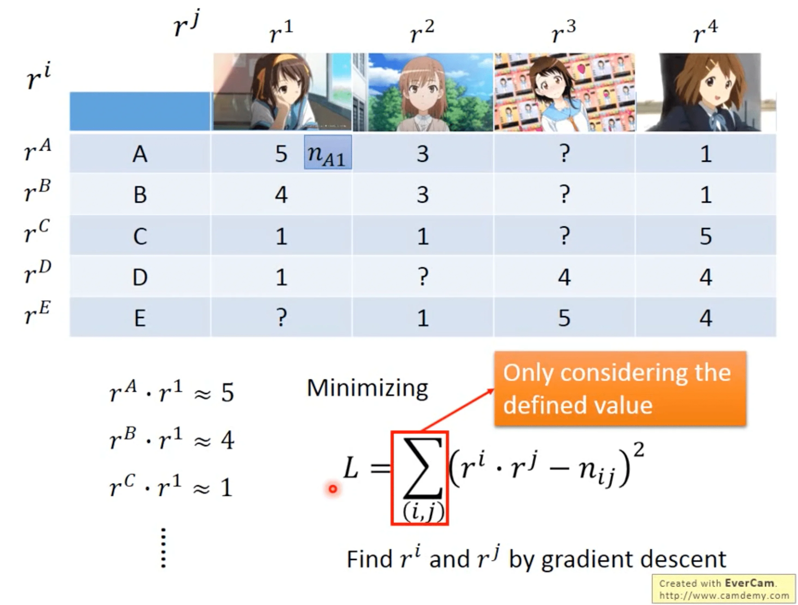

我们把无监督学习分为两大类：

- Clustering & Dimension Reduction（化繁为简）

  也就是抽象。比如给定一些树木的图片，我们要找到一个 function，对应它们都输出一个「树」的抽象表示。一般情况下我们只会有输入，而没有输出的 Label.

- Generation（无中生有）

  给定一段编码（Code），我们要找到一个 function，对应不同的编码输出不同的结果。比如输入 1，输出枫树，输入 2，输出柏树。一般情况下我们只有 Label，而没有 input. 也就是说我们可能有一堆图像，但我们不知道什么样的输出可以生成这些图像。

本节只关注第一类的 Linear Methods.

## Clustering

聚类的定义就不展开讲了。其主要问题是我们究竟需要多少个类别？这个一般是由经验来决定的，没有什么统一的办法。

最常见的做法有：

- K-means

  - 把 $X = \{x^1, ..., x^n, ..., x^N\}$ 聚类为 $K$ 类

  - 随机初始化 $K$ 个中心 $c^i, i = 1, 2, ..., K,(c^i \in X)$. 聚类中心最好是从数据里随机取，如果是不依赖于数据完全随机生成，有可能某个聚类在第一次更新时不包含任何一个样本，那它在更新的时候就会出错（分母为 0）。

  - 重复：

    - 对于 $\forall x^n \in X$ ：

      - 如果 $x^n$ 最靠近 $c^i$，则 $b^n_i = 1$ 表示这个样本属于第 $i$ 个中心
      - 否则 $b^n_i = 0$

    - 更新所有的聚类中心：
      $$
      c^i = \sum_{x^n} b^n_ix^n \bigg/ \sum_{x^n}b^n_i
      $$
      

- Hierarchical Agglomerative Clustering（HAC）阶层分群法

  这是一个自底向上的 merge 算法，从叶子开始算样本间的相似度，最相似的 N 个样本聚为一类。不断往上聚类直到只剩一个根节点。然后根据想要的类别个数在树的对应层上切一刀，当前层的节点个数就是类别个数。

  

但是聚类有一个问题，它只把某个样本分配给唯一一个类别。但是样本可能具有多种类别的属性，只用一个类别来描述未免有些以偏概全。所以我们可以用 Distributed representation 来做降维。也就是说，给定一个样本，它同时具有多种类别的特征，我们可以用一个 vector 来表示这个样本，每一维表示一个类别，其值表示该样本属于对应类别的强度。

## Dimension Reduction

所以降维为什么会有用？这是因为某些用高维表示的样本其实不需要这么高的维度就可以描述。（例子都很直觉这里就不提了）

我们想要找到一个函数，输入现有的样本，输出它的一个低维度的表示。

一个简单的做法是 Feature Selection，就是从现有的 Feature 中挑选出有代表性的留下来，剔除其余的特征。但是这种做法只对比较简单的数据有效，如果数据本身的维度比较高或者不好描述，就不适用于这种方式。

另一种常见的做法是主成分分析（Principle Component Analysis, PCA）

## PCA

这就是一个常见的线性降维的做法，它的核心就是要找到一组参数 $W$ 使得 $z = Wx$ 且 $z$ 的维度小于 $x$.

我们先举一个简单的例子，这里的 $z$ 是一维的（也就是一个标量），那么 $W$ 和 $x$ 实际上都是一维向量，我们用 $w^1$ 来表示这个 $W$。

我们首先约束 $||w^1||_2 = 1$。那么$ z_1 = w^1 \cdot x$ 的结果就是 $x$ 在 $w^1$ 方向上的投影的长度。

那么如何找这个 $w^1$？我们的原则是，要让 $z^1$ 的方差尽可能地大。

如果我们希望降低到超过 1 维的情况，这时候就需要找第二个 $w^2$ 使得 $z^2 = w^2\cdot x$ 尽可能地分散。为了让 $w^1, w^2$ 不相等，我们引入一个约束：$w^1 \cdot w^2 = 0$，也就是不同维度对应的投影向量必须是正交的。直觉上来说，我们希望找到「多个正交的维度」，使得样本在这些维度上都可以尽量地分散开。

把所有的 $w$ 都叠起来，我们就得到一个正交矩阵。
$$
W = 
\begin{bmatrix}
(w^1)^T \\ (w^2)^T \\ ...
\end{bmatrix}
$$
现在的问题是，到底要怎么找这些 $w$？当然可以把这个问题建模成神经网络然后用梯度下降，但是这里要介绍一个经典的做法，也就是拉格朗日乘子法。

我们要找到的特征是 $z_1 = w^1\cdot x$，使得 $x$ 在 $w^1$ 方向上尽可能地分散，也就是方差尽可能大​。所以我们从方差入手：

1. 首先计算均值：
   $$
   \bar{z_1} = \frac{1}{N}\sum z_1 = \frac{1}{N}\sum w^1\cdot x = w^1\cdot\frac{1}{N}\sum x = w^1\cdot \bar{x}
   $$

2. 再来计算方差（这里省略 $\frac{1}{N}$ 不然写起来太麻烦了）
   $$
   \begin{aligned}
   Var(z_1) &= \sum_{z_1}(z_1 - \bar{z_1})^2 \\
   &= \sum_x (w^1\cdot x - w^1 \cdot \bar{x})^2 \\
   &= \sum_x \big(w^1 \cdot (x - \bar{x})\big)^2 \\
   &= \sum (w^1)^T(x-\bar{x})(x-\bar{x})^Tw^1 \\
   &= (w^1)^T\sum (x-\bar{x})(x-\bar{x})^T\ w^1 \\
   &= (w^1)^TCov(x)w^1
   \end{aligned}
   $$
   其中第三行到第四行可以这样转换是因为当 $a, b$ 都是列向量的时候：
   $$
   (a\cdot b)^2 = (a^Tb)^2 = a^Tba^Tb = a^Tb(a^Tb)^T = a^Tbb^Ta
   $$
   最后一行的 $Cov(x)$ 是 $x$ 的协方差矩阵，我们记为 $S = Cov(x)$ ，那么问题就变成了：

   找到一个 $w^1$ 可以使得 $(w^1)^TSw^1$ 最大。但我们要给定 $w^1$ 一个约束，也就是 $||w^1||_2 = 1$，否则只要 $w^1$ 取无穷大就好了。

3. 先说结论，由于 $S$ 是协方差矩阵，所以它一定是对称且半正定的，也就是说它所有的特征值都非负。**我们要找的 $w^1$ 其实就是 $S$ 的最大的特征值对应的特征向量。**

   证明过程才真正用到拉格朗日乘子法（就是有约束的极值）：

   1. 设
      $$
      g(w^1) = (w^1)^TSw^1 - \alpha \big((w^1)^Tw^1-1 \big)
      $$

   2. 对 $w^1$ 的每一维求偏导，令它们都等于 0：
      $$
      \partial g(w^1)/\partial(w^1_1) = 0 \\
      \partial g(w^1)/\partial(w^1_2) = 0 \\
      ...
      $$
      然后我们可以得到：
      $$
      Sw^1 - \alpha w^1 = 0 \to Sw^1 = \alpha w^1
      $$
      也即 $w^1$ 是 $S$ 的关于特征值 $\alpha$ 的特征向量。对上式两边左乘 $(w^1)^T$ 有：
      $$
      (w^1)^TSw^1 = \alpha(w^1)^T w^1 = \alpha
      $$
      那我们的目的是使得左边最大，也就是使得右边最大。那么满足条件的 $\alpha$ 就是 $S$ 的最大的特征值，所以 $w^1$ 就是 $S$ 的最大的特征值对应的特征向量。

4. 然后我们要找下一个 $w^2$，那么相比 $w^1$ 它多了一个约束：$(w^2)^Tw^1 = 0$. 也先说结论，**这样找出来的 $w^2$ 是对应 $S$ 的第二大的特征值的特征向量。**

   证明：

   1. 设
      $$
      g(w^1) = (w^1)^TSw^1 - \alpha \big((w^1)^Tw^1-1 \big) - \beta\big((w^2)^Tw^1 - 0\big)
      $$

   2. 同样地对每一维求导，令它们都等于 0. 然后我们得到：
      $$
      Sw^2 - \alpha w^2 - \beta w^1 = 0
      $$
      左乘 $(w^1)^T$ 可以消掉第二项（约束 2，正交），且第三项为 1（约束 1，二范数等于 1）。于是有：
      $$
      (w^1)^TSw^2 - 0 - \beta = 0
      $$
      因为第一项是一个标量，所以它的转置等于其本身，因而有：
      $$
      \big((w^1)^TSw^2\big)^T = (w^2)^TSw^1 = \alpha(w^2)^Tw^1 = 0
      $$
      所以必须有 $\beta = 0$，因此：​
      $$
      Sw^2 - \alpha w^2 = 0
      $$
      于是有 $w^2$ 也是 $S$ 的一个特征向量。那么因为 $w^1$ 和 $w^2$ 是正交的，所以 $w^2$ 只能是第二大的特征值对应的特征向量。

### Decorrelation

PCA 降维还有一个好处是它实际上做了一次 decorrelation。$z$ 的协方差矩阵 $Cov(Z)$ 是一个对角阵，不同维度之间的协方差是 0，也就是不相关。那么如果这个 PCA 降维以后的特征要给一个生成模型使用，那么我们在做高斯先验假设的时候，我们就可以顺理成章地假设不同特征之间是不相关的，这样可以显著减少参数量，进而缓解过拟合问题。

我们把 $z$ 的协方差展开看看：
$$
\begin{aligned}
Cov(z) &= \sum (z-\bar{z})(z-\bar{z})^T = WSW^T, \ S = Cov(x) \\
&= WS[w^1 \quad ... \quad w^K] \\
&= W[Sw^1 \quad ...\quad Sw^K] \\
&= W[\lambda_1w^1 \quad ... \quad \lambda_Kw^K] \\
&= [\lambda_1Ww^1 \quad ... \quad \lambda_KWw^K] \\
&= [\lambda_1e_1 \quad ... \quad \lambda_Ke_K] \\
\end{aligned}
$$
注意 $W$ 是正交矩阵，因此 $Ww^1$ 只有 $(0, 0)$ 的位置是 1，其他位置是 0，这样的矩阵我们叫做 $e_1$，以此类推。所以 $Cov(z)$ 就是一个对角矩阵。

### Another point of view

现在我们从另一个角度来看 PCA.

如上图，我们以 MNIST 为例，假设我们有 $K$ 个基本成分如最上面一行所示，那么一个手写数字 7 就可以表示成 $[1\ 0\ 1\ 0\ 1\ ...]$，表示它是由 1 倍的 $u^1, u^3, u^5$ 所组成. 同样的我们可以用一个 $[c_1 \ c_2 ... c_K]$ 来表示所有的手写数字，每个位置的值表示对应的 component 的强度。

注意到上式的最后还有一个 $\bar{x}$，是所有 $x$ 的均值。我们把 component 的线性组合记为 $\hat{x}$，那么 $x - \bar{x} \approx \hat{x}$.

假设我们现在不知道这些 component 是什么，那我们就可以构造一个 reconstruction error:
$$
||(x - \bar{x}) - \hat{x}||_2
$$
于是我们的目标就变成找到一组 $\{u^1, ..., u^K\}$ 使得这个 reconstruction error 最小。也即：
$$
L = \min_{u^1,...,u^K} \sum \big|\big| (x-\bar{x})-\sum_{k=1}^K c_ku^k \big|\big|_2
$$
可以证明，我们之前说的 $w^1, ..., w^K$ 就是这里的 $u^1, ..., u^K$，也就是 $Cov(x)$ 的前 $K$ 大个特征值对应的特征向量就是我们要找的 basic component. 下面是证明：

首先，我们把 $x - \bar{x} \approx \hat{x}$ 表示成矩阵乘法：

其中 $x^i$ 表示第 $i$ 个数据，$c$ 的下标代表第 $i$ 个 component 的权重，上标代表第 $j$ 维的权重。要解这个最小化问题，就要用奇异值分解（Singular Value Decomposition）：

如图，右边的矩阵 $U$ 就是我们的 basic component 组成的矩阵，而在 SVD 分解中，它就是 $XX^T$ 的前 $K$ 大的特征值对应的特征向量组成的矩阵。而这里的 $XX^T$ 正是 $Cov(x)$. 所以用 SVD 得到的解和 PCA 得到的解是相同的。

那反过来，要怎么求解权重 $c_i$？
$$
\because \hat{x} = \sum_{k=1}^K c_kw^k \approx x - \bar{x} \\
\therefore c_k = (x - \bar{x})\cdot w^k
$$
因为第一个公式左右两边相等的情况下，两边右乘 $w^k$ 就可以把左边的 $w^j, j\ne k$ 消掉，而 $w^k(w^k)^T = I$，左边就剩下 $c_k$ 了。

有趣的是，这里可以跟神经网络联系起来。

假设 $K=2$，我们的输入是 $x-\bar{x}$，那么就有第一层 hidden layer $c_k = (x-\bar{x})\cdot w^k$，而输出 $\hat{x} = \sum_{k=1}^K c_kw^k$.（图中只画出了累加第二个 component 时的权重）。而我们要优化的目标就是最小化输出与输入之间的误差。这其实就是 Auto encoder.

不过如果用梯度下降来训练，其实是不可能和 PCA 相同的解的。第一个原因是 PCA 已经保证了误差最小化，而梯度下降不一定能刚好落到这个最小化的位置。再来就是梯度下降并不能保证解得的参数之间互相正交，而 PCA 是保证它们正交的。不过梯度下降的好处就在于它的网络可以是深层的，但 PCA 一般只有一层。

### Weakness of PCA

PCA 当然也不是万能的。

第一个弱点在于它是无监督的，那么它的效果其实取决于无标签样本分布。举个例子，如果我们的 unlabelled data 是如下分布，那 PCA 可能会得到一个左上到右下的投影方向。但是这一堆数据有可能是左右分为两类，这样做完 PCA 以后反而会导致他们混在一起。

一个解决方法是引入有标签数据，用线性判别分析（Linear Discriminant Analysis, LDA）来解，不过这个实际上是监督学习了，所以这里不展开。

另一个弱点在于，它是一个线性变换，所以如果高维的样本本身无法很好地线性降维，那么 PCA 的效果也会很差。这种情况需要用非线性降维来做，后面会讲到。

### PCA - Pokemon

现在来举一个例子。我们知道一只宝可梦是用六维属性（HP, ATK, DEF, SP ATK, SP DEF, SPEED）来描述的，那么如果我们要对这六个属性做降维，我们应该用几维的表征？（也就是需要用多少个主成分？）

一个简单的方法是计算：
$$
\frac{\lambda_i}{\lambda_1+\lambda_2+\lambda_3+\lambda_4+\lambda_5+\lambda_6}
$$
也就是，我们计算每个主成分对应的特征值（也就是用这个主成分做降维的话，数据分散的程度）在所有特征值中的占比。因为 $X$ 是六维的，所以我们能够得到 6 个主成分。这里给出一个数据：

|       | $\lambda_1$ | $\lambda_2$ | $\lambda_3$ | $\lambda_4$ | $\lambda_5$ | $\lambda_6$ |
| ----- | ----------- | ----------- | ----------- | ----------- | ----------- | ----------- |
| ratio | 0.45        | 0.18        | 0.13        | 0.12        | 0.07        | 0.04        |

可以看到，最后两个主成分的占比是很小的，意味着在这两个主成分上投影，数据的分散程度很低。因此我们可以只选用前 4 个作为主成分。那么实际来试一下。

我们现在取前 4 个主成分，每个主成分都是 1x6 维的（ 6x6 矩阵的特征向量当然是 1x6 维的）

|      | HP   | ATK  | DEF  | SP ATK | SP DEF | SPEED | 描述  |
| ---- | ---- | ---- | ---- | ------ | ------ | ----- | ----- |
| PC1  | 0.4  | 0.4  | 0.4  | 0.5    | 0.4    | 0.3   | 强度 |
| PC2  | 0.1  | 0.0  | 0.6  | -0.3   | 0.2    | -0.7  | 防御（牺牲速度） |
| PC3  | -0.5 | -0.6 | 0.1  | 0.3    | 0.6    | 0.1   | 特防（牺牲攻击和生命） |
| PC4  | 0.7  | -0.4 | -0.4 | 0.1    | 0.2    | -0.3  | 生命力 |

我们可以把前面两个主成分对应的散点图画出来。可以看到强度最高的三只 PM 分别是原始回归盖欧卡（？这数据也太新）、Mega 超梦 Y 和 Mega$^2$ 绿毛虫（不是）。防御力最高的是壶壶。

把后面两个主成分对应的散点图画出来：

可以看到高生命力的是吉利蛋和幸福蛋，高特防的是壶壶和冰神柱（我忘了它叫什么），这确实是和数据相符的。

### PCA - MNIST

我们可以把一张手写数字图像也用 PCA component 的线性组合来表示。我们把前 30 个 component reshape 成图像以后打印出来：

（MNIST 的图像大小是 28x28=784，因此特征向量是 1x784 维，因此可以 reshape 回 28x28）

> 这里我一开始没理解过来，PCA 到底降低了哪一维？实际上 PCA 要降低的是 $XX^T$ 的横轴的维度（可以回看上面的 Another point of view 一节），也就是从一个 MxM （这里是 784x784）的矩阵降维到 MxK （784x30）的矩阵。但是每个主成分本身还是 1xM 维的，因为每个主成分都是原先的 MxM 维矩阵的特征向量。

### PCA - Face

这里会有一个问题，我们一开始说 PCA 的主成分是作为图像的 component，这些 component 的加权和就会约等于图像本身。但是我们上面找出来的 MNIST 和 FACE 的 PCA component 看起来都不像是「Component」. 这一原因是 component 加权和的「权重」本身是一个实数，它是可正可负的。这意味着 PCA 的成分不一定是「一部分的图像」，而有可能是一个比较整体的结果。

比如说我要得到数字 9，它可以是一个数字 8 减去下面的圆圈再加上一笔竖画。又或者比较 general 地来说，我们可以先加上一堆乱七八糟的东西，再减去一些乱七八糟的东西，它可能最后得到的就是我们想要的图像。

如果我们真的想要得到类似于「部件」的 component，我们就要强制要求 component 及其对应的权重是非负的（也就是 $w^i, \alpha_i$ 都是非负的）。这种做法叫 Non-negtive matrix factorization （NMF），而 SVD 分解出来的矩阵并不保证所有 component 的权重是非负的。

比如说 MNIST 上做 NMF 的结果：

在人脸上做 NMF 的结果：

## Matrix Factorization

接下来是矩阵因子分解的部分。有时候我们会有两种 object，它们之间受到同一个 latent factor 控制。

（这个例子实在是太那个了）

假设说我们现在有 M 个肥肥（列）和 N 个女性动漫角色（行），于是我们统计肥肥买了多少个对应的角色的手办，记作矩阵 $X$.

这时候我们想知道是什么在影响肥肥是否会购买对应的手办。我们假设有萌呆和萌傲娇两个因素（$K=2$），而角色本身也有傲娇和萌两种属性，那么肥肥的萌属性和角色的属性的內积越大，代表这个肥肥越有可能购买对应的手办。

那么现在我们有这个矩阵 $X$，假设这个影响因素是 $K$ 维的，那我们要怎么找到这 $M$ 个肥肥以及 $N$ 个手办对应的 $K$ 维属性？这就要用到矩阵因子分解，也就是我们有一个 $M\times N$ 的矩阵 $X$，我们希望把它分解成一个 $M\times K$ 和一个 $K\times N$ 矩阵的乘积，并最小化这个乘积和原始矩阵之间的误差。

前面说到的 SVD 是可以解决这个问题的，至于中间多出来的那个矩阵可以分配给前一个或后一个矩阵都行。

但是如果我们没有办法得到完整的 $X$，也就是有一些数值是未知的，那么用 SVD 去做就会做不动。这时候我们可以用梯度下降避开这些没有值的位置：

用有值的位置得到了 $r^i, r^j$ 以后，我们就可以用这些值去反推没有值的位置。这个做法常用在推荐系统。

我们上面是考虑说，矩阵 $X$ 就是近似等于两个分解后的矩阵的乘积。但也有可能有其他的偏差因素在产生影响。

考虑到这些 individual characteristics，我们把原来的式子写作：
$$
r^A \cdot r^1 \approx 5 \to r^A \cdot r^1 + b_A + b_1 \approx 5
$$
其中 $b_A$ 表示这个肥肥有多喜欢买手办，$b_1$ 表示角色 1 有多有人气。那么我们的优化目标就要改成：
$$
L = \min \sum_{i,j}(r^i\cdot r^j+b_i+b_j-n_{ij})^2
$$
当然我们还是用梯度下降（可以加上正则项，考虑 $r$ 是不是松散的，也就是一个肥肥要么萌呆要么萌傲娇，不会两个都萌）。

#### Applications

- Topic Analysis

  也就是 Latent Semantic Analysis（LSA），我们找到的 latent factor 可能就是文章的主题。

  

还有一些 related work 这里不提了。