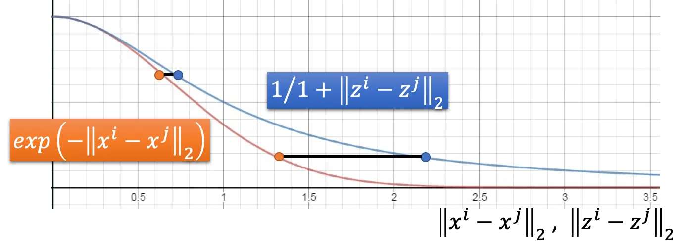

这一节我们要讨论非线性降维。假设我们现在有一笔数据，它是一个高维的流形（Manifold），也就是说，它实际上是一个分布在低维度的数据，只是被扭曲了以后放到了高维里。

一个常见的例子就是地球，它就是一个三维空间中的二维平面。这样的形状存在一个问题，那就是欧式几何只在很小的区域内成立。如果我们用欧几里得距离去计算两点之间的距离，那么只有在点很近的时候这样的比较才是有意义的。我们想要做的就是把这个高维空间中的流形摊平，我们就可以在降维后的空间里面很方便地计算两点之间的欧氏距离。这对于我们做聚类或者监督学习都是有帮助的。

### Locally Linear Embedding（LLE）

也即局部线性嵌入。它的做法是，对于 $x^i$ 的邻居，我们希望找到一组 $w_{ij}$ 使得下面这个式子最小化：
$$
\sum_i \big|\big| x^i-\sum_j w_{ij}x^j \big|\big|_2
$$
也就是说，我们希望用 $x^i$ 的邻居的线性组合来表示 $x^i$，我们要做的就是找到这个线性组合的权重。然后经由这些权重找到一个降维的结果 $z^i, z^j$. 也就是说，我们希望找到一组维度低于 $x$ 的 $z$ 使得下面这个式子最小化：
$$
\sum_i \big|\big|z^i-\sum_j w_{ij}z^j \big|\big|_2
$$
我们通过 $w_{ij}$ 保留了降维以后的 $z^i, z^j$ 之间的关系。这就是「在天愿作比翼鸟，在地愿结连理枝。」

LLE 其实是没有一个指导性的做法来说明这个 transformation 要怎么做的，但它的好处就在于，如果 $w_{ij}$ 是已知的，我们甚至不需要知道原来的特征表示 $x$，也可以计算出降维后的 $z$.

至于邻居数目的选取取决于原始数据的分布。比如说上面那个 S 形状的流行，用 LLE 处理的话：

显然有邻居数量太少的时候，它的关系捕捉得不够好。如果邻居数量太多了，又回到上面说的，欧氏距离在较大的范围内是失效的，LLE 反而捕捉到了不对的联系。所以邻居数量要选取一个适当的值。

### Laplacian Eigenmaps

另一种做法是拉普拉斯特征图，这是一种基于图的方法。

之前在 P23 Semi-Supervised Learning 一节中也有说到，两个点通过一组高密度区域相连的话，他们的距离是比较近的。所以我们可以把原始数据构造成图结构，那么点在图上的距离就可以用于近似表示点在流形上的距离。

我们回顾一下半监督学习的 Loss：
$$
L = \sum_{x^r} C(y^r, \hat{y}^r) + \lambda S
$$
其中后一项展开为：
$$
S = \frac{1}{2}\sum_{i,j} w_{i,j}(y^i-y^j)^2 = \bold{y}^TL\bold{y} \\
L = D - W
$$
我们称为平滑正则项，它用来评估我们在无标签样本上预测出的标签有多「平滑」。其中，如果两个样本在图中是相连的，那么 $w_{i, j}$ 就是两者的相似度，否则为 0. 这就要求相似的样本要有相似的标签。

$L$ 称为矩阵的 Laplacian，是一个 $(R+U)\times(R+U)$ 的矩阵，是 Degree matrix（临边权重和的矩阵） 和 Weight Matrix（带权重的邻接矩阵）的差。

回到无监督学习上，道理是一样的。我们希望说，如果 $x^1, x^2$ 在高维空间中是接近的，那么降维后的 $z^1, z^2$ 也要是相近的。

于是我们写出一个相似的表达式：
$$
S = \frac{1}{2}\sum_{i,j}||w_{i,j}(z^i-z^j)||_2
$$
不过这样当然是行不通的。因为少了监督学习的 Term，模型只要让所有的 $z^i=z^j=0$ 就好了。所以我们还要加上一些约束。我们规定说，如果我们希望降维后的维度是 $M$，那么我们希望 $z$ 不要比 $M$ 的维度更小，而是要充满整个 $M$ 维空间。也即：
$$
\mathrm{Span}\{z^1, z^2, ..., z^N\} = R^M
$$
实际上这样解出来的 $z$ 就是 $L$ 的最小的 $M$ 个特征值对应的特征向量。

如果我们找到了 $z$ 再对数据做聚类的话，这样的聚类被称为 **谱聚类（Spectual Clustering）**。

## t-SNE

T-distributed Stochastic Neighbot Embedding

前面的做法有一个问题是：它们只约束了相似的样本降维后也要相似，但它们没有约束不相似的样本在降维以后不要堆在一起。

t-SNE 的做法是，先计算所有样本之间的相似度 $S(x^i, x^j)$，然后要做一个 Normalization 的计算：
$$
P(x^j|x^i) = \frac{S(x^i, x^j)}{\sum_{k\ne i}S(x^i, x^j)}
$$
显然有 $\sum_{j\ne i} P(x^j|x^i) = 1$

假设我们现在已经找出了一组降维后的 $z$，计算所有降维后的样本的相似度 $S'(z^i, z^j)$，以及：
$$
Q(z^j|z^i) = \frac{S'(z^i, z^j)}{\sum_{k\ne i}S'(x^i, x^j)}
$$
直觉上来说，我们是希望在高维和低维空间中，样本之间的相似度的尺度的分布是尽可能相似的。因此我们要最小化的目标是这两个分布之间的 KL 散度：
$$
\begin{aligned}
L &= \sum_i KL \big( P(*|x^i)||Q(*|z^i) \big) \\
&= \sum_i \sum_j P(x^j|x^i)log\frac{P(x^j|x^i)}{Q(z^j|z^i)}
\end{aligned}
$$
训练的话只要对 $z$ 求微分做梯度下降就可以。不过 t-SNE 的问题在于要对所有的样本计算相似度，如果原本数据维度很高的话，这个计算量是很大的。所以可以先用 PCA 之类的方法先降维一次，然后再用 t-SNE 二次降维。

还有一个问题是，t-SNE 实际上不适用与做 training-testing 的任务，因为它无法 apply 到新来的数据上。所以它更多地被用在可视化上。

#### t-SNE Similarity Measure

我们仍未讨论的一个问题是，t-SNE 是如何计算相似度的？

参考之前的 graph-based 的相似度计算，我们在原始数据上的相似度计算选用径向基函数（RBF function）：
$$
S(x^i, x^j) = exp(-||x^i - x^j||_2)
$$
那么在降维以后的数据上也用一样的做法吗？

SNE（没有 t）就是这样做的。但是 t-SNE 却采用了一种 t 分布来计算相似度：
$$
S'(z^i, z^j) = \frac{1}{1+||z^i-z^j||_2}
$$

从这里可以看出来，t 分布有很明显的长尾效应。也就是说，如果本来在高维空间中，两点之间有一定的距离，那么在降维后使用 t 分布计算的相似度中，这个距离会被放大。因此 t-SNE 可以将不相似的类别分得更开。（左图实际上是先做了 PCA 再做的 t-SNE）

