所谓 Auto Encoder 其实就是如下的结构：

我们希望用一个神经网络学习图像的表示，把原始图像转换成一个维度更低的表征。但问题是，我们并不能事先知道这个表征长什么样，因此对于这个 Encoder，我们只有输入而没有标签。

那我们反过来想要训练另一个神经网络，它可以把一个低维度的表征解码成原始图像。同样的，我们虽然有输出的标签，但我们并没有作为输入的表征。

很自然地，我们会想要把这两个网络接在一起，输入和输出都是图像本身，而低维表征即作为 Encoder 的输出，也作为 Decoder 的输入，这样的结构就叫做 Auto Encoder. 

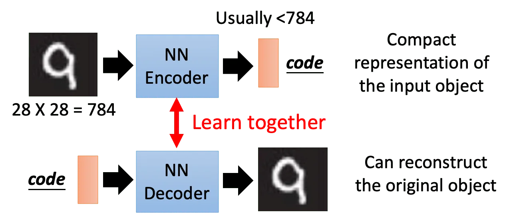

## Starting from PCA

> 这里可以和 P56 Linear Methods 的 Another Point of View 一节对照看

我们知道 PCA 在做的事情就是将输入图像（zero mean 以后的图像）乘以一个变换矩阵，得到一个中间表示。这个中间表示乘以变换矩阵的转置，得到一个输出图像。我们希望找到这样的一组变换矩阵 $W$ 使得输入和输出的均方误差尽可能小。

其中中间的隐层 $c$ 也叫做 Bottleneck Layer，因为它的维度一般是远小于输入图像的。而这个隐层 $c$ 的输出就是我们想要的低维编码。

我们把输入乘以变换矩阵的操作叫 encoder，把中间表示乘以变换矩阵的转置的操作叫 decode. 这样的结构我们就把它称为 Auto-encoder.

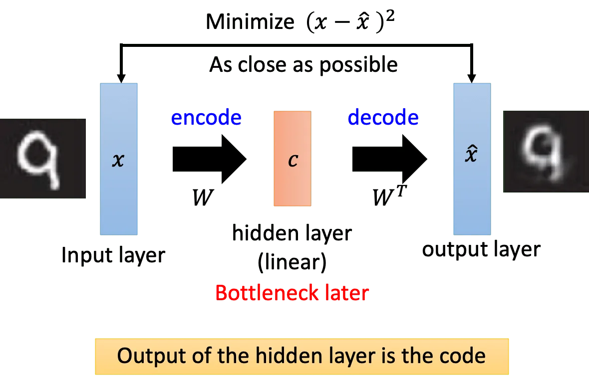

当然，auto-encoder 可以是深层的。不过我们发现说这样的结构如果不用 RBM 对每一层做初始化，它训练出来的效果不会太好。

另外，刚才在 PCA 里我们要求 decoder 和 encoder 的参数矩阵互为转置。虽然我们确实可以让网络做到这一点，但是现在一般来说是不做这个约束直接 train 的。

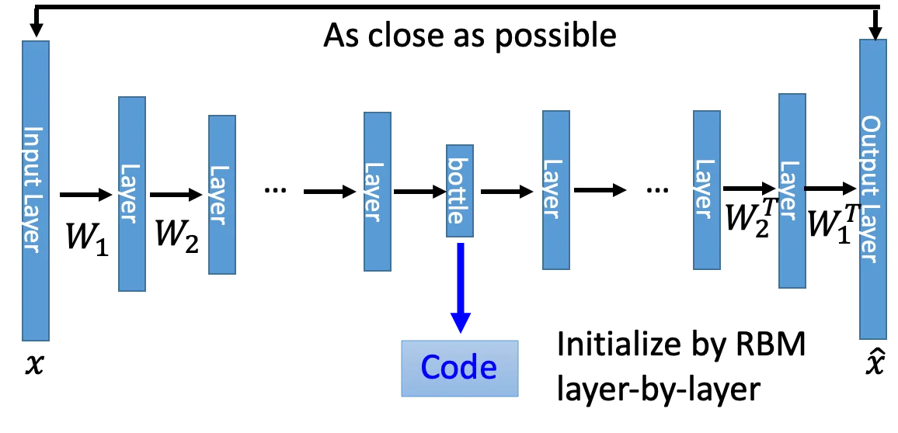

 这里给出一个 PCA 和 Deep Auto-encoder 在 MNIST 上的结果：

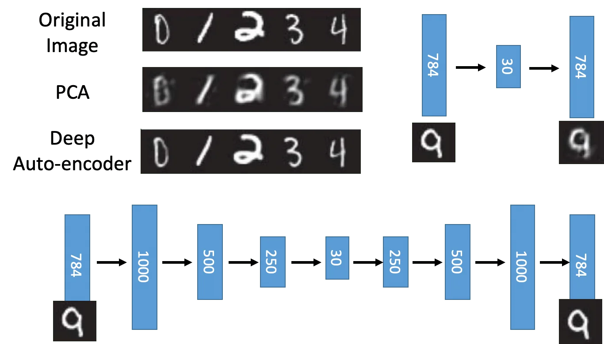

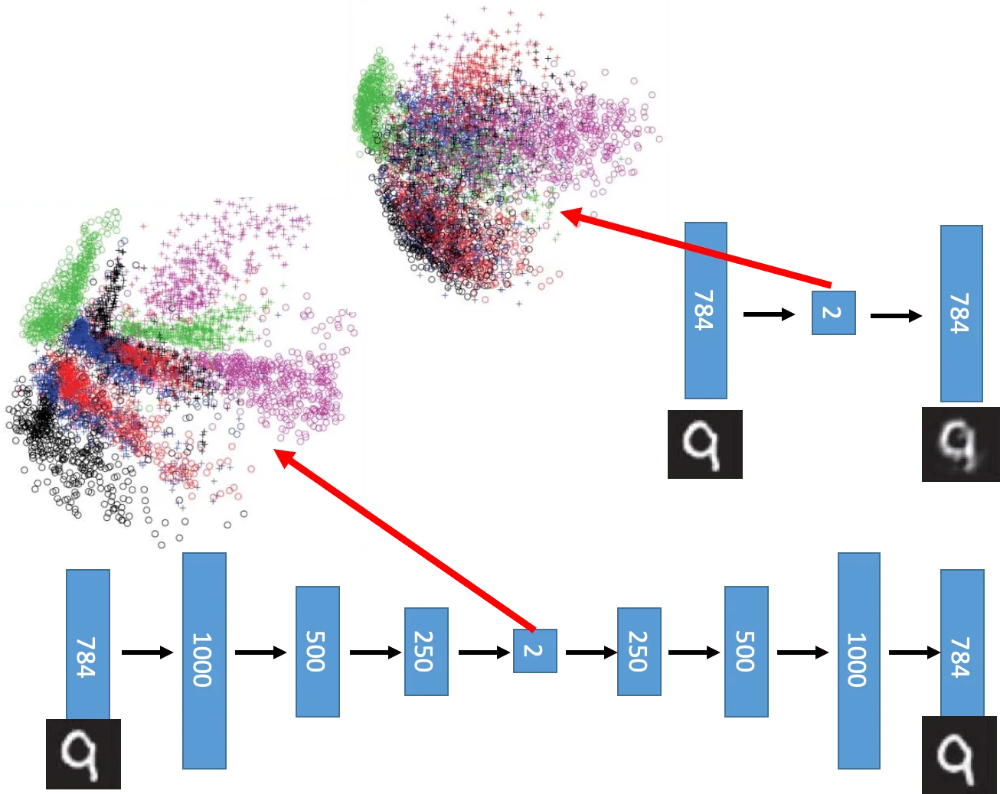

可以看到显然 Deep Auto-encoder 的重构效果更好，而且相比 PCA，数字在低维的时候仍然有比较清晰的分界。

## Applications

### Text Retrival

比如说我们现在想做文档的查询，给定一个 query，我们希望知道哪一篇文档跟这个 query 最相似。

那么我们可以将文档和 query 都表示成向量，然后去计算它们之间的相似度（比如余弦相似度）。

自然可以用词袋模型（+TF-IDF）来表示一篇文章以及一个 query，但词袋模型的问题在于它不能考虑任何语义相关的信息。

Hinton 的做法是用一个 auto-encoder 把文档和 query 向量化，再进行相似度计算。结果是很惊人的：

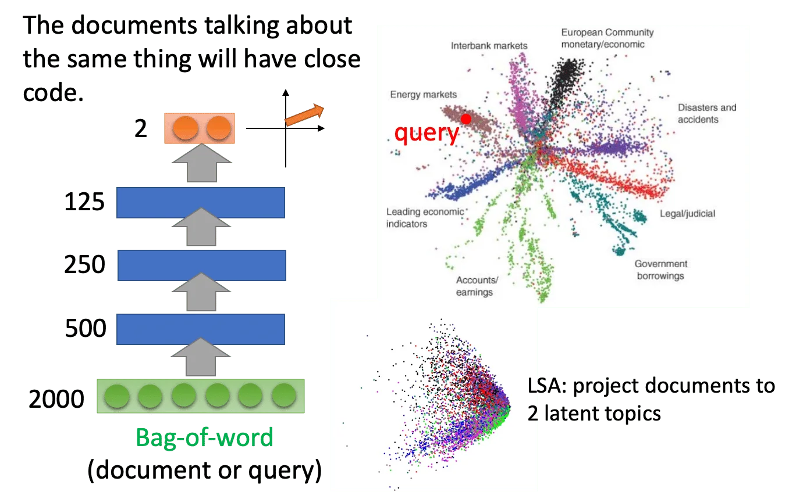

右下角是潜在语义分析（Latent Semantic Analysis，LSA）的结果，可以看到它的结果并不好，而 Auto-encoder 可以很好地把不同类别的文章分开来。

### Similar Image Search

相似图片搜索。

如果直接计算像素强度空间的欧几里得距离，那么找出来的结果可能是很夸张的。所以一个好的做法是用 auto-encoder 把图像转换成低维表示，然后用这个低维表示去做匹配。

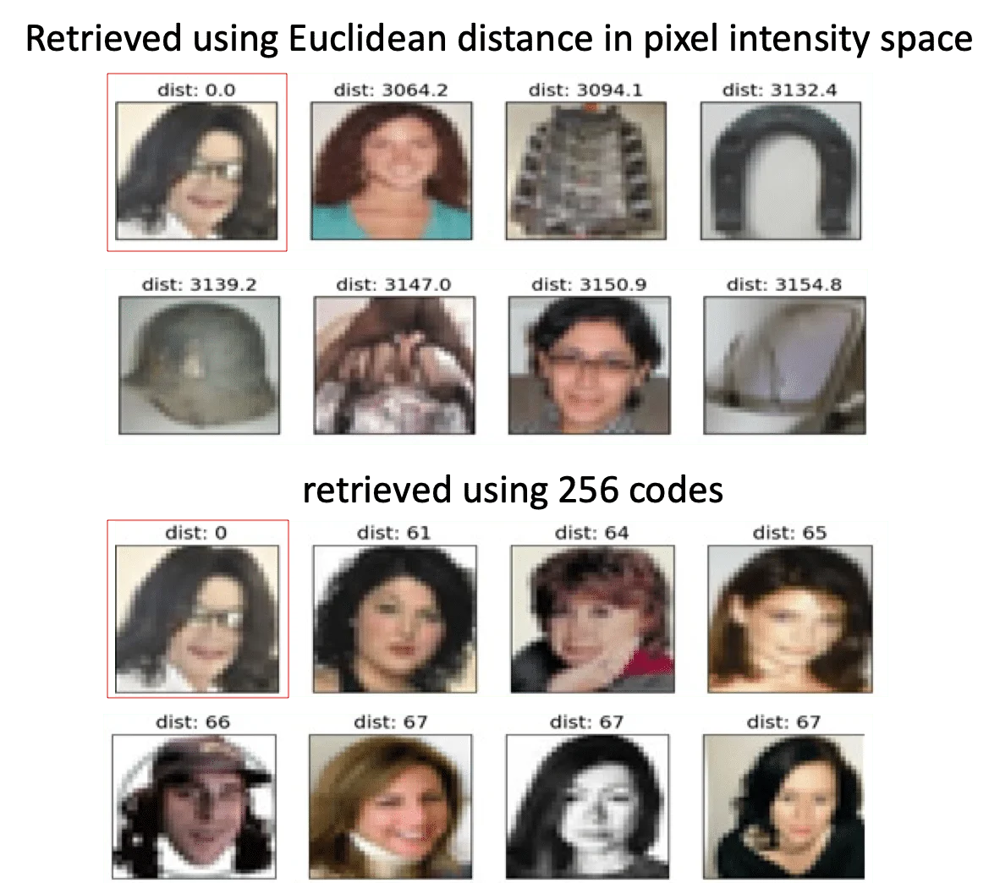

可以看到说 auto-encoder 用 code 找出来的图像虽然在像素上看起来不那么像，但是从语义上看基本都是黑色长发的人脸。而直接用像素距离找出来的图像就比较糟糕。

### Pre-training DNN

假设我们现在有一个最左边的目标网络要 Train，但是我们希望有一个好的参数初始化。

那么我们可以分别对每一层的 weight 用 auto-encoder 做 pretrain，每次做完就 fix 住然后继续 pretrain 下一层的 weight.

直到最后一层输出层之前的 weight 我们就不再用 pretrain，而是用反向传播去训练这一层并 finetune 前面几层的参数。

| Target                                                       | Pretrain 1                                                   | Pretrain 2                                                   | Pretrain 3                                                   | Fine-tune                                                    |
| ------------------------------------------------------------ | ------------------------------------------------------------ | ------------------------------------------------------------ | ------------------------------------------------------------ | ------------------------------------------------------------ |
| 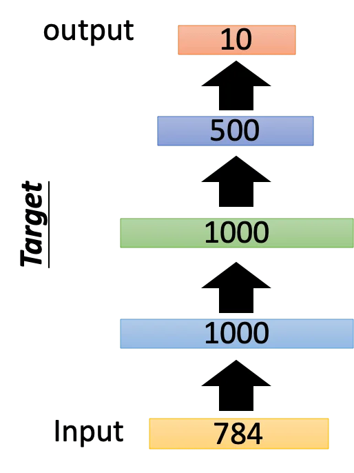 | 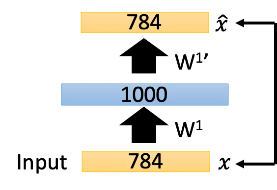 | 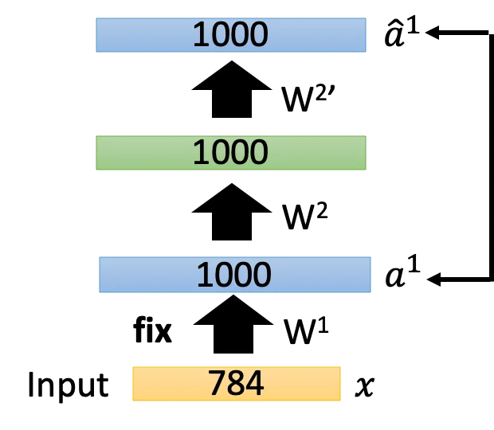 | 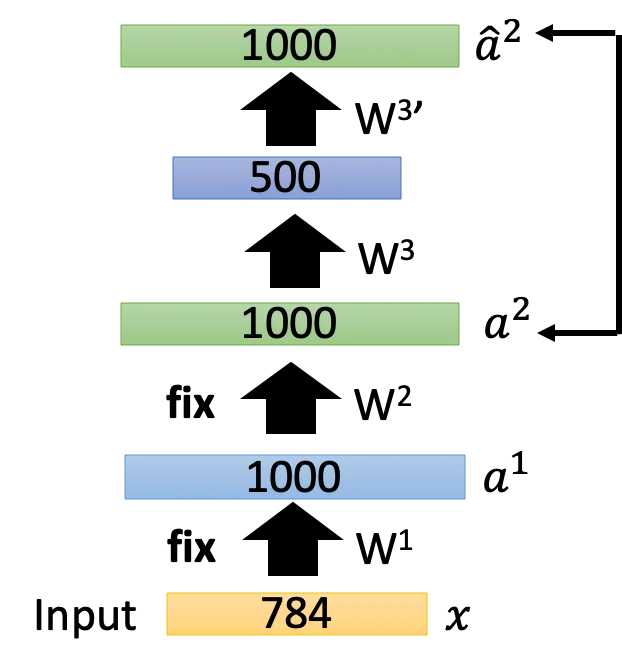 | 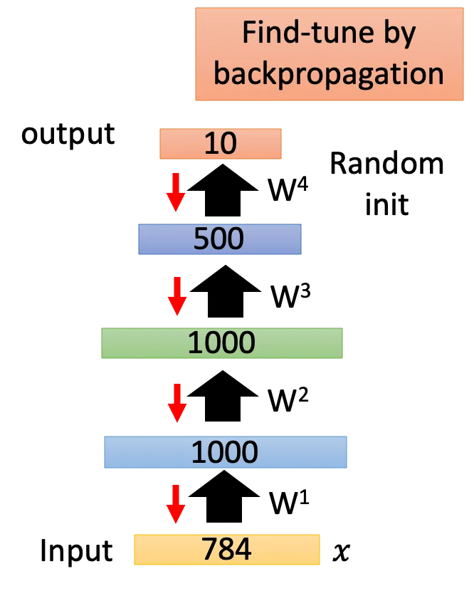 |

### De-noising auto-encoder

也就是给原图加噪声，让 auto-encoder 能过滤噪声重构原图。

还有一个比较相似的应用叫 Constractive auto-encoder，它的做法是给中间表示加一个约束，要求输入发生变化的时候（有噪声），它对中间表示产生的影响最小化。

### Other Dimension Reduction Methods

- 受限玻尔兹曼机（Restricted Boltzmann Machine, RBM），它不是一个 NN-based 的方法。
- 深度置信网络（Deep Belief Network，DBN），它其实就是深层的 RBM

## Auto-encoder for CNN

前面我们说到 Decoder 实际上是 Encoder 的逆变换，那么对于 CNN 的来说，Encoder 里做了卷积和池化，那么在 Decoder 里就要做 Deconvolution 和 Unpooling（逆卷积逆池化？）。

### Unpooling

先说 Unpooling. 它的做法是很直觉的，就是从哪里取的最大值，就往哪里放回去（事先记录），其余位置补 0。当然直接用最大值填充所有空位也可以，Keras 就是这样做的。

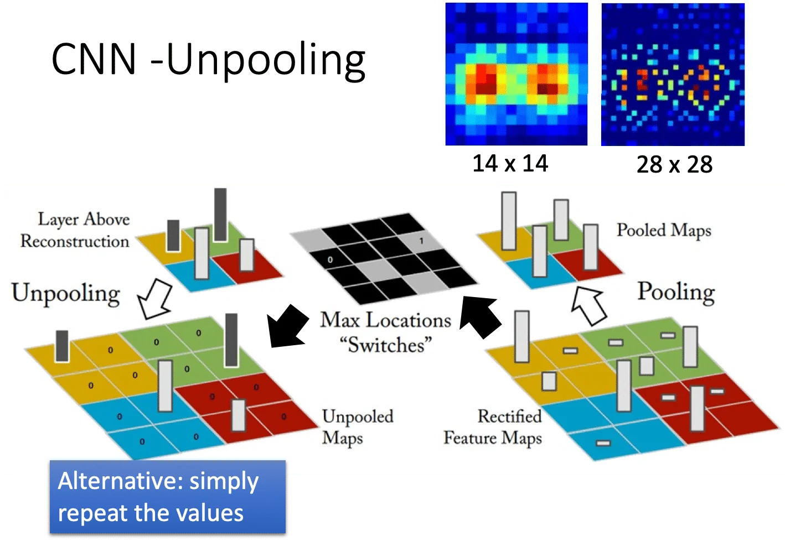

### Deconvolution

逆卷积实际上就是「padding + 卷积」。我们以一维卷积为例。

左边由 5 个输入经由 3x1 卷积变成了 3 个节点。我们很自然地会想到反卷积就是把 3 个节点扩展回 5 个，也就是每个节点分别乘以 3 个权重得到三个输出，重叠的位置再相加。实际上这样是等同于右边的先补 0 再卷积，唯一不同的是右边的卷积核的元素是逆序的。所以我们说逆卷积其实就是在做卷积。

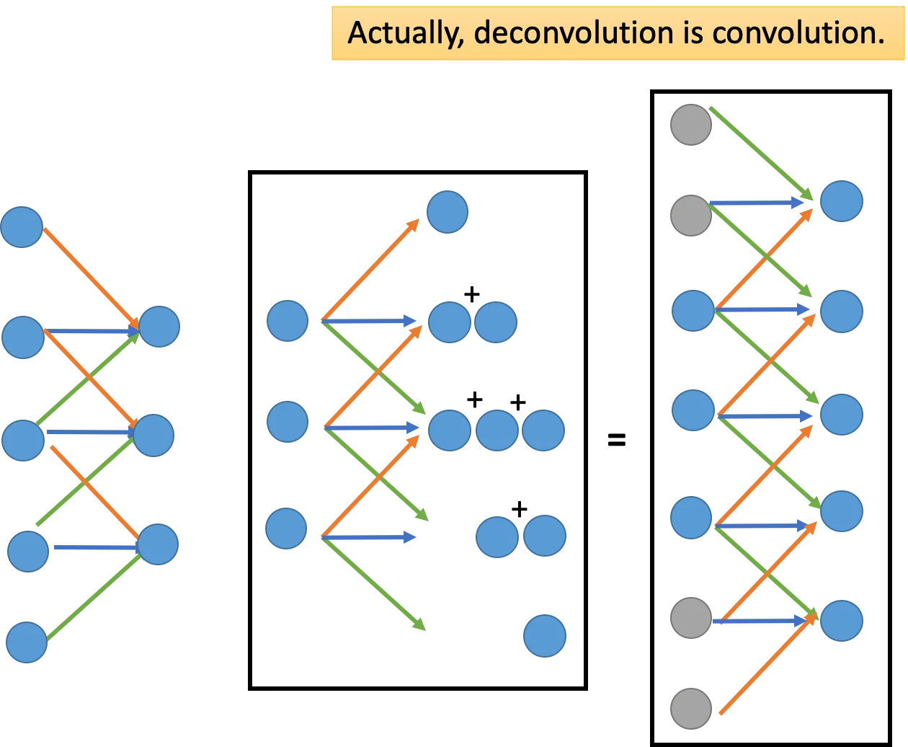

## Generation

Auto-encoder 训练好以后，我们不仅能得到一个编码器，这个解码器实际上可以用来做生成。用 MNIST 为例。

我们在 Train 好的 code 的二维空间里面等距地采样并送入 Decoder，可以看到解码器是能够输出一些有意义的结果的。注意我们采样出来的点可能并不是数据中存在的某张图的编码，但是 decoder 仍然能解码出和原始图像分布很接近的图像。

> 这里的训练对 Encoder 加了约束，要求编码是 0 均值的，这样做是为了采样起来比较方便。

并且我们看到数据分布也有一定的解释性。比如从左到右是有圆圈到没有圆圈，从下到上是直线变成斜线。

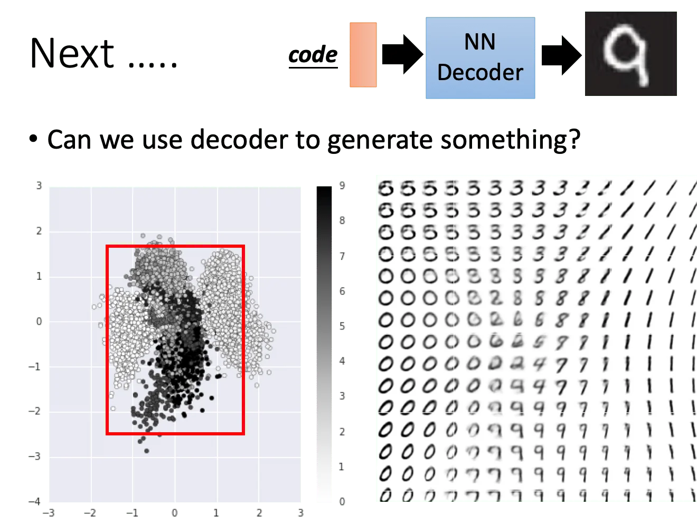