> 本节包含 P59~P62 的内容

我们之前已经学到了 Auto-Encoder 的基本结构：

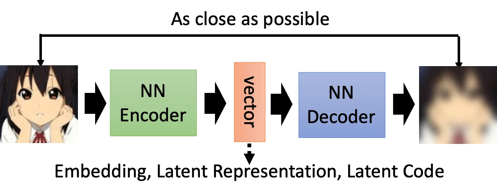

原始图像通过一个神经网络的 Encoder 得到一个向量表示，这个向量我们称之为 Embedding、Latent Representation 或者 Laten Code.

这个向量再经过一个神经网络的 Decoder 得到一张输出图像。Auto-Encoder 的训练目标就是要最小化这个输出图像和输入图像之间的误差。

今天这节课要讨论的是两个问题：

- 除了最小化输入输出误差以外，有没有别的方法可以用来训练 Auto-Encoder？
- 要怎么解释这个中间向量？

## Beyond Reconstruction

我们首先要讨论的是，除了最小化重构误差，还有没有更好的方法可以训练 Auto-Encoder？

### What is good embedding?

首先，一个好的 Embedding 需要能够表示原始的 object. 那我们要如何评估一个 Embedding 的好坏？

我们可以训练一个 Discriminator（可以看做是一个 Binary Classifier），输入图像和它的 Embedding，判断这个 Embedding 是不是图像的表征。

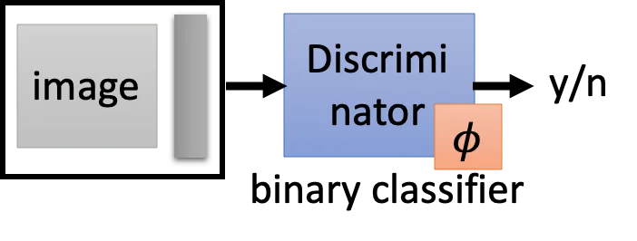

如果图像和 Embedding 是一对，那么这个 Discriminator 的输出就是 Yes，否则输出 No.

我们假设这个 Discriminator 取决于参数 $\phi$，损失函数为 $L_D$，那我们的目标就是找到一个 $\phi$ 使得 $L^*_D = \min_\phi L_D$ 

如果我们通过梯度下降能够得到把损失降到很低，那就说明这个 Encoder 计算出来的这一组 Embedding 是有代表性的。反之，如果这个 Discriminator 很难训练，损失很难下降，那就说明这一组 Embedding 不够具有代表性。

下图是有代表性的情况。Embedding 能够很好地反应原图的特征，Discriminator 就能很好地判别它们的关系。

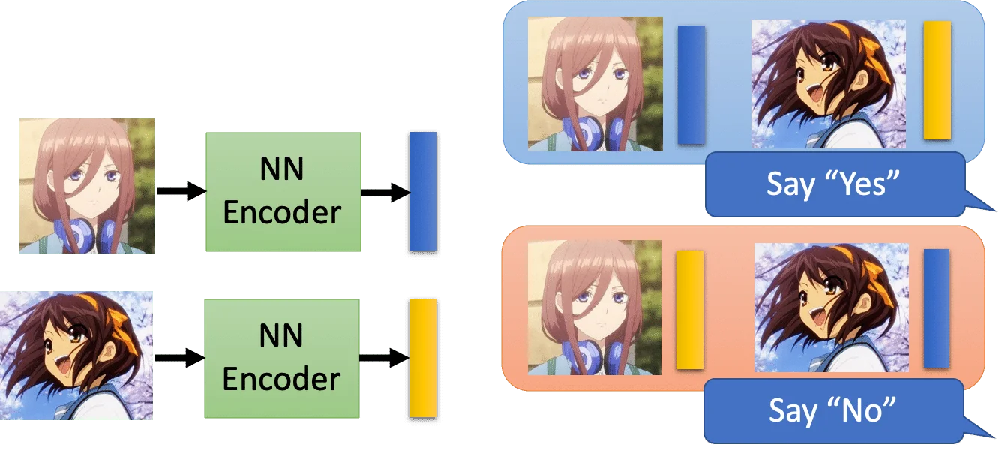

下图是没有代表性的情况。这种情况下不同的 Embedding 长得都差不多，Discriminator 就会很难把它们区分开。

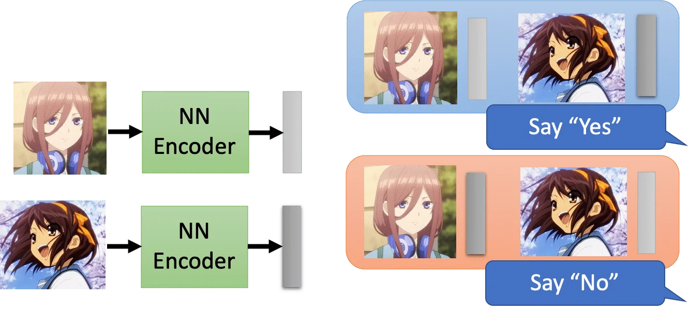

这样一来，我们就可以修改 Auto-Encoder 的训练目标。

原来我们希望最小化的是 $||x-\hat{x}||_2$，而现在我们的优化目标变成，找到 Auto-Encoder 的一组参数 $\theta^*$，使得：
$$
\begin{aligned}
\theta^* &= arg\min_\theta L^*_D \\
&= arg\min_\theta\min_\phi L_D
\end{aligned}
$$
那么我们就是要同时训练 Encoder 和 Discriminator，找到一组 $\theta$ 和 $\phi$ 来最小化 $L_D$. 不同的 Discriminator 会对结果产生影响。这个技巧被用在 Deep InfoMax 中。

实际上，原来 typical 的 auto-encoder 的训练可以看做是上面这种方法的一个特例，且只考虑了正样本的情况。

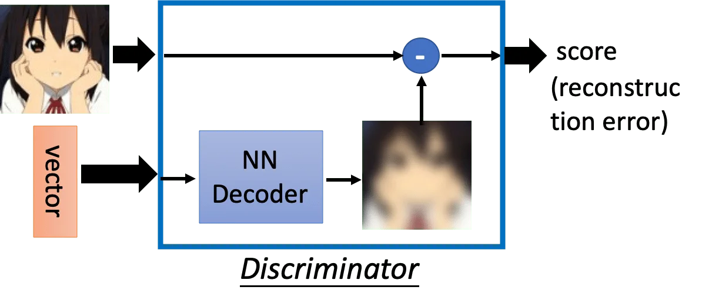

### Sequential Data

如果输入是序列数据，比如文本数据的时候，我们可以借鉴 word embedding 的做法用 skip-thought. 也就是输入一句话，输出这句话的上一句和下一句话。

但是这样其实是比较难训练的，所以又出现了 quick-thought. 它的做法是，用一个 encoder 去处理所有的句子，再用一个分类器（其实就是做向量內积），输入当前句子和它的下一个句子以及一些随机 sample 的句子。我们希望分类器能够很好地预测出下一个句子是哪一个输入。

这里不能只输入下一句做二元分类的原因是，这会导致 encoder 干脆把所有的句子的 embedding 都学成一样的。因此要加入一些随机 sample 的句子，让 encoder 不仅使得前后两句话的 embedding 相近，还要使得不相连的两句话的 embedding 有比较大的不同。

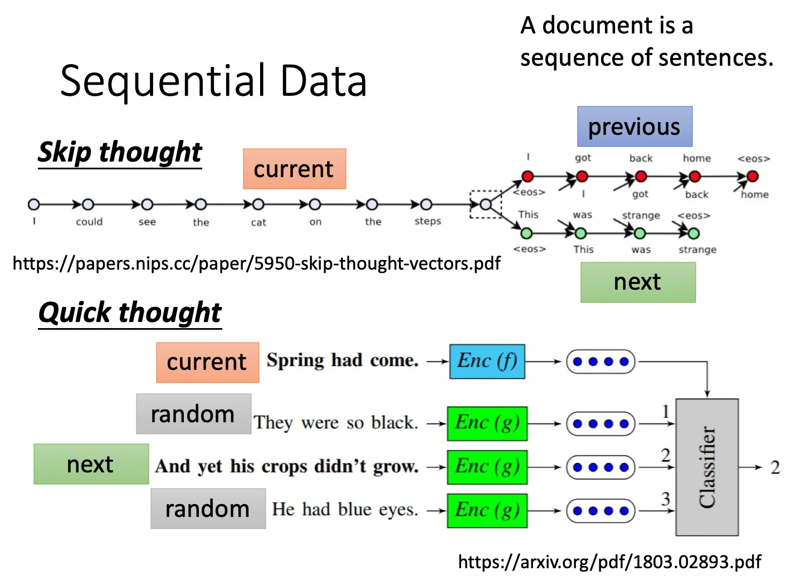

在语音的领域还有一种做法叫对比预测编码（Constractive Predictive Coding，CPC）. 它的做法是希望 encoder 输出的这个 embedding 经过一个 auto regressive 的 decoder 后得到的输出可以用来预测后 K 个时刻的 encoder 输出的 embedding.（其实跟 skip thought 是很像的，不过 CPC 预测的是 embedding，skip-thought 预测的是句子/单词。）

## Interpretable embedding

接下来我们来探讨如何让这个 latent vector 更具有可解释性。

### Feature Disentangle

多媒体的输入通常包含了多种多样的信息。当我们用 encoder 对输入进行编码，得到的 latent vector 也可能包含了这些信息。但我们希望能够知道哪些维度分别表示什么样的信息，这时候我们就需要 feature disentangle.

比如下图中，音频信号包含了语音信息，也包含了说话人的特征信息。而文本输入包含了语义信息和词法信息。

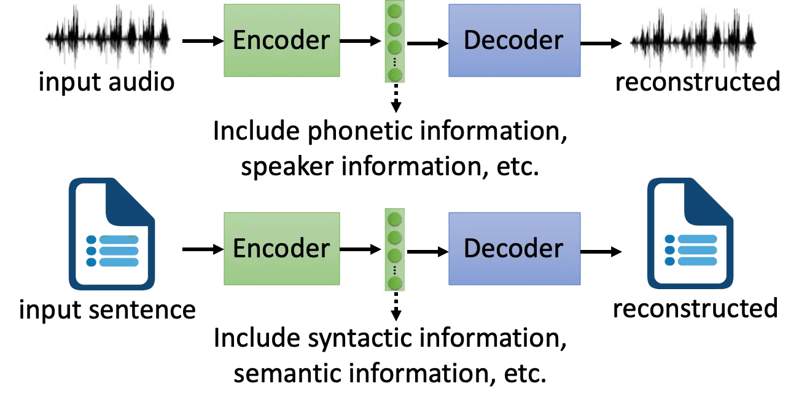

我们希望 Encoder 输出的 vector 能够自动将不同的信息分在不同的区域，比如 200 维的 latent vector，我们希望前 100 维是语音信息，后 100 维是说话人的信息。或者我们可以分别使用两个 encoder 得到两个 latent vector，然后拼接到一起送进 decoder.

注意这里是一个简化的示例，实际的音频信号可能还包含噪音、环境音等其他的信息。

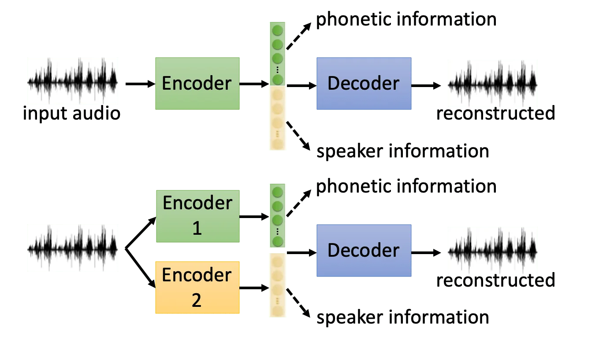

但是做这件事有什么用？一个直觉的想法是，我们可以用它来做一个变声器。

如下图，我们可以通过男女生的音频数据学到一个 encoder 和 decoder，然后将女生的 "How are you?" 中的语音信息和男生说 "Hello" 的语者信息进行拼接，送入 decoder，我们就期望得到一个男生说 "How are you?" 的音频。

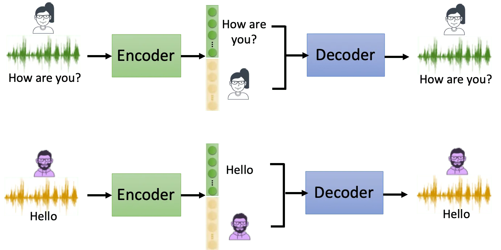

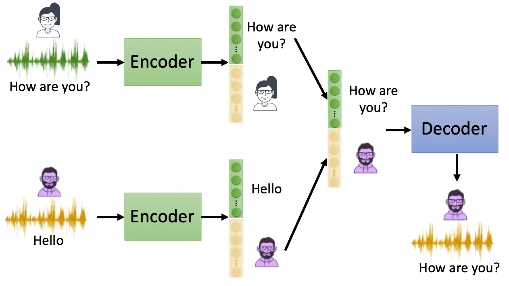

我们可以用对抗网络来训练这样的一个模型。

我们现在同时（其实是迭代地）训练一个 Encoder 和一个 Speaker Classifier。我们给后者的输入是 latent vector 的前 100 维。但我们的目的是要骗过这个 Speaker Classifier 让它猜不出说话人到底是谁。那么我们希望 Encoder 可以学到不要把说话人的信息放在前 100 维，从而最大程度地骗过 Speaker Classifier. 这两个网络是迭代训练的。

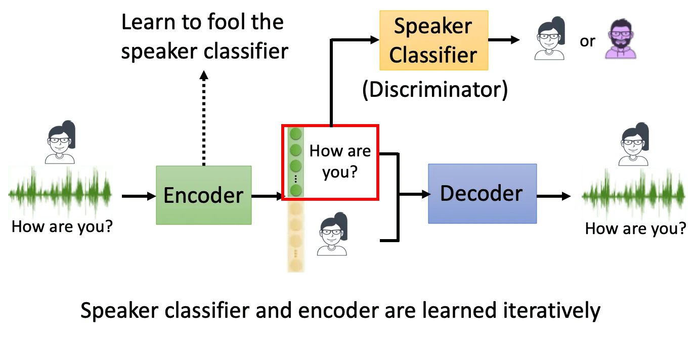

当然我们也可以对网络架构进行特殊的设计来达到这个目的。

比如下图，我们用两个 Encoder 分别输出两个 latent vector. 其中 Encoder 1 使用了 Instance Normalization，它会抹除输入中的全局信息。对于声音信号来说，这个全局信息（也就是输入的每个片段都包含的信息）就应该是语者的特征，因此 Encoder 1 的输出应该只包含和内容有关的信息。

但我们要如何保证 Encoder 2 的输出只包含语者信息呢？一种做法是在送入 Decoder 之前对 Encoder 2 输出的 latent vector 做一次 AdaIN. 而 AdaIN 的作用是给 src（vector 1）加上 dst（vector 2）带来的全局信息。而这个全局信息就是语者特征，因为如果全局信息包含内容信息，那对于 vector 1 的每个片段，它都会被加上整个句子的内容，这是不合理的。因此使用 AdaIN 以后，我们就可以使得 Encoder 2 的输出只包含全局信息，也就是语者信息，而不包含内容信息。

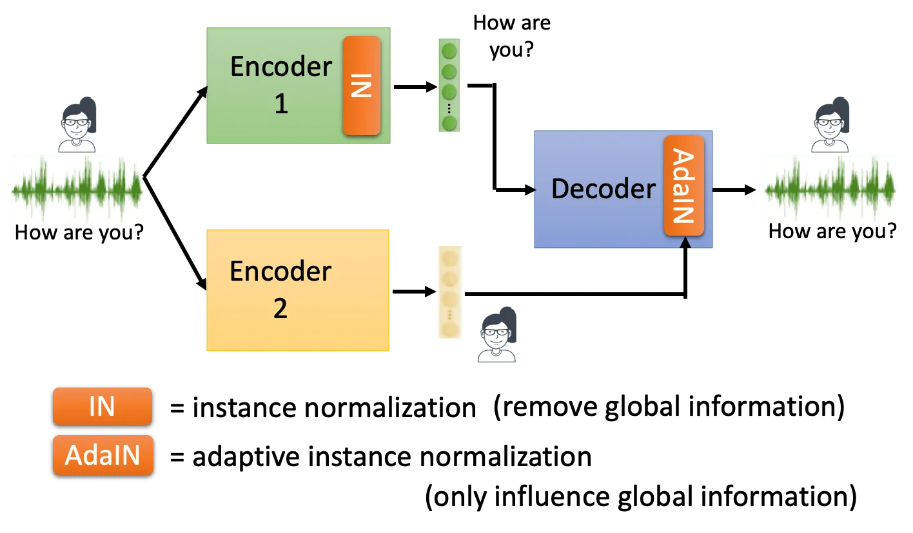

### Discrete Representation

前面说到的 auto-encoder 得到的 latent vector 一般都是一个 continuous 的向量。但光看这个向量我们很难理解它到底代表什么意思。如果我们能够让这个向量是离散的，那么我们甚至可以直接从向量看出它的聚类关系。

我们可以在 vector 的后面再加一层，把 vector 转换成 one-hot 编码，或是按阈值划分的二进制编码。但是这个操作显然是不可微的。不过有一个 trick 叫 gumbel-softmax reparameterization 可以解决这个问题。这里先不展开。

不过这里可以讨论的是 one-hot 和二进制编码哪个更好一点？理论上来说二进制编码会比较好。因为 10 位的二进制编码可以表示的信息，one-hot 需要用 1024 维来表示。另外，二进制编码是有机会能够处理没见过的数据的。但是 one-hot 的话，可能碰到没见过的数据就抓瞎了（因为对应位置的 weight 可能从来没有被训练到）。

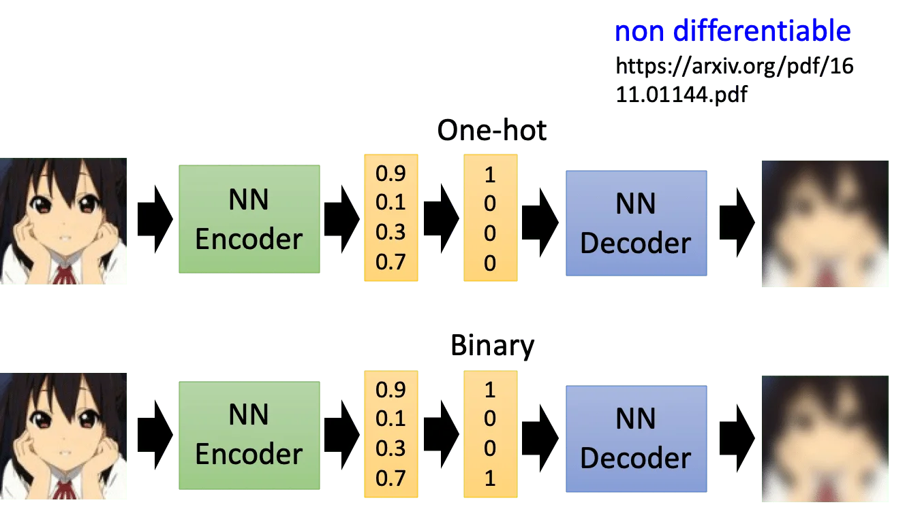

有一个比较知名的做法是 [**Vector Quantized Variational Auto-encoder（VQVAE）**](https://arxiv.org/abs/1711.00937)

它的做法是从 data 中学一个 codebook，也就是一组 **离散** 的向量。然后把输入图像送入 Encoder 得到一个连续的 vector，用这个 vector 和 codebook 中的 vector 计算相似度，把最相似的那个离散向量当做 decoder 的输入。当然这也是不可微的，具体怎么训练看论文。

那么这样做有什么意义？我们认为说这种离散的表示，它包含的信息也是离散的。举例来说，如果我们的输入是声音讯号，那么这些离散表示包含的信息就是语言信息（音节/文字是离散的 token），而不包含语者信息或者其他噪声。所以用 VQVAE encode 得到的 vector 就起到了一个过滤噪声，保留语言信息的作用。

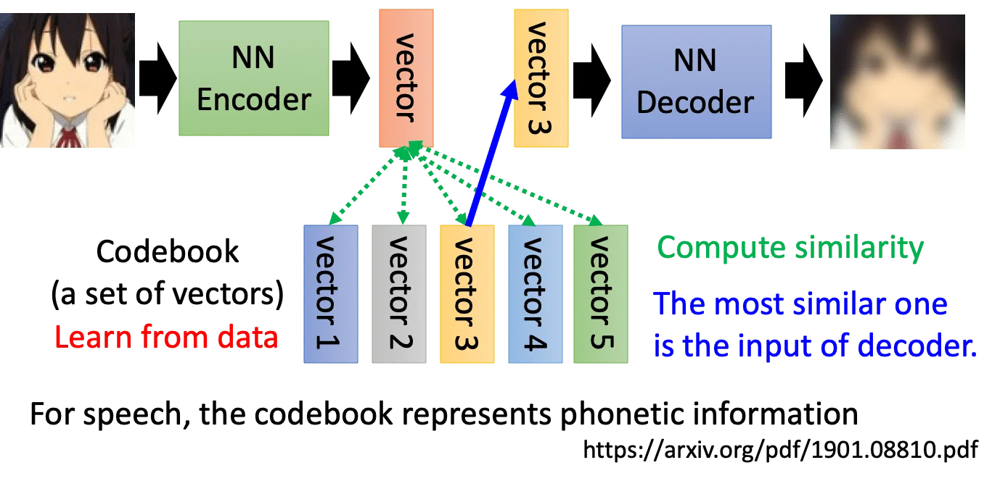

### Sequence as Embedding

除了让中间向量离散化，我们甚至可以让它是一个序列。这就是 seq2seq2seq auto-encoder.

比如说我们希望输入一篇文章，encoder 会把它变成一个 word sequence，decoder 通过这些 word sequence 可以还原出原来的文章。

很自然地，我们会认为这个中间的 word sequence 应该是文章的摘要。但问题是我们并不能保证这个 word sequence 具有任何可读性，因为 decoder 只管将这段序列扩展成原来的文章，至于它是要把复旦大学缩写成复旦还是复大这是我们不能控制的。

GAN 的做法是引入一个 discriminator 来判断这个中间序列是否是一段人类可读的摘要：

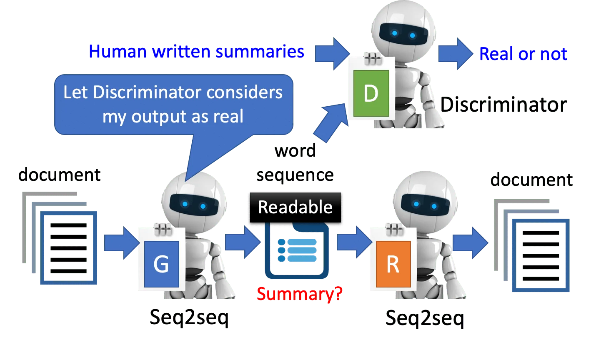

当然这个中间的 word sequence 也是不可微的。我们训练的原则是，如果发现模型不可微，那就用强化学习硬做就是了（？）

其他的还有将 Embedding 表示成 Parsing Tree，这里放两篇 ref 不再细讲：

https://arxiv.org/abs/1806.07832

https://arxiv.org/abs/1904.03746

## Concluding Remarks

总结一下，这节课讲了两个内容：

- More than minimizing reconstruction error
  - 引入 Discriminator
  - 序列数据
- More interpretable embedding
  - Feature Disentangle
  - 离散和结构化