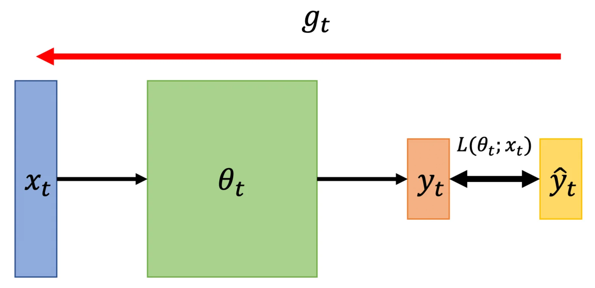
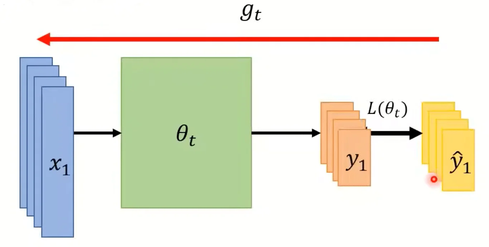
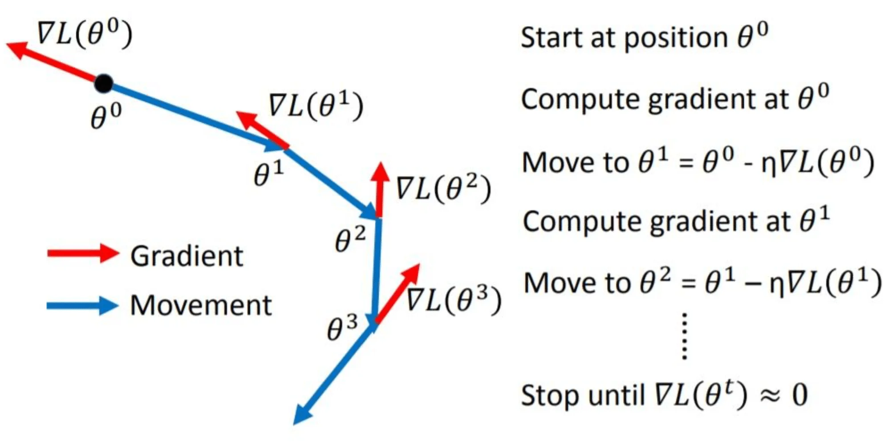
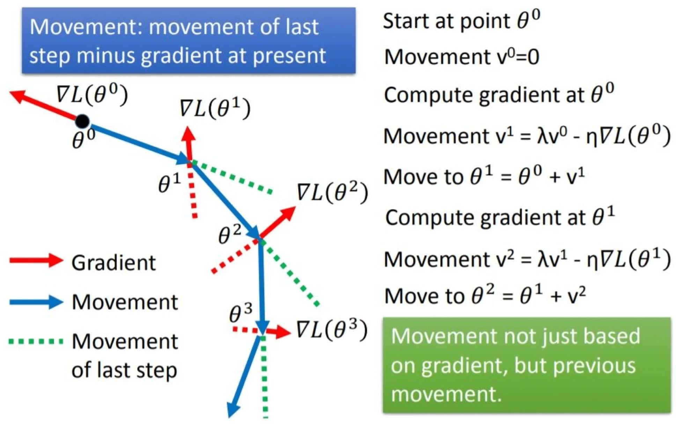
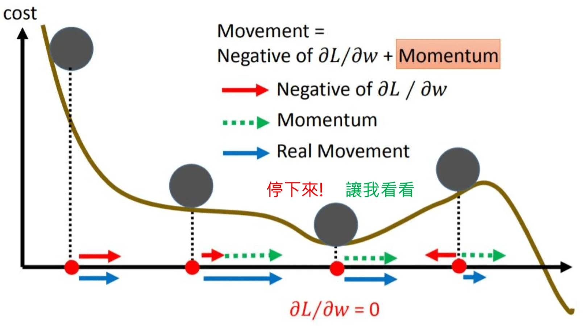
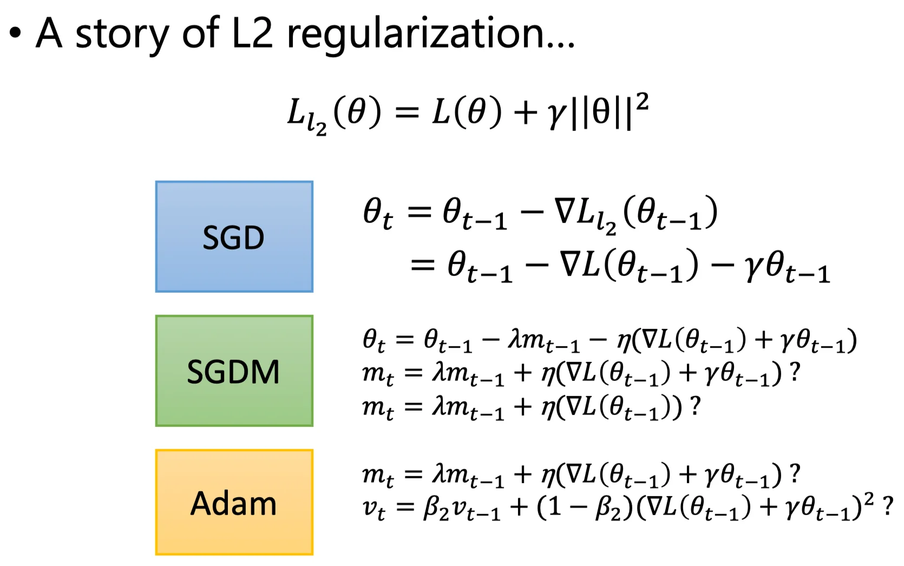
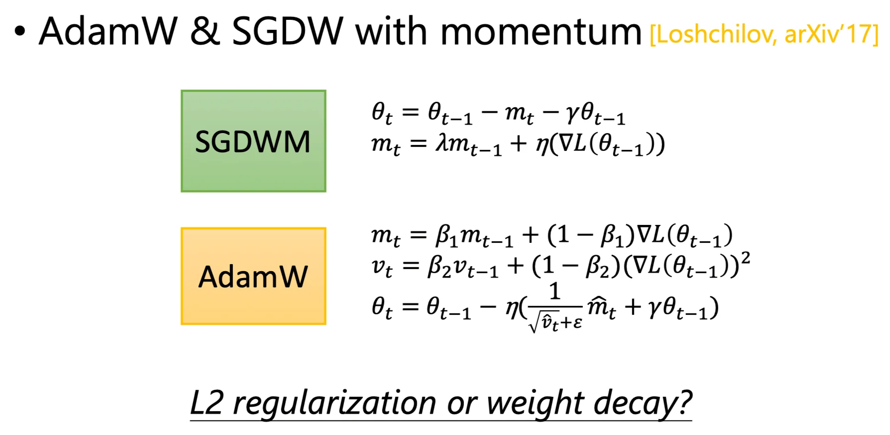
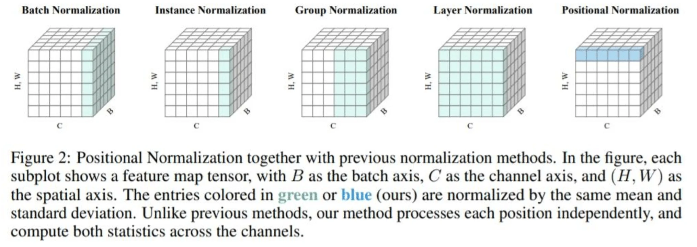

**What you have known before?**

- SGD
- SGD with momentum
- Adagrad
- RMSProp
- Adam

所有的 Optimizer 其实都需要很强的约束才能保证收敛。本节不对这些优化器作任何收敛保证的数学证明。

**Some Notations**

- $\theta_t$：t 时刻的模型参数
- $\triangledown L(\theta_t) \ \mathrm{or} \ g_t$：$\theta_t$ 处的梯度值，用来计算 $\theta_{t+1}$
- $m_{t+1}$：0 到 t 时刻累积的 **动量（Momentum）**，用来计算 $\theta_{t+1}$

**What is Optimization about?**

目的就是要找到一组 $\theta$ 使得 $\sum_x L(\theta; x)$ 最小。

**Online vs Offline**

- Online：one pair of $(x_t, \hat{y}_t)$ at a time step

  

  

- Offline：pour all $(x_t, \hat{y}_t)$ into the model at every time step.

  

## SGD

随机梯度下降（Stochastic Gradient Descent）

1. 随机初始化参数 $\theta^0$
2. 计算 $\theta_0$ 处的梯度 $\triangledown L(\theta^0)$
3. 更新参数 $\theta^1 = \theta^0 - \eta \triangledown L(\theta^0)$
4. 重复 2-3 步直到收敛

## SGD with Momentum (SGDM)

带动量的 SGD.

和普通的 SGD 的区别是，我们定义一个 **动量（Momentum）**记为 $v$，初始化 $v^0 = 0$. 它记录了历史梯度的信息。

1. 随机初始化参数 $\theta^0$，初始化梯度 $v^0 = 0$
2. 计算 $\theta_0$ 处的梯度 $\triangledown L(\theta^0)$
3. **【新】更新动量** $v^1 = \lambda v^0 - \eta\triangledown L(\theta^0)$
4. **【新】更新参数** $\theta^1 = \theta^0 + v^1$ （注意这里是加上动量，因为动量记录的是反向梯度，也就是参数更新的方向）
5. 重复 2-4 步直到收敛

这里的动量 $v^i$ 实际上是过去所有的梯度的加权和，目的是希望历史梯度能够指导前进的方向（一个「惯性」的概念）。比如遇到山谷（梯度 $\approx 0$ 的情况也能够依靠历史梯度的信息跳出：

## Adagrad

自适应的梯度更新。其实就是把 SGD 的第三步梯度更新换成：
$$
\theta^1 = \theta^0 - \frac{\eta}{\sqrt{\sum_{i=1}^{t-1}(g_i)^2}} g_{t-1}
$$
其中 $g_t$ 表示当前梯度值。而系数的分母部分是历史梯度的均方根。其意义是用这个均方根来近似反应当前位置二阶梯度的值，从而约束参数更新的步长。

上一节里也有提到，一阶梯度大的地方，最优的更新步长并不一定是大的，而是要综合二阶梯度来考虑，最优的更新步长应该与一阶梯度的绝对值成正比，与二阶梯度成反比。

## RMSProp

其实是 Adagrad + Momentum 的思想。

> 注意 RMSProp 中的「动量」和 SGDM 的「动量」不是一个意思
>
> SGDM 中的动量是替代了参数更新中的梯度，而 RMSProp 是用动量来替代 Adagrad 中的梯度系数的分母。

把 SGDM 的第一步动量初始化改为： $v^1 = g_0^2$

第三步动量更新改为：
$$
v_t = \alpha v_{t-1} + (1-\alpha)(g_{t-1})^2
$$
第四步参数更新改为（注意这里没有使用动量来更新梯度，而是把历史动量作为系数）：
$$
\theta_t = \theta_{t-1} - \frac{\eta}{\sqrt{v_t}} g_{t-1}
$$
这么改的目的主要是在优化第四步的梯度系数的分母部分。如果是 Adagrad 的做法会导致这个系数无限累加，那么随着训练轮次的上升，参数更新会变得越来越慢。而修改后的系数（第三步）是一个指数平滑平均，相当于使用了一个滑动窗口，只关心近期的梯度值，而远期的值会因为乘了多次 $(1-\alpha)$ 而趋于 0 被忽略。

但是 RMSProp 仍然不能解决卡在梯度为 0 的位置的问题。（？）

## Adam

其实是 SGDM + Momentum 的思想。

我们先修改一下记号：

- SGDM
  $$
  \theta_t = \theta_{t-1} - \eta m_t \\
  \quad \\
  m_t = \beta_1 m_{t-1} + (1-\beta_1) g_{t-1}
  $$

- RMSProp
  $$
  \theta_t = \theta_{t-1} - \frac{\eta}{\sqrt{v_t}} g_{t-1}\\
  \quad \\
  v_1 = g_0^2 \\
  \quad \\
  v_t = \beta_2 v_{t-1} + (1-\beta_2)(g_{t-1})^2
  $$

结合以上两者，Adam 的参数更新写作：
$$
\theta_t = \theta_{t-1} - \frac{\eta}{\sqrt{\hat{v}_t+\varepsilon}} \hat{m}_t
$$
也就是说，梯度用在了两处，第一处是在公式（4）计算 $m_t$，也就是动量，用于做梯度更新。

第二处是在公式（5）计算 $v_t$，也就是系数，用于约束更新步长。

其中，公式里有两处 de-bias 的记号：
$$
\hat{m}_t = \frac{m_t}{1-\beta_1^t} \\
\quad \\
\hat{v}_t = \frac{v_t}{1-\beta_2^t}
$$
一般 $\beta_1 = 0.9, \beta_2 = 0.999, \varepsilon = 10^{-8}$ 是为了防止分母为 0 的情况。

要做 de-bias 的目的是，在训练一开始的时候 $m_t, v_t$ 是比较小的，那么给它除以一个比较小的数字，将其放大。而随着时间的累积，$m_t, v_t$ 会逐渐变大，这时候 $\beta^t$ 也在逐渐变小，$1 - \beta^t$ 就在逐渐变大，那么给 $m_t, v_t$ 除以一个比较大的数字就可以将其放缓（实际上除以小于 1 的数都会变大，这里的放缓是相对的）。这样的目的是为了让 $\hat{m}_t, \hat{v}_t$ 不会随时间的变化太大。

> 中间一些介绍新 Optimizer 的部分就略过了

## Do you really know your optimizer?

我们在做正则化的时候会给 Loss Function 加上一个正则化项，那这就会导致一个问题。在使用动量的 Optimizer 中（比如 SGDM 和 Adam），我们在累积动量的时候是否要累积正则项？

下面这篇文章的实验表明，在累积动量的时候 **不累积正则项比较好** ，而是只在参数更新的时候额外减去正则项。我们把原始的，在动量中累积正则项的做法叫做 **L2 正则化（L2 Regularization）**，而把下图的，只在参数更新的时候考虑正则项的做法叫做 **权重衰减（Weight Decay）**。

## Things help optimization

- Shuffling：随机打乱训练数据

- Dropout：在训练阶段随机丢弃每层的一部分神经元

- Gradient Noise [Neelakantan, et al., aXiv'15]

  在计算梯度的时候随机加上一个高斯噪声，这个噪声会随着时间减弱。
  $$
  g_{t, i} = g_{t, i} + N(0, \sigma_t^2) \\
  \sigma_t = \frac{c}{(1+t)^\gamma}
  $$

这些做法都是在鼓励模型做 Exploration.

- Warm-Up：一开始用比较小的 LR，然后慢慢把 LR 调大

- Curriculum Learning：一开始用比较简单的 data 做训练，等训练稳定下来后再用难的 data 继续训练。这样做（或许）可以提高泛化性能。这样做主要有两点考量，第一点是如果一开始就使用比较难的 data，那么 Model 可能很难学好。第二点是，easy 或者说 clean 的 data 更能代表总体均值，在这种比较 general 的 data 上进行训练可以快速收敛到一个比较好的范围内，然后再在 hard data 上 finetune.

- Fine-tuning：用 pre-trained 的模型，冻结前面的层，只训练后几层，或者是整体在新的数据上继续训练。

- Normalization

  

- Regularization

## Conclusion

对比 SGDM 和 Adam：

|          | SGDM                       | Adam                                                     |
| -------- | -------------------------- | -------------------------------------------------------- |
| 训练速度 | 快                         | 慢                                                       |
| 收敛性   | 更好收敛                   | 可能无法收敛                                             |
| 稳定程度 | 稳定                       | 不稳定                                                   |
| 泛化性   | 好                         | 较差                                                     |
| 应用建议 | 图像任务：分类、分割、检测 | NLP：QA、翻译、摘要 语音分析 GAN 强化学习 |

没有 one-fit-all 的优化器，要根据特定的任务选择最合适的 Optimizer.

